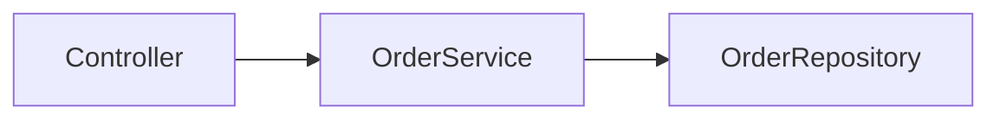

# Repo Wiki 页面格式

`/repo-wiki` 生成的每一页必须遵循此格式。路径相对于 `docs/repo-wiki/`。

## 源码锚点（强制）

每条实质性结论必须标注源码位置，格式：

```markdown
> **源码** `src/order/service.ts:42-118`
```

规则：

- 使用仓库内相对路径（POSIX 风格 `/`）
- 行号为闭区间 `start-end`；单行写 `42-42` 或简写 `42`
- 锚点必须指向**当前工作区实际存在**的文件与行号
- 一个段落可有多条锚点

## 交叉引用（按需）

```markdown
> **术语** 见 [CONTEXT.md](../../CONTEXT.md#order)
> **相关决策** [ADR-0001](../adr/0001-event-sourced-orders.md)
> **相关模块** [OrderService](./02-core-modules/order.md)
```

- 若 `CONTEXT.md` 不存在，省略术语行
- 若无相关 ADR，省略决策行
- Wiki 页之间用相对链接互链

## README.md 模板

```markdown
# {项目名} — 代码库架构导读

{一句话项目定位}

## 技术栈

- {语言 / 框架 / 主要依赖，每项带源码锚点}

## 入口

> **源码** `{main-entry}:{line-range}`

{从入口开始的 2-3 句主流程摘要，链到 01-execution-flow.md}

## 如何使用本 Wiki

- 规范文档（术语、决策、需求）见 `CONTEXT.md`、`docs/adr/`、`docs/prd/`
- 本 Wiki 描述**代码现状**；冲突时以规范文档为准
- 元数据见 [_meta.yaml](./_meta.yaml)
```

## 主题页模板（01–07）

```markdown
# {主题标题}

{1-2 段概述，使用 CONTEXT 词汇（若存在）}

## {小节标题}

{描述}

> **源码** `{path}:{start}-{end}`

{可选：更多小节…}
```

## 模块页模板（02-core-modules/{name}.md）

```markdown
# {模块名}

{职责描述 — 1 段}

> **源码** `{path}:{start}-{end}`
> **术语** 见 [CONTEXT.md](../../../CONTEXT.md#{anchor})（若适用）

## 对外接口

{公共 API、导出、主要类型 — 每项带源码锚点}

## 依赖

- [{依赖模块}](./other-module.md) — {一句话}
> **源码** `{path}:{start}-{end}`

## 调用者

- {谁调用本模块 — 带源码锚点}
```

## 图表（可选）

当图确实帮助理解且有源码依据时，在 `diagrams/` 下创建 Mermaid 源文件：

```markdown
<!-- diagrams/order-flow.md -->

```

正文页引用：

```markdown
## 流程概览

见 [order-flow 图](./diagrams/order-flow.md)。

> **依据** `src/order/service.ts:42-118`、`src/order/repository.ts:10-55`
```

规则：

- 单张图渲染失败不影响正文阅读
- 每张图必须标注依据的源码锚点
- 不要生成无源码依据的臆测架构图

## 过时标记

刷新时若某页未重新验证，可在页首添加：

```markdown
> ⚠️ 最后验证 commit: {old_commit}（当前: {current_commit}）— 可能过时，请以源码为准
```

## 禁止内容

- 复制 `docs/prd/` 全文或 States 矩阵
- 在 Wiki 中重新定义 `CONTEXT.md` 已有术语
- 用 Wiki 替代 ADR 记录决策理由
- 无源码锚点的纯叙述性结论
- 安装 / 部署 / CI/CD 教程
