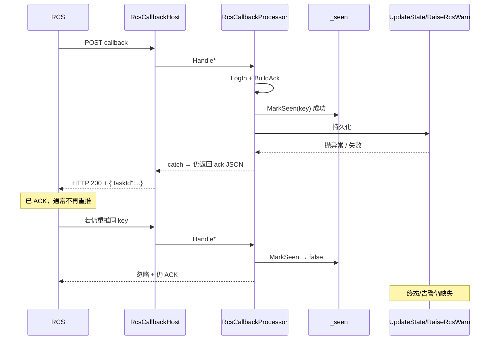
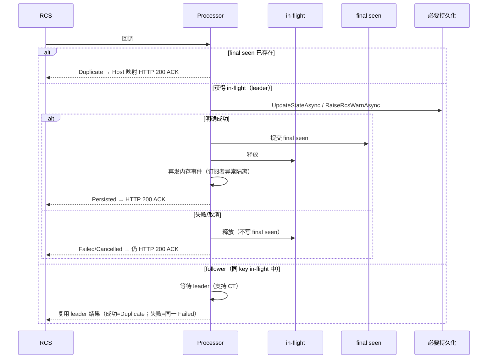

# P0-4｜回调去重先于持久化，终态或告警可能丢失

Type: bug  
Priority: P0  
Status: closed  
Labels: callback, idempotency, persistence, rcs, safety, closed  
Feature: p0-4-callback-dedupe-after-persist

> 此内容由 AI 在分拣期间生成。

## 1. 问题陈述

`RcsCallbackProcessor` 在 `UpdateStateAsync` / `RaiseRcsWarnAsync` **成功之前**就把去重键写入进程内 `_seen`。随后若持久化抛异常（或等价失败），处理器仍吞异常并向 RCS 返回 `{"taskId":"..."}`（HTTP 200 Content）。同 key 再推会被 `MarkSeen` 判为重复并忽略，导致：

- **push/scan 终态**可能未落库、内部事件未派发；
- **warnCallback 告警**可能未落 `MAS_AUTO_ALARM_EVENT`。

去重应保护**已成功持久化**的重复推送，而非吞噬**未成功处理**的重试。

## 2. 真实调用链（2026-08-04 源码核查）

### 2.1 HTTP 入口

```
IHost.StartAsync
  └─ RcsCallbackHost.StartAsync                    # IHostedService（Communication DI 注册）
       └─ Kestrel MapPost ×3
            ├─ POST /externalApi/pushTaskStatus
            ├─ POST /externalApi/scanTaskStatus
            └─ POST /externalApi/warnCallback
                 │  ReadBodyAsync → IRcsCallbackProcessor.Handle*
                 └─ Results.Content(ack, application/json)   # 始终 200 + JSON body
```

| 锚点 | 路径 | 行为 |
|------|------|------|
| Host | `src/CncLoader.Communication/Rcs/RcsCallbackHost.cs` | `MapEndpoints`：读 body → `Handle*` → `Results.Content`（无 5xx 分支） |
| 注册 | `src/CncLoader.Communication/DependencyInjection/CommunicationServiceCollectionExtensions.cs` | `IRcsCallbackProcessor`→`RcsCallbackProcessor`；`RcsCallbackHost` 作 HostedService |
| 契约 | `src/CncLoader.Core/Rcs/RcsCallbackModels.cs` | 路径常量；`RcsErrorCode.ToTaskState`：0→COMPLETED / 9→CANCELED / 其它→FAILED |
| 接口 | `src/CncLoader.Core/Rcs/IRcsCallbackProcessor.cs` | 约定「吞异常并总能返回应答」 |

### 2.2 pushTaskStatus（completed / failed / cancelled）

文件：`src/CncLoader.Communication/Rcs/RcsCallbackProcessor.cs` · `HandlePushTaskStatusAsync`

**当前错误顺序（修复前）：**

1. `JsonDocument.Parse` → 读 `taskId`、`data.system.error_code` / `msg`
2. `BuildAck(taskId)` → `LogInAsync`（IN 报文流水；失败仅 Warning，不影响后续）
3. 缺 `taskId` → 直接 return ack
4. `state = RcsErrorCode.ToTaskState(errorCode)`
5. `dedupKey = $"push:{taskId}:{errorCode}"`
6. **`MarkSeen(dedupKey)`** —— 首次 true / 重复 false（**先于持久化**）
7. 若首次：`await _store.UpdateStateAsync(taskId, state, …)` → `_notifier.RaiseTaskStatus(…)` → Information 日志
8. 若重复：Debug「重复推送忽略」
9. `return ack`
10. `catch`：Warning + `TryLogInAsync` + **仍 `return BuildAck(taskId)`**

### 2.3 scanTaskStatus

同文件 · `HandleScanTaskStatusAsync`：键 `scan:{taskId}:{errorCode}`，时序与 push 相同（`MarkSeen` → `UpdateStateAsync` → `RaiseScanResult`）。

### 2.4 warnCallback（alarm）

同文件 · `HandleWarnCallbackAsync`：

1. `BuildAck(null)` + `LogInAsync`（无 taskId）
2. 遍历 `data[]`：`robotCode` / `beginTime` / `warnContent` / `taskCode`
3. `dedupKey = $"warn:{robotCode}|{beginTime}|{warnContent}"`（**不含 taskCode**）
4. **`MarkSeen`**；重复则 `continue`
5. 首次：`await _alarms.RaiseRcsWarnAsync(…)` → `_notifier.RaiseWarn(…)`
6. `return ack`；`catch` 仍 `BuildAck(null)`

### 2.5 去重组件（修复前）

| 项 | 实现 |
|----|------|
| 结构 | `HashSet<string> _seen` + `Queue<string> _seenOrder` + `object _seenLock` |
| 容量 | `SeenCapacity = 4000`；超出 FIFO 从 `_seen` 淘汰 |
| TTL | **无**（仅容量淘汰） |
| 线程安全 | `MarkSeen` / `ForgetTask` 持 `_seenLock`；持久化在锁外 await |
| `MarkSeen` | `_seen.Add` 成功→enqueue→true；已存在→false |
| `ForgetTask` | redo/redispatch 成功后删 `push:{taskId}:*` / `scan:{taskId}:*`（不碰 warn；`_seenOrder` 僵尸项见 `findings.md`） |
| 进程重启 | 不保留（纯内存） |

### 2.6 持久化与副作用

| 步骤 | 实现 | 说明 |
|------|------|------|
| 任务终态 | `IRcsTaskStore.UpdateStateAsync` → `RcsTaskStore` | EF 更新 `MAS_AUTO_AGV_TASK`；行不存在则 **静默 return**（不抛、无 bool——「显式失败」接缝须在实现中补齐，见 D1） |
| 告警落库 | `IAlarmEventService.RaiseRcsWarnAsync` → `AlarmEventService` | 写 `MAS_AUTO_ALARM_EVENT`（`RCS_WARN`）；失败抛异常 |
| 内部事件 | `RcsCallbackNotifier.Raise*` | 同步 `Invoke`；订阅方见 §2.8 |
| 预记收口 / 生产 PLC 写 | **不在** Processor 内 | 调度器主循环读任务态 + HasMat 复核后 Confirm / 写 `POS_TEST_START` |
| 报文流水 | `LogInAsync` / `TryLogInAsync` | 在去重协调之前；失败不影响 ACK；**不计入** final seen 成功边界 |

### 2.7 下游消费（终态落地后）

- `RcsTaskTracker`：订阅 `TaskStatusReceived` → FAILED 自动 redo / CANCELED 告警；`PollLoopAsync` 对未完结 taskId 批量 `queryTask`
- `PositionScheduler`：主循环按任务态推进；订阅失败/取消清交接登记
- warn：仅回调路径落库+事件；无 queryTask 类兜底

### 2.8 事件订阅链与 PLC / 副作用边界（D6 必读，RED 前核对）

| 订阅方 | 事件 | 副作用 | 是否直接写生产 PLC |
|--------|------|--------|-------------------|
| `RcsTaskTracker` | TaskStatus | FAILED→auto redo；CANCELED→告警落库 | 否 |
| `PositionScheduler` | TaskStatus Failed/Canceled | 清 `_expectedInbound`、可能退回中转架/告警 | 否（不写 `POS_TEST_START`） |
| `InventoryService` | ScanResult / TaskStatus | 盘点校正槽位账；失败结束盘点 | 否 |
| `ChangeFrameOrchestrator` | TaskStatus | 可能下发换架第二发；`PushDispatched` 原子防双发 | 否（RCS 下发，非 PLC） |
| `CncMachineSimulator` | TaskStatus Completed | **模拟器** `WriteRegister` 改 HasMat 等 | **仅模拟器**，非现场 PLC 路径 |
| UI `RcsViewModel` | 三事件 | 终端/Growl/刷新 | 否 |

**结论：** 生产路径上，回调事件链**不直接写** `POS_TEST_START`；PLC 写在调度主循环 Loaded/Unloaded 闸口。实现时须隔离订阅者异常（D6.2）；RED-14 覆盖「订阅者抛异常不导致重复持久化」。换架第二发已有 `Interlocked` 幂等；模拟器写寄存器仅演示环境。

## 3. 当前错误时序（修复前）



```
回调 → MarkSeen(提交 seen) → 持久化失败 → catch 仍 ACK(200)
     → 同 key 重推 → MarkSeen 失败 → 忽略 → 终态/告警丢失
```

## 4. 目标安全时序（已锁定）



```
回调 → 占用 in-flight → 持久化明确成功 → 提交 final seen → 发事件 → ACK
                     ↘ 失败/取消 → 释放 in-flight，不写 final seen
follower → 等待 leader 结果（可取消）→ 不提前报成功、本次不串行重试风暴
```

## 5. completed 路径证据

| 证据 | 源码 |
|------|------|
| error_code=0 → COMPLETED | `RcsErrorCode.ToTaskState` |
| 键含结果码 | `push:{taskId}:{errorCode}`（0/1/9 互不吞） |
| MarkSeen 在 UpdateStateAsync 前 | `HandlePushTaskStatusAsync` |
| 异常仍 ACK | 类注释 + `catch` return `BuildAck` |
| Host 恒 200 | `Results.Content` |
| 轮询兜底（条件） | `UpdateState` 未成功时 poll 可补终态；成功后事件丢失则 poll 可能跳过 |

## 6. alarm 路径证据

| 证据 | 源码 |
|------|------|
| 共用 `_seen` / `MarkSeen` | 同一 `RcsCallbackProcessor` |
| 键 | `warn:{robot}\|{begin}\|{content}` |
| MarkSeen 在 RaiseRcsWarnAsync 前 | `HandleWarnCallbackAsync` |
| 无轮询兜底 | Tracker / 对账①b 不消费 warn |
| 重启后 | final seen 丢失；再推可能再插告警行（D8 已知限制） |

## 7. ACK 语义（已锁定 D5）

| 内部结果 | HTTP（本期） | Body | final seen |
|----------|--------------|------|------------|
| Persisted | 200 | 现有 `{"taskId":"..."}` / warn 空串 | 提交 |
| Duplicate | 200 | 同上 | 已存在，不副作用 |
| Failed | 200 | 同上（不新增错误字段） | **不提交** |
| Cancelled | 200 | 同上 | **不提交** |

处理器内部必须区分 Persisted / Duplicate / Failed / Cancelled；Host 继续映射为兼容 200 ACK。

## 8. 并发与重启语义（已锁定）

| 场景 | 目标行为 |
|------|----------|
| 同 key 并发 | 仅 leader 持久化；follower 等待 leader（支持 CT）；成功→Duplicate；失败→同一 Failed，**本次不形成串行重试**；释放后下一次新到达可接管 |
| 禁止 | follower 在 leader 未完成时提前返回「已成功持久化」 |
| 容量淘汰 | 仅影响 final seen（4000 FIFO）；**不影响** in-flight |
| 进程重启 | final seen 丢失；允许依赖持久化幂等再处理 |
| Inbox / 唯一约束 | **本期不做**（另开 ADR） |

## 9. 风险验证（修复前结论，供对照）

| # | 风险 | 结论 |
|---|------|------|
| R1 | key 在持久化成功前已 MarkSeen | **成立** → D1/D2 消除 |
| R2 | 失败后同 key 重推被忽略 | **成立** → D3 消除 |
| R3 | 失败仍 HTTP 200 ACK | **本端成立**；真实 RCS 是否停推见§残余限制 → D5 保持兼容 + 内部分结果 |
| R4 | completed 与 alarm 共用缺陷 | **成立** → D7 双路径同修 |
| R5 | 并发双写持久化 | 修复前单执行者但失败不可接管 → D4 |
| R6 | 部分成功与重复副作用 | → D6 + §2.8 |
| R7 | key 过粗 | 本期不改 key；碰撞另报 |
| R8 | 无 TTL；容量淘汰后可再处理 | D8 已知限制 |

## 10. 可测试接缝

现有工程：`tests/CncLoader.Core.Tests`（NUnit；手写 fake；`InternalsVisibleTo` 已开）。

| 接缝 | 说明 |
|------|------|
| **首选** 直接打 `RcsCallbackProcessor.Handle*` | 注入 Fake `IRcsTaskStore` / `IAlarmEventService` / `IRcsMessageLog` + `RcsCallbackNotifier` |
| 显式失败 | 当前 `UpdateStateAsync` 无 bool；实现须让「明确成功」可测（返回 Result/bool 或约定抛/不抛边界），RED-2 依赖此接缝 |
| 内部结果 | 可测 Persisted/Duplicate/Failed/Cancelled（返回值扩展或可观察协调器状态）；Host 仍只映射 200 |
| 协调器 | 允许抽取「占用 → 持久化 → 提交/释放」小类型到可测位置（对齐 P0-1/P0-2/P0-3） |
| 禁止 | 本 Issue 不引入 mock 框架 |

## 11. RED 测试（已锁定顺序）

### 第一组——核心失败释放

1. push：`UpdateStateAsync` **抛异常**后，同 key 再次到达会再次调用持久化。
2. push：**显式失败** — 当前 `UpdateStateAsync` 返回 `Task`（无 bool/Result）；**不适用真实接口**。替代：FAILED 终态（error_code=1）下 `UpdateStateAsync` 抛异常后同 key 可重试。
3. scan：`UpdateStateAsync` 抛异常后同 key 可重试（走 `HandleScanTaskStatusAsync`）。
4. warn：`RaiseRcsWarnAsync` 抛异常后，同 key 可重试。
5. Cancellation：持久化中取消后不留下 seen，第二次未取消 token 须再次持久化（沿用既有 CT 参数，无生产接缝改动）。

### 第二组——成功与并发

6. 成功后同 key 只持久化一次。
7. 两个并发同 key 只有 leader 执行持久化。
8. follower 等待 leader，不提前返回。
9. leader 成功后 follower 返回 Duplicate/成功结果。
10. leader 失败后 in-flight 被释放，下一次新回调可以接管。

### 第三组——协议和边界

11. Failed 内部结果仍由 Host 映射为兼容 HTTP 200 ACK。
12. 不同 callback 类型/key 不互相吞。
13. final seen 容量淘汰不影响正在处理的 in-flight。
14. 订阅者异常不导致重复持久化。
15. CancellationToken 能取消 follower 等待且不破坏 leader。

## 12. 已确认决策 D1–D8

### P0-4「回调去重先于持久化」— 决策纪要（2026-08-04 锁定）

**底线：** final seen 仅在必要持久化明确成功后提交；失败/取消释放 in-flight；同 key 再次到达不得因上次失败被吞；外部 HTTP/ACK 保持兼容。

| # | 决策 |
|---|------|
| **D1** | **seen 提交时机：** 仅当回调对应必要持久化**明确成功返回**后提交 final seen。push/scan → `UpdateStateAsync` 明确成功；warn → `RaiseRcsWarnAsync` 明确成功。异常、显式失败、取消均不得提交。成功边界以持久化方法为准，不以「已进入处理器」或「已记流水日志」为准。 |
| **D2** | **两态模型：** in-flight（处理中）与 final seen（已持久化成功）分离，**不得**共用单一布尔 HashSet 语义。in-flight 不受 final seen 容量淘汰影响；final seen 继续快速去重成功回调。不引入持久化 Inbox 或新表。 |
| **D3** | **失败与取消：** 释放 in-flight；不写 final seen；后续同 key 可重新成为处理者；Warning/Error 含 callback 类型、脱敏 key、失败阶段。Cancellation 按正常取消，不伪装为持久化成功。 |
| **D4** | **并发：** 仅一个 leader 执行持久化；follower 等待 leader 结果（支持 CT，禁止永久挂起）。leader 成功 → follower 作 Duplicate/成功，不再副作用；leader 失败 → follower 返回同一 Failed，**本次不形成串行重试风暴**；in-flight 释放后下一次新到达可接管。禁止 follower 在 leader 未完成时提前返回「已成功持久化」。 |
| **D5** | **HTTP/ACK：** 本期仍 HTTP 200；ACK body 保持现有格式；不改 4xx/5xx；不新增未经 RCS 确认的错误字段。处理器内部分 Persisted / Duplicate / Failed / Cancelled；失败不得进 final seen。残余限制见下节。 |
| **D6** | **部分成功与事件：** ① 持久化成功才提交 final seen；② 提交后再发内存事件，订阅者异常须隔离记录，不回滚 final seen、不造成持久化重复；③ push/scan 状态更新保持幂等；④ warn 同进程内靠 in-flight+final seen 防重复插入；⑤ 「DB 已提交但客户端收到异常」不确定提交本期不猜测解决，Inbox/唯一约束另开架构议题；⑥ 不重复写生产 PLC、不重复推进状态；事件链副作用见 §2.8，RED 前核对幂等边界。 |
| **D7** | **适用范围：** 统一覆盖 push、scan、warn/alarm，及同一协调路径上的 completed/failed/cancelled。共用「占用 → 持久化 → 提交/释放」；保留 key namespace；本期不重定义 key 内容，碰撞另报；**completed 与 warn 必须同修**。 |
| **D8** | **重启/容量：** 维持内存去重；final seen 容量 4000 与现有淘汰策略；in-flight 不进容量队列且结束必释放；重启后 final seen 丢失，允许靠持久化幂等再处理；不新增迁移/唯一索引/Inbox/中间件；容量淘汰后历史回调可能再处理=已知限制；持久化 Inbox/唯一约束需单独 ADR，不进 P0-4。 |

**ADR / PRD：** 不新建。属既有可靠性契约的实现偏差修复。

## 13. 残余限制（明确）

1. **HTTP 200 与真实 RCS 重推：** 200 是否令现场 RCS 停止重推**尚未现场确认**。本修复保证：**只要同 key 再次到达，就不会因上次失败被吞**。改变 HTTP 失败协议须供应商确认并另建 ADR/Issue。
2. **进程重启：** final seen 丢失；成功终态再推依赖 `UpdateStateAsync` 幂等；warn 再推可能再插告警行（无 DB 唯一约束）。
3. **容量淘汰：** final seen 满 4000 FIFO 淘汰后，历史成功 key 可能被再次处理。
4. **不确定提交：** 「数据库已提交但客户端收到异常」本期不通过猜测解决；不引入 Inbox。

## 14. 验收标准

- [x] D1–D8 行为全部落地
- [x] RED 1–15 全部绿
- [x] 失败路径：释放 in-flight、不写 final seen、同 key 再到达可再持久化
- [x] 成功路径：同 key 只持久化一次；follower 不提前成功、不双写
- [x] 内部区分 Persisted/Duplicate/Failed/Cancelled；Host 仍 HTTP 200 + 现有 ACK body
- [x] push、scan、warn 共用协调机制且均修复（D7）
- [x] 订阅者异常隔离，不导致重复持久化（D6 / RED-14）
- [x] 不改 RCS 出站协议方法名、不改 PLC 点位、不建 Inbox/新表
- [x] `dotnet test tests/CncLoader.Core.Tests` 通过；`dotnet build CncLoader.sln` 0 警告 0 错误

## 15. 非目标

- 不建父 PRD、不新建 ADR（本 Issue）
- 不新增 Surface
- 不处理 `ForgetTask`/`_seenOrder` 僵尸项（既有技术债）
- 不实现 `Plc.MaxReconnectAttempts`
- 不处理其他 P0/P1/P2
- 不引入 mock 框架 / FlaUI / CI
- 不改外部 HTTP 失败协议、不新增 RCS 未确认的 ACK 字段
- 不引入持久化 Inbox / 唯一索引 / 消息中间件

## 16. 未验证项（实现/联调阶段）

- 真 MySQL 故障注入与真实 RCS 重推行为（见§残余限制）
- 高并发同 key 现场压测
- 容量 4000 淘汰后的现场频率
- 「DB 已提交但客户端异常」双写窗口（架构议题，非本 Issue）

## 17. Agent 简报

**类别：** bug  
**摘要：** 将 RCS 回调去重改为 in-flight + final seen 两态；仅在必要持久化明确成功后提交 final seen；失败/取消释放占位；并发 follower 等待 leader；外部 HTTP 200/ACK 格式保持兼容。

**当前行为：**  
`MarkSeen` 先于 `UpdateStateAsync` / `RaiseRcsWarnAsync`；失败仍返回 ACK 且 key 留在 seen；同 key 重推被忽略。

**期望行为：**  
严格按本 Issue「已确认决策 D1–D8」：占用 → 持久化明确成功 → 提交 final seen → 再发内存事件（订阅者异常隔离）；失败/取消释放 in-flight；follower 等待且支持 CT；Host 继续 200。

**关键接口：**  
- `IRcsCallbackProcessor` / `RcsCallbackProcessor` — 处理顺序与内部分结果（Persisted/Duplicate/Failed/Cancelled）  
- `IRcsTaskStore.UpdateStateAsync` — push/scan 必要持久化；须可表达明确成功/显式失败  
- `IAlarmEventService.RaiseRcsWarnAsync` — warn 必要持久化  
- 去重协调机制（可抽取小型可测类型）— in-flight 占用/等待/释放与 final seen 提交；容量仅约束 final seen  
- `RcsCallbackHost` — 继续将处理器结果映射为 HTTP 200 + 现有 ACK body  

**验收标准：**  
- [x] 见本 Issue §14  
- [x] RED §11 第一至第三组共 15 项全绿  
- [x] `dotnet test tests/CncLoader.Core.Tests` 通过  
- [x] `dotnet build CncLoader.sln` 0 警告 0 错误  

**范围外：**  
见 §15；不碰 ForgetTask 僵尸项；不建 ADR/PRD/Inbox。

**实现前必读：**  
1. 本 Issue「已确认决策 D1–D8」与 §4 目标时序、§13 残余限制  
2. `docs/客户端开发文档.md` §12.3 / §12.4  
3. `CONTEXT.md` RCS 任务 / 报警相关术语  
4. 本 Issue §2.8 事件订阅链与 PLC 边界  

**依赖：**  
- 无 — 决策已锁定；可立即开始（无父 PRD）  
- 契约 SSOT = 本 Issue D1–D8 + 开发文档 §12.3  

**阻塞项：**  
- 无 — 可立即开始  

## Comments

> 此内容由 AI 在分拣期间生成。

### 源码分拣（2026-08-04）

- 还原 `RcsCallbackHost` → `RcsCallbackProcessor` → `MarkSeen` → 持久化 → 恒 ACK 全链。
- 三核心风险 R1/R2/R3：成立（R3 对本端 ACK 成立；对真实 RCS 停推为残余限制）。
- completed（push/scan）与 alarm（warn）均受影响。
- 当时状态 `needs-triage`，等待决策锁定。

### 决策纪要（2026-08-04）

> 此内容由 AI 在分拣期间生成。

瑞小米锁定 D1–D8：

1. **D1** final seen 仅在 `UpdateStateAsync` / `RaiseRcsWarnAsync` 明确成功后提交；异常/显式失败/取消不提交。
2. **D2** in-flight 与 final seen 两态分离；in-flight 不受容量淘汰；无 Inbox/新表。
3. **D3** 失败/取消释放 in-flight；可再成为处理者；Cancellation 不伪装成功。
4. **D4** leader/follower：等待结果、支持 CT；失败不形成本次串行重试风暴；禁止提前报成功。
5. **D5** 外部仍 HTTP 200 + 现有 ACK；内部分 Persisted/Duplicate/Failed/Cancelled；改失败协议另开 ADR。
6. **D6** 持久化成功边界；事件异常隔离不回滚 seen；warn 进程内防双插；不确定提交/Inbox 另议；生产 PLC 不在回调事件链直接写。
7. **D7** push/scan/warn 与 completed/failed/cancelled 统一协调机制；key namespace 保留；双路径同修。
8. **D8** 内存去重 + 4000 容量；重启/淘汰为已知限制；Inbox ADR 不进本 Issue。

RED 顺序锁定为三组 15 项（§11）。  
状态：`needs-triage` → **`ready-for-agent`**。不建 ADR/PRD。

### 第一组 RED 证据（2026-08-04）

> 此内容由 AI 在分拣期间生成。

**状态：** 保持 `ready-for-agent`（本轮仅第一组 RED，未进入 GREEN，未关闭）。

**测试文件：** `tests/CncLoader.Core.Tests/Communication/RcsCallbackProcessorDeduplicationTests.cs`

**接口确认：**

| 项 | 结论 |
|----|------|
| Handle* 签名 | `(string rawBody, CancellationToken ct = default) → Task<string>` |
| Host CT | `RcsCallbackHost` 已传 `ctx.RequestAborted` |
| `UpdateStateAsync` | `Task`，**无显式失败返回**；行不存在静默 return（处理器不检查） |
| `RaiseRcsWarnAsync` | `Task<long>`，成功返 Id，失败靠抛异常 |
| MarkSeen 位置 | push/scan/warn 均在持久化**之前** |
| 生产代码改动 | **零**（未加 CT 接缝；未动 seen/ACK） |

**命中路径与结果：**

| # | 测试方法 | 路径 | Expected | Actual | 结果 |
|---|----------|------|----------|--------|------|
| 1 | `Push_UpdateStateAsync抛异常后_同key再次到达须再次持久化` | `HandlePushTaskStatusAsync` + `UpdateStateAsync` | calls=2 | **1** | RED |
| 2 | `Push_Failed终态_UpdateStateAsync抛异常后_同key须再次持久化_代替显式失败` | push error_code=1 → FAILED | calls=2 | **1** | RED（代替显式失败） |
| 3 | `Scan_UpdateStateAsync抛异常后_同key再次到达须再次持久化` | `HandleScanTaskStatusAsync` | calls=2 | **1** | RED |
| 4 | `Warn_RaiseRcsWarnAsync抛异常后_同key再次到达须再次落告警` | `HandleWarnCallbackAsync` + `RaiseRcsWarnAsync` | calls=2 | **1** | RED |
| 5 | `Push_持久化期间取消后_释放key_第二次未取消token须再次持久化` | push + CT 取消 → OCE 被 catch | calls=2 | **1** | RED |

**命令：**

```text
dotnet test tests/CncLoader.Core.Tests/CncLoader.Core.Tests.csproj --filter "FullyQualifiedName~RcsCallbackProcessorDeduplication"
→ 失败 5 / 通过 0（5 个 RED）

dotnet test tests/CncLoader.Core.Tests/CncLoader.Core.Tests.csproj
→ 失败 5，通过 64，跳过 0，总计 69
```

**根因（断言失败原因）：** 第一次进入持久化前 `MarkSeen` 已写入 `_seen`；异常/取消被 catch 吞掉后仍 ACK；同 key 第二次 `MarkSeen` 返回 false，跳过持久化。

**未做：** 第二/三组（并发 follower、成功去重、HTTP ACK、容量、真实 RCS 重推）；未实现 GREEN。

### 第二组 RED 证据（2026-08-04）

> 此内容由 AI 在分拣期间生成。

**状态：** 保持 `ready-for-agent`（第二组 RED 已钉；未 GREEN）。

**方法：** `PersistGate`（`TaskCompletionSource` + `RunContinuationsAsynchronously`）— Entered → 阻塞 Hold → ReleaseSuccess / ReleaseException。编排：先起 leader → await Entered → 再起同 key follower → 记录 `IsCompleted` / 调用次数 → 再 Release（断言前必释放，避免挂起）。

**新增测试：**

| # | 测试方法 | 期望 | 实际 | 结果 |
|---|----------|------|------|------|
| 6 | `Push_成功后同key只持久化一次` | calls=1 | 1 | **PASS**（既有成功去重） |
| 7 | `Push_并发同key只有leader执行持久化` | 阻塞期 calls=1 | 1 | **PASS**（靠提前 MarkSeen） |
| 8 | `Push_follower必须等待leader完成不得提前ACK` | followerCompletedEarly=false | **true** | RED |
| 9 | `Push_leader成功后_follower作为重复成功完成且不重复持久化` | 等待 + calls=1 | 提前完成（calls=1） | RED（等待） |
| 10 | `Push_leader失败后_follower不串行重试_第三次新回调可接管` | 等待；第三次 calls=2 | 提前完成；第三次 **calls=1** | RED |
| 11 | `Warn_follower必须等待leader_成功后只落告警一次` | warn 等待 + calls=1 | **提前 ACK** | RED |

**命令：**

```text
dotnet test … --filter "FullyQualifiedName~RcsCallbackProcessorDeduplication"
→ 失败 9 / 通过 2 / 总计 11

dotnet test tests/CncLoader.Core.Tests/CncLoader.Core.Tests.csproj
→ 失败 9，通过 66（原 64 + P0-4 PASS 2），总计 75
```

**结论：**

- 成功重复只持久化一次：已具备（PASS）。
- follower 在 leader 完成前**提前 ACK**：push / warn 均证实（`IsCompleted==true`）。
- leader 失败后第三次同 key **仍被吞**（calls 仍为 1）。
- 生产代码本轮零修改；无死锁/超时/NRE。

**未做：** 第三组（Host HTTP 映射、容量淘汰、订阅者异常隔离、follower CT 取消）。

### 第一、二组 GREEN 证据（2026-08-04）

> 此内容由 AI 在实现期间生成。

**状态：** 保持 `ready-for-agent`（第一、二组已 GREEN；第三组尚未 RED/GREEN；未关闭）。

**新协调器文件：** `src/CncLoader.Communication/Rcs/CallbackDeduplicationGate.cs`（`internal`，不进 Core、无 public API）

| 内部状态 | 实现 |
|----------|------|
| in-flight | `Dictionary<string, TaskCompletionSource<CallbackDedupOutcome>>` |
| final seen | `HashSet<string>` + `Queue<string>`，容量 4000 FIFO |
| 同步 | 私有 `_gateLock`；持锁不 await、不持久化 |
| 结果 | `Persisted` / `Duplicate` / `Failed` / `Cancelled` |

**算法要点：**

1. 锁内：final seen → Duplicate；in-flight → follower 取 leader Task；否则建 TCS（`RunContinuationsAsynchronously`）为 leader。
2. leader 成功：锁内移 in-flight + 提交 final seen → 锁外 `TrySetResult(Persisted)`。
3. leader 失败/取消：锁内仅移 in-flight，不写 final seen → 锁外完成 TCS 为 Failed/Cancelled（不把异常挂到未观察 Task）。
4. follower：`WaitAsync(ct)`；成功→Duplicate；失败→Failed；取消→Cancelled；follower CT 只取消等待，不碰 leader。

**三条回调接线（同一 `_dedupe` 实例）：**

| 路径 | key | leader 持久化 | 事件 |
|------|-----|---------------|------|
| push | `push:{taskId}:{errorCode}` | `UpdateStateAsync` | 仅 Persisted → `RaiseTaskStatus` |
| scan | `scan:{taskId}:{errorCode}` | `UpdateStateAsync` | 仅 Persisted → `RaiseScanResult` |
| warn | `warn:{robot}\|{begin}\|{content}` | `RaiseRcsWarnAsync` | 仅 Persisted → `RaiseWarn` |

已删除旧 `_seen` / `_seenOrder` / `MarkSeen`；`ForgetTask` 委托协调器清 final seen（仍不碰 warn / `_finalSeenOrder` 僵尸项）。`RcsCallbackHost` / ACK body / HTTP 200 **未改**。

**自查：** follower 真 await；失败/取消释放 in-flight；follower 取消不删 leader；TCS 锁外完成；final seen 仅成功后写入；push/scan/warn 共用；无第二套 seen；Failed 日志含 type/脱敏 key/stage，不刷完整 callback。

**测试：**

```text
dotnet test … --filter "FullyQualifiedName~RcsCallbackProcessorDeduplication"
→ 失败 0 / 通过 11 / 总计 11

dotnet test tests/CncLoader.Core.Tests/CncLoader.Core.Tests.csproj
→ 失败 0 / 通过 75 / 总计 75（原 64 + P0-4 11）

dotnet build CncLoader.sln
→ 0 警告 0 错误

git diff --check
→ 无 whitespace error
```

**第三组尚未覆盖：** Host HTTP 200 映射专项（RED-11）、跨类型 key 互不吞（RED-12）、容量淘汰不影响 in-flight（RED-13）、订阅者异常不重复持久化（RED-14）、follower CT 取消不破坏 leader（RED-15）；真实 RCS 重推 / 真 MySQL 故障注入。

### 第三组边界 RED/契约证据（2026-08-04）

> 此内容由 AI 在实现期间生成。

**状态：** 保持 `ready-for-agent`（第三组测试已钉；事件隔离 1 项 RED；**未修生产事件派发**；未关闭）。

**Host ACK 接缝：** 抽取 `internal RcsCallbackAckResults.FromAckBody`（`Results.Content` + `application/json; charset=utf-8`）；`RcsCallbackHost.MapEndpoints` 三端点改用该工厂（行为保持，无第二套映射）。测试用 `DefaultHttpContext` + `MemoryStream` + `IResult.ExecuteAsync`（`RequestServices` 注入 `NullLoggerFactory`），**不启 Kestrel / 不监听端口**。

**新增测试清单：**

| # | 文件 | 测试 | 结果 |
|---|------|------|------|
| 11 | `RcsCallbackHostAckTests` | 持久化成功 → HTTP 200 + ContentType + ACK JSON | **PASS** |
| 11b | `RcsCallbackHostAckTests` | 持久化失败 → 仍 200；ACK 不变；同 key 可重试 | **PASS** |
| 12a | `RcsCallbackProcessorDeduplicationTests` | push/scan 同 taskId+errorCode namespace 隔离 | **PASS** |
| 12b | 同上 | task vs warn namespace 互不吞 | **PASS** |
| 12c | 同上 | 两 warn 不同 content 分别持久化 | **PASS** |
| 13a | `CallbackDeduplicationGateTests` | final seen 4000 FIFO 淘汰后最早 key 可再处理 | **PASS**（耗时 **8 ms**） |
| 13b | 同上 | in-flight 不参与容量淘汰；follower 仍等原 leader | **PASS** |
| 14a | DeduplicationTests | 坏订阅者后 final seen 不回滚、不重复持久化、ACK 兼容 | **PASS** |
| 14b | 同上 | 坏订阅者不得阻断后续正常订阅者 | **RED**（goodCalls=0） |
| 14c | 同上 | Duplicate/follower 不重复触发事件 | **PASS** |
| 15 | 同上 | follower 取消不影响 leader；释放后第三次 Duplicate | **PASS** |

**契约直接 PASS：** Host 200（成功/失败）、key namespace 隔离、容量 4000 + in-flight 不受淘汰、follower Cancellation、订阅者异常不回滚 seen / Duplicate 不重复事件。原 11 个 P0-4 测试继续通过。

**形成 RED（1）：** `坏订阅者不得阻断后续正常订阅者` — 真实 `RcsCallbackNotifier.Raise*` 使用 multicast `Invoke`；第一个订阅者抛异常后后续订阅者不被调用（Expected=1, Actual=0）。属 D6 事件隔离边界；**本轮不修**。

**命令：**

```text
dotnet test … --filter "…RcsCallbackProcessorDeduplication|…CallbackDeduplicationGate|…RcsCallbackHostAck"
→ 失败 1 / 通过 21 / 总计 22

dotnet test tests/CncLoader.Core.Tests/CncLoader.Core.Tests.csproj
→ 失败 1 / 通过 85 / 总计 86
```

**未改：** 去重算法、容量常量、key 规则、ACK body、HTTP 协议语义。测试工程仅加 `FrameworkReference Microsoft.AspNetCore.App`（非 NuGet）以执行 `IResult`。

**第三组 GREEN 待办：** 事件派发改为逐订阅者 try/catch 隔离（仅修 `Raise*` 或等价），使 RED-14b 转绿；其余第三组契约已绿。

### 第三组 GREEN 证据（2026-08-04）— 事件订阅者逐个隔离

> 此内容由 AI 在实现期间生成。

**状态：** 保持 `ready-for-agent`（第三组事件 RED 已 GREEN；未关闭 Issue；可进入最终审查与回归）。

**安全派发 helper：** `RcsCallbackNotifier.InvokeHandlersSafely<TEvent>`  
- `GetInvocationList()` → 按注册顺序逐个 `((EventHandler<T>)d).Invoke`  
- 每订阅者独立 try/catch；异常 `LogWarning`（type / 脱敏 subject / subscriber.Method）；不向外抛  
- 事件 null 直接返回；不并行；不在 `_dedupe` 锁内调用  

**覆盖的事件出口（均 `EventHandler<T>`，经 Raise*）：**

| 出口 | callback type | subject |
|------|---------------|---------|
| `RaiseTaskStatus` | push（poll 源记 poll） | 脱敏 taskId |
| `RaiseScanResult` | scan | 脱敏 taskId |
| `RaiseWarn` | warn | 脱敏 robot\|beginTime |

`RcsCallbackProcessor` 内无直接 `.Invoke` / `?.Invoke`；仅 Persisted 调用上述 Raise*；Duplicate/follower/Failed/Cancelled 不发事件。

**行为：** 坏订阅者不阻断后续；事件异常不回滚 final seen、不重复持久化、ACK/HTTP 200 不变。

**新增接线测试：** `Push_` / `Scan_` / `Warn_坏订阅者后正常订阅者仍调用_重复不持久化不发事件`（各 path 持久化=1、好/坏订阅者各 1 次、二次不触发）。

**验证：**

```text
dotnet test … --filter "…RcsCallbackProcessorDeduplication|…CallbackDeduplicationGate|…RcsCallbackHostAck"
→ 失败 0 / 通过 25 / 总计 25（原 22 + wiring 3；RED-14b 已绿）

dotnet test tests/CncLoader.Core.Tests/CncLoader.Core.Tests.csproj
→ 失败 0 / 通过 89 / 总计 89

dotnet build CncLoader.sln
→ 0 警告 0 错误

git diff --check
→ 无 whitespace error
```

**尚未验证：** 真实 RCS 收 200 后是否停推、真 MySQL 故障注入、进程重启 final seen 丢失、不确定提交（DB 已提交但客户端异常）。

### UpdateStateAsync 显式成功（2026-08-04）— 审查 P1 修补

> 此内容由 AI 在实现期间生成。

**状态：** 保持 `ready-for-agent`（未关闭）。

**审查发现：** `RcsTaskStore.UpdateStateAsync` 在任务行不存在时静默 `return`（无 bool），gate 将「无异常完成」当作 Persisted → 提交 final seen → 同 key 重试被吞。违反 D1「必要持久化明确成功后才提交 final seen」。

**契约改动：** `IRcsTaskStore.UpdateStateAsync` → `Task<bool>`  
- `true`：找到行并 SaveChanges 成功  
- `false`：任务不存在  
- 异常/取消：继续抛出  

**生产调用方（均显式处理，无 `_=` 忽略）：** Processor push/scan；`RcsTaskService` Cancel/Finish；`RcsTaskTracker` poll；`PositionScheduler` 对账①b / orphan。

**gate：** `persistAsync` 改为 `Func<CancellationToken, Task<bool>>`；`false` → Failed、释放 in-flight、不写 final seen、错误消息「任务不存在或状态未更新」。

**RED（处理器故意 `return true` 忽略 store false）：**

```text
Push_UpdateStateAsync返回false后_同key须再次持久化且事件只在成功时触发
Expected calls=2, Actual=1 → RED
```

**GREEN：** push/scan 透传 `UpdateStateAsync` bool；warn 仍 `RaiseRcsWarnAsync` 后 `return true`。

**测试：** push/scan false→再处理；false 不发事件；false 波次 follower 不串行、第三次可接管；true 后仍只一次；gate 直测 false。  
**Store 层：** 无新增 EF Provider/集成测试（未引依赖）；行为由 Store 源码 + processor/gate 契约覆盖。

**验证：**

```text
过滤 P0-4 → 30/30 通过
全量 → 94/94 通过
build → 0 警告 0 错误
git diff --check → 无 whitespace error
```

**仍暂缓：** ForgetTask Queue 僵尸；follower 失败日志放大；HTTP 200 / Inbox / 真 RCS。

### 验收关闭（2026-08-04）

> 此内容由 AI 在分拣期间生成。

**状态：** `ready-for-agent` → `closed`  
**Labels：** 追加 `closed`

#### 1. 根因

- 持久化前提交 seen（`MarkSeen` 先于 `UpdateStateAsync` / `RaiseRcsWarnAsync`）
- 失败仍保留 seen，同 key 重推被忽略
- follower 靠提前 `MarkSeen` 立即 ACK，未等待 leader
- 任务不存在时 `UpdateStateAsync` 静默 return，被当作 Persisted

#### 2. 最终实现

- in-flight / final seen 两态（`CallbackDeduplicationGate`）
- leader/follower single-flight；follower `WaitAsync(ct)` 等待 leader
- 必要持久化明确成功后才提交 final seen；失败/取消/false 仅释放 in-flight
- `IRcsTaskStore.UpdateStateAsync` → `Task<bool>`；未命中 false、成功 true、异常/取消继续抛
- push / scan / warn 共用同一协调路径；namespace 隔离
- `RcsCallbackNotifier` 逐订阅者 try/catch 隔离；仅 Persisted 发事件；Duplicate/follower 不重复发布
- Host 三端点统一 `RcsCallbackAckResults.FromAckBody`；成功/失败/重复/取消仍 HTTP 200；ACK body 不变

#### 3. RED→GREEN 与最终命令

- RED 1–15 全部转绿；过滤套件 **30/30**；全量 **94/94**

```text
dotnet test tests/CncLoader.Core.Tests/CncLoader.Core.Tests.csproj --filter "FullyQualifiedName~RcsCallbackProcessorDeduplication|FullyQualifiedName~CallbackDeduplicationGate|FullyQualifiedName~RcsCallbackHostAck"
→ 失败 0，通过 30，跳过 0，总计 30

dotnet test tests/CncLoader.Core.Tests/CncLoader.Core.Tests.csproj
→ 失败 0，通过 94，跳过 0，总计 94

dotnet build CncLoader.sln
→ 0 警告，0 错误

git diff --check
→ 无 whitespace error（exit 0）
```

#### 4. 未做人工真实 RCS/MySQL 故障注入的理由

- 本 Issue 契约以进程内去重时序与持久化成功边界为准；外部 HTTP 200/ACK 保持兼容（D5）
- 真实 RCS 收 200 后是否重推属供应商行为，改变失败协议须另开 ADR
- 真 MySQL 故障注入需现场库与写脚本，超出本 Issue 安全边界；已由 Fake store/alarm + gate 契约覆盖

#### 5. 未验证项

- 真实 RCS 收到 HTTP 200 后是否重推
- 真 MySQL 不确定提交（DB 已提交但客户端收到异常）
- 进程重启后 final seen 丢失再推
- 长时间生产并发同 key 压测

#### 6. 保留风险

- `ForgetTask` 清除 final seen 后 `_finalSeenOrder` Queue 僵尸项（既有技术债，不影响正确性）
- leader 失败时同波 follower 各记 Failed 日志，可能放大
- final seen 仅内存、容量 4000 FIFO；淘汰后历史成功 key 可能再处理
- 「数据库已提交但客户端收到异常」窗口本期不猜测解决（无 Inbox）

#### 7. 明确无 ADR/PRD

- 未改外部 RCS 协议 / ACK 字段 / HTTP 失败语义
- 未引入 Inbox / 数据库迁移 / 唯一索引
- 未新增 Surface

**验收项核对：** D1–D8 与 RED 1–15 全部成立（静态核对 + 30/30 + 94/94 + build 0/0 + diff-check）。

**结论：** 本 Issue 验收标准已满足，关闭。真实 RCS/MySQL 故障注入不阻塞关闭。下一步候选：P0-6「盘点/人工校正覆盖预记槽」。
