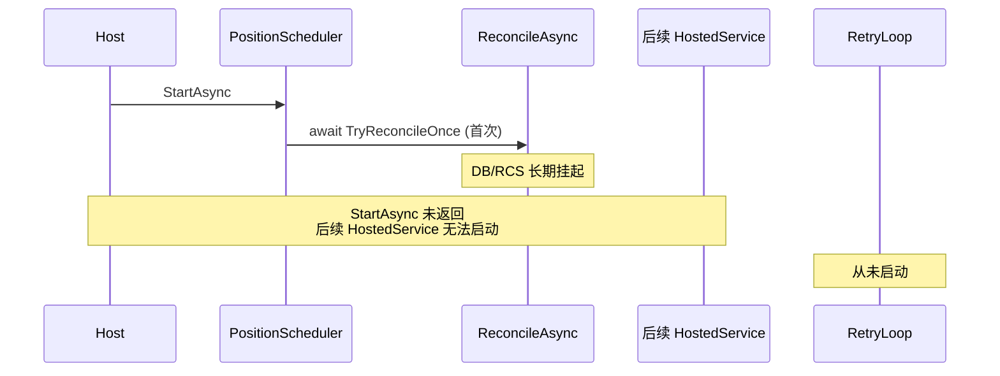
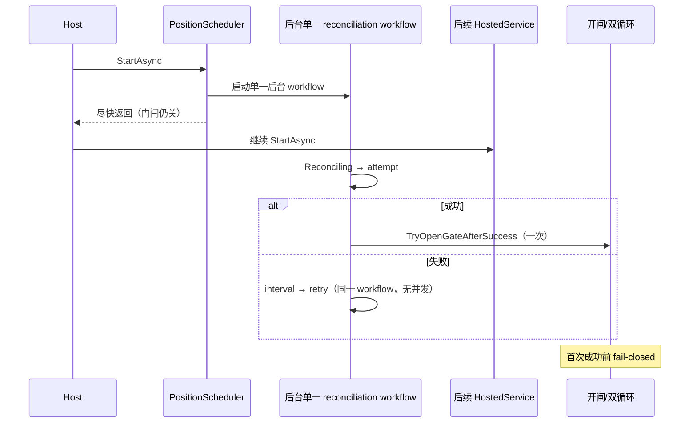

# P1-1：首次启动对账长期挂起阻塞 Host 启动

> 此内容由 AI 在分拣期间生成。

Type: bug
Priority: P1
Status: `closed`
Labels: `startup, reconciliation, hosted-service, lifecycle, reliability, closed`
Feature: `p1-1-startup-reconcile-nonblocking`

## 问题陈述

`PositionScheduler.StartAsync`（`IHostedService`）在启用调度器时**同步 await** 首次 `TryReconcileOnceAsync` → `ReconcileAsync`。若 DB / RCS / 下游查询长期挂起（或忽略 `CancellationToken`），`StartAsync` 不返回，Generic Host 按注册顺序串行启动后续 HostedService，导致：

- 其后注册的 `CncMachineSimulator` / `WaterMonitorService` / `InventorySchedulerService` / `PlcPollingService` 等无法启动；
- 对账失败后的后台 retry loop **根本不会启动**（`EnsureReconcileRetryLoopStarted` 仅在首次 attempt 返回 Failed 之后调用）；
- 注释声称「不阻塞其它 HostedService」，与实现不符。

P0-3 已保证 fail-closed / 单次开闸 / Stop 竞态；本 Issue 只解决**启动路径非阻塞**，不放宽门闩。

## 真实调用链（2026-08-05 源码核对）

```
IHost.StartAsync
  └─ 按 DI 注册顺序串行 IHostedService.StartAsync
       ├─ DeviceLogPurgeService
       ├─ RcsConnectionBootstrapper
       ├─ RcsCallbackHost
       ├─ RcsSimulator
       ├─ RcsTaskTracker
       ├─ PositionScheduler.StartAsync          ← 阻塞点
       │    ├─ [SchedulerEnabled=false] → 置 Succeeded / IsReconciled=true；return（不开循环）
       │    ├─ _cts = CreateLinkedTokenSource(startToken)
       │    ├─ 装载点位缓存（失败 Warning，可继续）
       │    ├─ await TryReconcileOnceAsync(_cts.Token)   ← 同步等待首次对账
       │    │    ├─ 状态 → Reconciling；清空 FailureReason；Attempt++
       │    │    └─ await ReconcileAsync(ct)
       │    │         └─ StartupReconcileCoordinator.RunAsync
       │    │              ├─ ① GetUnfinishedTaskIdsAsync(ct) + 绑定
       │    │              ├─ ①b QueryAsync(ct) 终态收口
       │    │              ├─ ② RollbackStaleReservations / PLC 门补落账
       │    │              └─ ③ PLC 账实核对（过程异常=全局失败）
       │    ├─ Succeeded → TryOpenGateAfterSuccess()；return
       │    ├─ Cancelled → return（不启 retry）
       │    └─ Failed → EnsureReconcileRetryLoopStarted()  # Task.Run(ReconcileRetryLoopAsync)
       ├─ CncMachineSimulator          ← 须等 PositionScheduler.StartAsync 返回
       ├─ WaterMonitorService
       ├─ InventorySchedulerService
       └─ PlcPollingService
```

| # | 核对项 | 结论 | 证据 |
|---|--------|------|------|
| 1 | `StartAsync` 是否同步 await 首次对账 | **是** | `await TryReconcileOnceAsync(_cts.Token)` |
| 2 | 后续 HostedService 是否等待返回 | **是** | Host 串行；其后多项 HostedService 注册在调度器之后 |
| 3 | 首次失败 vs 长期不完成 | **失败**：await 结束后启单一 retry loop；**挂起**：`StartAsync` 永不返回，retry loop 不启动 | `EnsureReconcileRetryLoopStarted` 仅 Failed 分支 |
| 4 | CT 是否传到生产调用方 | **调度器内阶段均传 ct**；EF `ToListAsync(ct)`；RCS `SendAsync` 链 ct + `RequestTimeoutMs` | 协调器 / 各 Phase / Store / Client |
| 5 | 下游忽略 CT 时 Stop/shutdown | **残余风险**：`StopAsync` 取消生命周期 CTS 并 `WhenAny(..., 3s)` 等待 loop/dispatch/**retry**；**首次 attempt 挂在 StartAsync 调用栈内**，不在 `_reconcileRetryTask`；忽略 CT 时 Host.Start 与该栈可继续挂 | D4/D6 接受；本期不靠并发替代 attempt |
| 6 | 后台 retry 是否须等首次返回 | **是** | 首次未完成则到不了 `EnsureReconcileRetryLoopStarted` |
| 7 | 门闩 / 循环 / 事件 | 初始关闭；仅 `TryOpenGateAfterSuccess` 在 `_lifecycleLock` 内开闸并启双循环；`Reconciled` 锁外至多一次 | P0-3 契约保持 |
| 8 | Stop 与晚成功竞态 | **仍有效**：`EnterStopping` 先于取消；开闸检查 `_stopping` | 保持 |
| 9 | 其他启动入口调用 Reconcile | **否**（仅 `PositionScheduler` 启动路径） | 全仓检索 |
| 10 | Options 是否已有 reconcile 硬超时 | **无**；仅有 `ReconcileRetryIntervalMs`（失败重试间隔）与 RCS `RequestTimeoutMs`（单次 HTTP） | 本期不新增 timeout 配置 |

## 当前 / 目标时序

### 当前（缺陷）



### 目标（D1–D7）



## 风险与影响

| 风险 | 影响 | 缓解（本期） |
|------|------|--------------|
| 首次对账挂起阻塞 Host | 轮询/水位/盘点/机台模拟等后续服务迟迟不启；应用“假死”在启动阶段 | D1：StartAsync 不 await 首次完成 |
| 挂起时无 retry | 无法从瞬时故障恢复（因 retry 达不到） | D7：单一后台 workflow 统一重试 |
| 下游忽略 CT | workflow 自身可挂起；Stop 可能等到 Host 的 3s 上限仍有残留 Task | D4：不并发替代；不硬杀 Task；另开 Issue 若需硬超时 |
| 过早开闸 | 账实未核完即派工 | D2：成功前门闩关闭；P0-3 防御 |

## 已确认决策（D1–D8，2026-08-05 锁定）

本期默认采用「后台单工作流、无并发重试」。状态直接 `ready-for-agent`，不留 `needs-triage`。

| # | 决策 |
|---|------|
| **D1** | `StartAsync` 只启动**一个**后台 reconciliation workflow，然后尽快返回；**不得**等待首次对账完成。 |
| **D2** | Gate 初始保持关闭；首次对账成功前：`IsReconciled=false`；状态循环=0；派工循环=0；`Reconciled` 事件=0；所有 Dispatch 入口继续 fail-closed。 |
| **D3** | 后台 workflow 串行：`Reconciling → attempt → success open gate` 或 `Reconciling → failure → interval → retry`。同一时刻最多一个 Reconcile attempt；禁止因超时或重试重叠执行。 |
| **D4** | 本期**不**增加「硬超时后抛弃仍运行 Task」：下游忽略 CT 时允许 workflow 自身继续挂起；但不得阻塞 Host 启动线程或后续 HostedService；不启动并发替代 attempt；超时策略另开 Issue。 |
| **D5** | `StartAsync` 的启动 `CancellationToken` 只控制启动过程；后台生命周期使用 Scheduler 自有 CTS。若 StartAsync token **已取消**：必须不启动或立即进入 stopping，**不遗留**后台 reconciliation 任务。 |
| **D6** | `StopAsync`：首步进入 stopping；取消生命周期 CTS；首次 attempt 晚成功不得开闸；不得只启动一个业务循环；不重复触发事件。Stop 是否无限等待「不响应 CT 的外部调用」为残余风险，本期不通过并发 attempt 解决。 |
| **D7** | 首次失败与后续失败统一由**同一个**后台 workflow 重试；删除「首调同步 + 失败后另开 retry loop」双模型；保留 single-flight。 |
| **D8** | 现有状态 UI、Warning、失败原因清空、重试间隔配置与成功日志语义保持；不改外部协议；不加 ADR/PRD。 |

**ADR / PRD：** 不新建。属启动生命周期修复；契约仍以 §6.3 / P0-3 / 本 Issue 决策为准。

## RED 清单（第一组）

优先扩展既有启动测试；文件过大时新增 `PositionSchedulerNonBlockingStartupTests`。

使用真实 `PositionScheduler` + 手写 fake / 既有接缝；TCS 挂起；有界 `WaitAsync`；禁止用 `Sleep`/`Delay` 做调度断言。

1. 首次 Reconcile 被 TCS 挂起 → `await StartAsync()` 必须在完成前返回（当前同步 await → **RED**）。
2. StartAsync 返回时：`IsReconciled=false`；双循环=0；`Reconciled`=0。
3. StartAsync 返回后，后续 HostedService 可继续启动（最小 harness / 契约证明；不启完整 WPF Host）。
4. 挂起 attempt 后成功：只开闸一次；双循环各 1；事件=1。
5. 挂起期间 Stop，再释放成功：不开闸；双循环=0；事件=0。
6. 首次失败后：StartAsync 早已返回；后台按配置重试；同时最多一个 attempt。
7. 第一次失败、第二次挂起：不出现第三个并发 attempt。
8. 多次 `StartAsync`：后台 reconciliation workflow 至多一个；不因重复调用生成多个 retry loop。
9. StartAsync token 入口已取消：不留 reconciliation task；不开闸。
10. Reconciling：清空旧 FailureReason；保持 P0-3 契约。

## 验收标准

- [x] RED 1–10 在 GREEN 后全绿
- [x] `StartAsync` 在首次对账完成前返回；后续 HostedService 不被阻塞
- [x] 成功前 fail-closed（D2）；成功后单次开闸 / 双循环 / 事件（P0-3）
- [x] 单一后台 workflow；无并发 attempt（D3/D7）
- [x] Stop 后晚成功不开闸；无半开闸（D6）
- [x] 入口已取消不遗留后台任务（D5）
- [x] 不新增 reconcile 硬超时配置（D4）
- [x] 既有 P0-3 启动/停止/UI 状态测试不降断言
- [x] `dotnet test` 测试工程通过；`dotnet build CncLoader.sln` 0 警告 0 错误

## 非目标

- 不修改生产代码于本 RED 轮（本轮仅 Issue + RED）
- 不新增 timeout Options / 硬杀仍运行 Task
- 不改 RCS/PLC 协议、UI Surface、ADR/PRD
- 不引入新测试框架 / mock 包
- 不放宽 fail-closed
- 不 commit / push（除非维护者另行要求）

## 未验证项

- 真实 Generic Host 多 HostedService 集成
- 真 DB / RCS / PLC 挂起与忽略 CT
- 真实关机超时表现
- 硬超时策略（另开 Issue）
- 长期重试稳定性

## 已知风险

- 后台 workflow 挂起不再阻塞 Host 启动，但仍可能影响 `StopAsync` 等待（D4/D6）。
- 本期禁止并发替代 attempt；忽略 CT 的下游只能靠取消协作或未来硬超时 Issue。
- 无 hard timeout；挂起期间 Gate 始终关闭。

## 依赖

- P0-3 已关闭（fail-closed / 单次开闸 / Stop 竞态）
- P0-5 已关闭（软删路由保护，无直接代码依赖）
- 无父 PRD

## 阻塞项

- 无 — 决策已锁定；可立即 RED → GREEN

## Agent 简报

**类别：** bug  
**摘要：** 使 `PositionScheduler` 启动对账改为后台单一 workflow，`StartAsync` 尽快返回且保持 fail-closed。

**当前行为：**
- `StartAsync` 同步 await 首次对账；长期挂起时阻塞 Host 串行启动链。
- 首次未返回则 retry loop 不启动。
- 失败路径已有单一 retry loop与 P0-3 门闩；成功/停止竞态保护已存在。

**期望行为：**
- `StartAsync` 启动至多一个后台 reconciliation workflow 后返回（D1/D7）。
- 成功前门闩关闭、双循环与 `Reconciled` 均为 0；Dispatch fail-closed（D2）。
- workflow 内串行 attempt + 间隔重试；无并发重叠（D3）。
- 不引入硬超时抛弃 Task（D4）；Stop 后晚成功不开闸（D6）。
- 启动 token 已取消则不遗留后台任务（D5）。
- UI/日志/重试间隔语义保持（D8）。

**关键接口：**
- `PositionScheduler.StartAsync` / `StopAsync` / `TryOpenGateAfterSuccess`
- `TryReconcileOnceAsync` / 既有 retry 循环（应变为单一 workflow，消除双模型）
- `IPositionScheduler` 只读状态与 `Reconciled` / `ReconciliationStateChanged`
- `RcsOptions.ReconcileRetryIntervalMs`（保持；不新增硬超时）
- 测试接缝：`DelayOverride`、`BeforeOpenGateClaim`、`EnterStopping`、循环/事件/attempt 计数

**验收标准：**
- [x] 专项非阻塞启动测试（TCS）全绿
- [x] 既有 `PositionSchedulerStartup` / P0-3 测试不降级且通过
- [x] 全量 `CncLoader.Core.Tests` 通过
- [x] `dotnet build CncLoader.sln` 0 警告 0 错误

**范围外：**
- 硬超时抛弃 Task、并发替代 attempt、ADR/PRD、UI 改版、协议变更

**实现前必读：**
- 本 Issue「已确认决策 D1–D8」
- `docs/客户端开发文档.md` §6.3 启动对账原则
- P0-3 Issue（fail-closed / 单次开闸 / Stop 竞态）勿回归

## Comments

> 此内容由 AI 在分拣期间生成。

### 决策锁定（2026-08-05）

瑞小米指定本轮一次完成：源码审查、Issue 创建、D1–D8 锁定、第一组 RED；生产代码零修改；不 commit/push。

状态：直接 `ready-for-agent`。

### RED 证据（2026-08-05）

> 此内容由 AI 在分拣期间生成。

**状态：** 保持 `ready-for-agent`（本轮仅 RED，未进入 GREEN，未关闭）。

**新增测试：** `tests/CncLoader.Core.Tests/State/PositionSchedulerNonBlockingStartupTests.cs`（10 项）

| # | 测试 | 结果 | 失败原因 |
|---|------|------|----------|
| 1 | `StartAsync_首次对账挂起时_必须在Reconcile完成前返回` | **RED** | `startTask.WaitAsync(2s)` → `TimeoutException`（同步 await 首次对账） |
| 2 | `StartAsync_返回时_门闩关闭且双循环与事件均为零` | **RED** | 同上 |
| 3 | `StartAsync_返回后_后续HostedService可继续启动` | **RED** | 同上；probe 无法在挂起期间启动 |
| 4 | `挂起attempt后成功_只开闸一次且双循环与事件各一次` | **RED** | StartAsync 未提前返回 |
| 5 | `挂起期间Stop再释放成功_不开闸且循环与事件为零` | **RED** | StartAsync 未提前返回，无法先 Stop |
| 6 | `首次失败后_StartAsync早已返回且后台串行重试` | **RED** | 首次 attempt 挂起时 StartAsync 不返回 |
| 7 | `第一次失败第二次挂起_不出现第三个并发attempt` | PASS | 既有 Failed→retry 单飞行仍成立 |
| 8 | `多次StartAsync_后台对账workflow至多一个` | **RED** | StartAsync 挂起不返回 |
| 9 | `StartAsync_入口token已取消_不留对账任务且不开闸` | **RED** | `TotalAttemptEntries` 期望 0 实际 1（仍进入对账） |
| 10 | `WaitingForRetry进入Reconciling_必须清空失败原因_且StartAsync不阻塞` | PASS | P0-3 清空契约保持 |

**命令结果：**

1. 专项（含既有 ReconciliationStartup）：失败 8 / 通过 16 / 总计 24  
2. 全量 `CncLoader.Core.Tests`：失败 8 / 通过 **399** / 总计 407（基线 397 + 本轮 10；既有 397 全绿）  
3. `dotnet build CncLoader.sln`：0 警告 0 错误  
4. `git diff --check -- tests .scratch/p1-1-startup-reconcile-nonblocking`：干净  

**生产代码：** 零修改。

### GREEN、最终回归与验收关闭（2026-08-05）

> 此内容由 AI 在分拣期间生成。

**状态：** `ready-for-agent` → **`closed`**

**实现摘要：**
- `PositionScheduler.StartAsync`：入口校验启动 token；装载点位后原子创建**唯一** `_reconcileWorkflowTask`（`Task.Run` → `ReconcileWorkflowAsync`），立即返回。
- 生命周期使用自有 `CancellationTokenSource`（不链接启动 token）。
- 删除「首调同步 + EnsureReconcileRetryLoopStarted」双模型；`ReconcileRetryLoopStartCount` 语义改为统一 workflow 启动次数（0/1）。
- `StopAsync` 观察 `_reconcileWorkflowTask`；开闸仍经 `_lifecycleLock` / `_stopping` 线性化。

**静态审查：**
1. 生产仅一处 workflow 创建点  
2. `ReconcileAsync` 仍经 Coordinator  
3. 失败不开 Gate  
4. retry 串行  
5. StartAsync 不 await 首次 attempt  
6. workflow Task 有字段并由 Stop 观察  
7. Start token ≠ lifecycle token  
8. Stop/开闸仍 `_lifecycleLock`  
9. 无测试 hook 进生产路径  
10. 无新增 timeout/依赖/配置  

**回归：**

| 命令 | 结果 |
|------|------|
| 专项 NonBlocking + ReconciliationStartup + Reconciliation | **48/48 PASS** |
| Core 全量 | **407/407 PASS** |
| `dotnet test CncLoader.sln` | **407/407 PASS** |
| `dotnet build CncLoader.sln` | **0 warning / 0 error** |
| `git diff --check -- src tests .scratch/p1-1-startup-reconcile-nonblocking` | 干净 |

**计数契约：** workflow ≤1；并发 attempt ≤1；成功后 State/Dispatch loop =1；`Reconciled` =1。

**未 commit / 未 push。**
