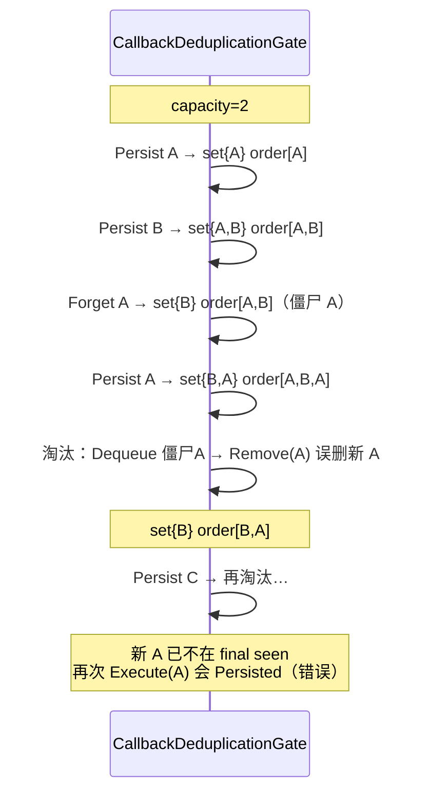

# P1-2：ForgetTask 僵尸顺序项导致新 final seen 提前淘汰

> 此内容由 AI 在分拣期间生成。

Type: bug
Priority: P1
Status: `closed`
Labels: `callback, idempotency, deduplication, memory, reliability, closed`
Feature: `p1-2-callback-final-seen-order`

## 问题陈述

`CallbackDeduplicationGate.ForgetTask` 只从 `_finalSeen`（`HashSet`）删除 `push:{taskId}:*` / `scan:{taskId}:*`，**不**从 `_finalSeenOrder`（`Queue`）删除对应顺序项。同 key 在 redo/redispatch 后再次 Persisted 时重新入队；容量淘汰 `Dequeue` 到旧僵尸项时会对**同名字面 key** 执行 `_finalSeen.Remove`，误删**重新提交的新 live 项**。

后果：本应 Duplicate 的终态回调被当成新 leader 再次持久化；或在容量压力下 live 集合与淘汰顺序不一致。  
`findings.md` / `AGENTS.md` 旧述「不影响正确性」已被本 Issue 证伪，以本 Issue 为准。

## 真实调用链（2026-08-05 源码核对）

```
RcsTaskService.RedoAsync / RedispatchAsync / AutoRedispatchAsync
  └─ result.Success → IRcsCallbackProcessor.ForgetTask(taskId)
       └─ RcsCallbackProcessor.ForgetTask
            └─ CallbackDeduplicationGate.ForgetTask
                 ├─ lock (_gateLock)
                 ├─ 扫描 _finalSeen 中 push:{id}:* / scan:{id}:*
                 └─ 仅 HashSet.Remove；Queue 不动（僵尸）

同 taskId 回调再次到达 → ExecuteAsync → Persist 成功
  └─ CommitFinalSeen_NoLock
       ├─ _finalSeen.Add(key)
       ├─ _finalSeenOrder.Enqueue(key)   // 新项 + 旧僵尸并存
       └─ while Count > capacity:
            _finalSeen.Remove(Dequeue()) // 僵尸 Dequeue 可误删新 live
```

| # | 核对项 | 结论 |
|---|--------|------|
| 1 | `_finalSeen` / `_finalSeenOrder` / 锁 | `HashSet<string>` + `Queue<string>` + `_gateLock` |
| 2 | `CommitFinalSeen_NoLock` | Add → Enqueue → while Count>cap Dequeue+Remove |
| 3 | Forget namespace | **仅** `push:` / `scan:` 前缀；**不碰** `warn:` |
| 4 | Forget 与 in-flight | **不**取消 / 不碰 `_inFlight` |
| 5 | 同 taskId 多 errorCode | Forget 删除该 task 全部 push/scan keys |
| 6 | 生产容量 | 默认 **4000**（本轮测试接缝可注入小容量，默认不变） |
| 7 | 测试接缝 | 已有 `ExecuteAsync`；本轮允许 `internal` 容量 ctor + 计数探针 |
| 8 | 生产调用方 | `RcsTaskService`：Redo / Redispatch / AutoRedispatch 成功后 |
| 9 | single-flight 回归 | 不得破坏 leader/follower、失败释放、follower 取消 |

## 错误时序



## 最小复现（容量=2）

1. Persist `push:A:0`
2. Persist `push:B:0`
3. `ForgetTask("A")`
4. 再 Persist `push:A:0`
5. Persist `push:C:0`
6. 再 Execute `push:A:0`

| 期望（GREEN） | 当前（RED） |
|---------------|-------------|
| B 作为最老 live 被淘汰 | 旧 Queue A 先误删新 A |
| 新 A 仍在 final seen | 新 A 已不在 set |
| A → **Duplicate**（persistCalls=0） | A → **Persisted**（persistCalls=1） |
| B → Persisted（可再处理） | B → Persisted（偶合正确） |

## 已确认决策（D1–D6，2026-08-05 锁定）

| # | 决策 |
|---|------|
| **D1** | final seen 的集合与顺序结构必须一致；Forget 后不得残留可影响未来同 key 的旧顺序项。 |
| **D2** | 同 key Forget 后重新 Persisted，视为新的最新成功项；淘汰顺序从重新提交时重新计算。 |
| **D3** | 容量仍为 4000；仅约束 final seen，不约束 in-flight。 |
| **D4** | Forget 只处理 task callback namespace（push/scan）；warn 不按 taskId Forget，保持原语义。 |
| **D5** | Forget 不取消 in-flight leader/follower；若正在持久化，完成后仍按结果提交或释放。 |
| **D6** | 本期仅进程内去重；不做 Inbox、DB 唯一约束、TTL、持久化或协议变化。 |

### 推荐 GREEN 数据结构（本轮不实现，写入约束）

- `LinkedList<string>` 保存 live 顺序；
- `Dictionary<string, LinkedListNode<string>>` 保存 final seen 与节点；
- Commit：存在即 Duplicate；不存在则尾插；
- Forget：从 Dictionary 和 LinkedList **同时**删除；
- Evict：从头删除 live 节点；
- 所有操作继续由同一把 `_gateLock` 保护。

**禁止**会无限积累 stale generation entry 的方案。若使用 generation Queue，必须同时证明 stale queue 有界或可压缩。

**ADR / PRD：** 不新建。

## RED 清单

文件：`tests/CncLoader.Core.Tests/Communication/CallbackDeduplicationGateForgetTests.cs`（或扩展既有 Gate 测试）。

1. 最小僵尸复现 capacity=2：A/B/ForgetA/A/C 后 A=Duplicate，B=Persisted  
2. push namespace  
3. scan namespace  
4. 同 taskId 多 errorCode：Forget 清全部 push/scan；重提后按新顺序  
5. 不同 taskId：Forget A 不影响 B  
6. warn：ForgetTask 不删 warn final seen  
7. in-flight：Forget 不取消 leader/follower；成功仍进 final seen；无第二并发持久化  
8. 重复 Forget：幂等、不抛、不影响他 key  
9. Forget→Persist 循环：不得因僵尸提前淘汰最新 key；order/live 探针有界且一致（GREEN 后）  
10. 容量 4000 回归：第 4001 淘汰最老 live  
11. single-flight 回归：成功 Duplicate / 失败释放 / follower 等待与取消 — 不降既有断言  

## 验收标准

- [x] RED 1–11 在 GREEN 后全绿
- [x] 最小复现：Forget 后重提的 key 不被旧顺序项误删
- [x] push/scan 覆盖；warn 不受 ForgetTask 影响
- [x] in-flight 不取消；单飞行不回归
- [x] 容量默认 4000；顺序结构无僵尸无界增长
- [x] 既有 `CallbackDeduplicationGate` / ProcessorDeduplication / HostAck 不降断言
- [x] Core 全量 + `dotnet build CncLoader.sln` 0 警告 0 错误

## 非目标

- 本 RED 轮不修复 Forget/淘汰逻辑（仅允许容量 ctor + 探针接缝）
- 不改 Processor/Host ACK、协议、HTTP
- 不引入 Inbox/TTL/DB 唯一约束
- 不处理 follower 日志放大
- 不 commit/push

## 未验证项

- 真高并发 / 长时间 Forget·重放
- 进程重启后 final seen 丢失
- 真 RCS
- 不确定提交

## 已知风险

- 进程内去重、容量 4000、重启丢失
- 不确定提交（DB 已写客户端异常）保持原样
- 本期不做 Inbox/TTL

## 依赖

- P0-4 已关闭（single-flight / 成功后 final seen）
- P1-1 已关闭（无直接代码依赖）

## 阻塞项

- 无 — 决策已锁定；可 RED → GREEN

## Agent 简报

**类别：** bug  
**摘要：** 使 ForgetTask 与 final seen 顺序结构保持一致，避免僵尸顺序项误删重新提交的 live key。

**当前行为：** Forget 只删 HashSet；Queue 留僵尸；淘汰时可能 Remove 新 live key。

**期望行为：** D1–D6；推荐 LinkedList+Dictionary 节点映射；容量 4000；warn/in-flight 语义不变。

**关键接口：**
- `CallbackDeduplicationGate.ForgetTask` / `CommitFinalSeen_*` / `ExecuteAsync`
- `RcsCallbackProcessor.ForgetTask`（委托）
- `RcsTaskService` Redo/Redispatch/AutoRedispatch 成功路径

**验收标准：**
- [x] Forget 专项测试全绿（含最小 A/B/C 复现）
- [x] 既有 Gate / ProcessorDeduplication / HostAck 通过
- [x] Core 全量 + build 0/0

**范围外：** Inbox、TTL、协议、ACK、follower 日志放大

**实现前必读：** 本 Issue D1–D6 + 推荐数据结构；P0-4 single-flight 契约勿回归

## Comments

> 此内容由 AI 在分拣期间生成。

### 决策锁定（2026-08-05）

瑞小米锁定 D1–D6；本轮源码确认 + Issue + RED；生产 Forget/淘汰逻辑零修改（仅允许容量 ctor + 探针）；不 commit/push。

状态：直接 `ready-for-agent`。

### RED 证据（2026-08-05）

> 此内容由 AI 在分拣期间生成。

**状态：** 保持 `ready-for-agent`（本轮仅 RED，未进入 GREEN，未关闭）。

**接缝（非行为修复）：** `CallbackDeduplicationGate` 增加默认 4000 的容量 ctor + `ProbeFinalSeenCount` / `ProbeFinalSeenOrderCount`；Forget/淘汰逻辑未改。

**新增测试：** `CallbackDeduplicationGateForgetTests.cs`（11 项）

| # | 测试 | 结果 |
|---|------|------|
| 1 | 最小僵尸复现 capacity=2 | **RED**：A 期望 Duplicate，实际 Persisted（persistCalls=1） |
| 2 | push namespace | **RED**：同上 |
| 3 | scan namespace | **RED**：同上 |
| 4 | 同 taskId 多 errorCode | PASS（Forget 后可全部重提） |
| 5 | 不同 taskId | PASS |
| 6 | warn 不受影响 | PASS |
| 7 | in-flight 不取消 | PASS |
| 8 | 重复 Forget 幂等 | PASS |
| 9 | Forget→Persist 循环 + 有界 | **RED**：最新 A 被误淘汰；order=2≠live=1 |
| 10 | 容量 4000 回归 | PASS |
| 11 | single-flight 回归 | PASS |

**最小复现实际结果（capacity=2）：** Persist A/B → Forget A → Persist A → Persist C → 再 Execute A = **Persisted**（错误）；B = Persisted（最老 live 淘汰，偶合正确）。

**命令：**
1. Gate Forget+既有 Gate：失败 **4** / 通过 **10** / 总计 14  
2. ProcessorDeduplication + HostAck：**27/27 PASS**  
3. Core 全量：失败 **4** / 通过 **414** / 总计 **418**（基线 407 全绿）  
4. build：见本轮验证  
5. diff-check：干净  

**Forget/淘汰生产逻辑：** 零修改（仅容量 ctor + 探针）。

### GREEN、最终回归与验收关闭（2026-08-05）

> 此内容由 AI 在分拣期间生成。

**状态：** `ready-for-agent` → **`closed`**

**实现摘要：**
- `_finalSeen`：`Dictionary<string, LinkedListNode<string>>`
- `_finalSeenOrder`：`LinkedList<string>`（仅 live，无僵尸）
- `CommitFinalSeen_NoLock`：已存在则保持原节点/FIFO；新 key `AddLast`；超容量删 `First` live node
- `ForgetTask`：先收集再 `RemoveFinalSeen_NoLock`（Dictionary + LinkedList 同时删）
- in-flight / warn / 默认容量 4000 / Processor·Host 未改

**静态核对：** 生产已无 `Queue`；Forget 双删；Duplicate 不造第二节点；淘汰 First live；同锁；探针 internal。

**最小复现（cap=2）GREEN：** A→B→ForgetA→A→C 后 A=**Duplicate**，B=**Persisted**；live count == order count ≤ 2。

**回归：**

| 命令 | 结果 |
|------|------|
| Forget + Gate | **14/14 PASS** |
| ProcessorDeduplication + HostAck + Gate | **41/41 PASS** |
| Core | **418/418 PASS** |
| Solution | **418/418 PASS** |
| `dotnet build CncLoader.sln` | **0 warning / 0 error** |
| `git diff --check` | 干净 |

**未 commit / 未 push。**
