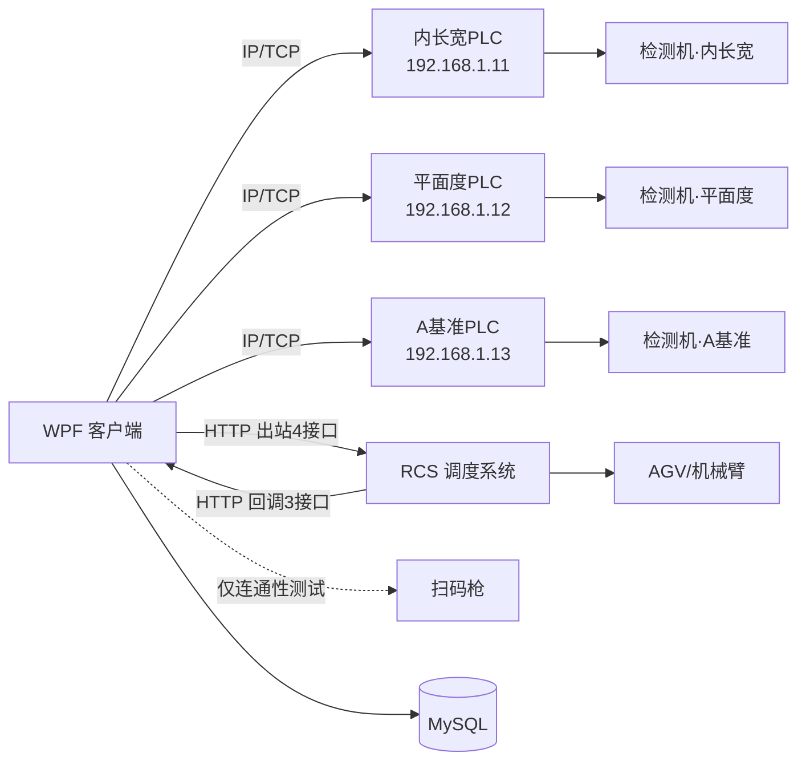
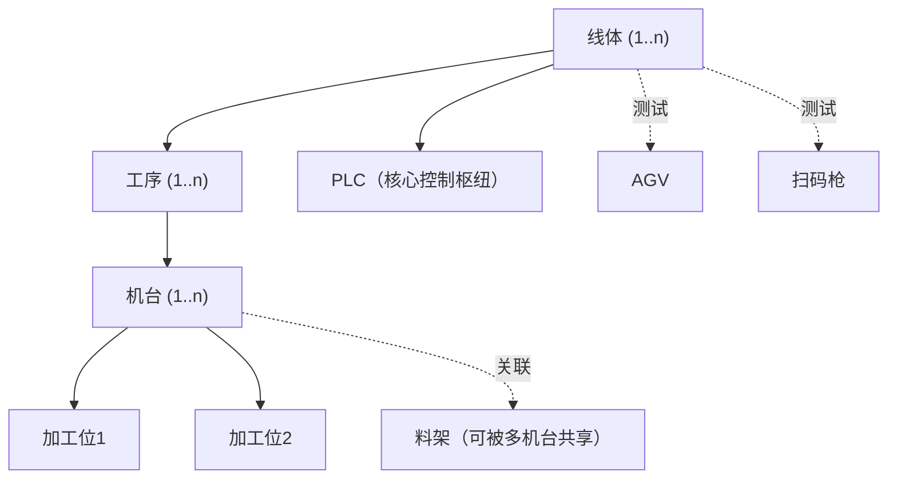
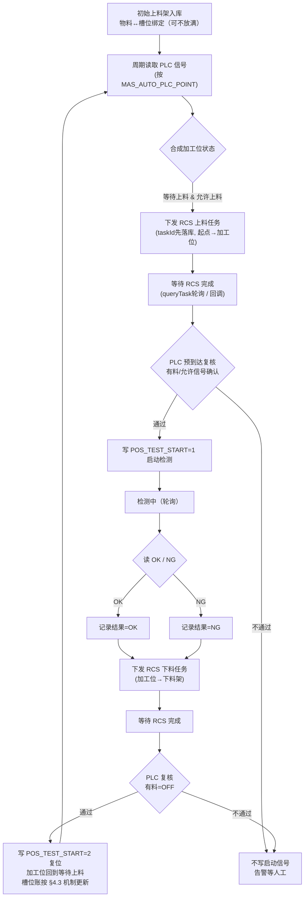

# 智造云枢 LineOS — 开发文档

> 本文是**唯一的开发方案**，已合并早期的标准化参考方案与原始需求方案：对二者做缺漏审查、逻辑调整与补齐，按当前约束（WPF / .NET 8 / MySQL / 仅与 PLC 通信）重写。数据库设计见 `数据库文档.md` 与 `sql/cnc_schema.sql`，UI 规范见 `UI设计文档.md`，PLC 信号契约见 `测试机信号表.md`，**RCS 接口契约见本文 §12（已合并，无需外部文档）**。本文与其他文档冲突处，**以本文为准**。
>
> **【v2 标记约定】** 本版按第四阶段业务变更（RCS 接管料架/托盘搬运调度）更新。`【v2 新增】`= 新增内容；`【v2 变更】`= 修改内容；原方案内容**不删除**，以 `> ⚠️【原方案·已由 v2 业务变更取代，保留备查】` 引用块注释保留（未来无 RCS 的项目可能复用）。

---

## 0. 关键修订（相对既有文档的调整）

落地前必须知道的六点变更，原因写在每条后面：

1. **数据库改为 MySQL**。既有文档用 Oracle 类型（`VARCHAR2`、`NUMBER(38,0)`、`sysdate`）。本文所有 DDL 已 MySQL 化，逻辑表名/字段名沿用原 schema 以便迁移对照。
2. **客户端仅与 PLC 通信，不直连机台**。既有文档存在"客户端直接 OPC/Modbus 读机台状态、FTP 直连机台取报告/传程式"的设计——这违反新约束。机台的所有状态、检测结果、上下料许可、启动控制，**全部经 PLC 信号**完成，信号定义见 `测试机信号表.md`。
3. **机台为双加工位、可并行**。每台机台固定 2 个独立加工位（信号表中的"工位1/工位2"），一位加工时另一位可并行上下料。调度与点位映射按"加工位"而非"机台"为最小单元。
4. **料架与物料追踪重构**。原模型无法表达"一架两用"与"槽位级物料定位"，本文将料架抽为独立主体 + 绑定关系 + 槽位表（见 §5）。【v2 补充】槽位表定位由"调度分配依据"调整为"物料位置账目"（见 §4.3、第 5 条）。
5. **【v2 新增】AGV 升级为 RCS 正式对接，搬运调度权移交**。上位机不再管理初始料架槽位分配、不再直接控制搬运起止执行；改为向 RCS 系统下发"起点→终点"任务（HTTP/JSON，4 出站接口 + 3 回调接口），料架/托盘（双托盘、抓取顺序不定）的取放调度由 RCS 负责。上位机职责收敛为：**任务下发、状态跟踪、PLC 复核、位置账目维护**。接口细节见 `RCS对接方案_v3.md`。
6. **【v2.4 实现】派工决策收敛到单一调度消费者 + 槽位原子预占**。工位状态机不再各自查料/选位/下发，只投递"上料/下料请求"，由一个单线程消费者串行完成"查料源→选槽/选位→原子预占→下发"；料架预占用带条件的原子 UPDATE 兜底外部写入者。彻底消除"料源紧张时多工位重复派工 / 抢同一空工位"的竞态，抢不到料 = 保持 WAIT_LOAD 等待（不告警）。方案见 §6.4。

> **范围决定**：原方案的**报告文件采集、程式文件上传、加工数据写入**均为客户端直连机台的文件级操作，与"仅与 PLC 通信"互斥。这些功能**本期不做**（详见 §9），相关表结构保留但不实现。

---

## 1. 技术架构与运行环境

| 项 | 选型 |
| --- | --- |
| 应用类型 | WPF 桌面应用程序（单机/工位机部署） |
| 目标框架 | **.NET 8**（`net8.0-windows`，类库 `net8.0`；SDK 8.0.x） |
| UI 框架 | WPF（`UseWPF`），UI 模式 MVVM，`CommunityToolkit.Mvvm` 8.4.x |
| UI 控件库 | **WPF-UI 4.3.x**（FluentWindow 外壳 + NavigationView 导航 + 明暗主题）+ **HandyControl 3.5.x**（业务控件），职责切分见 §1.4 |
| 设计方向 | **现代工业系统 / HMI 仪表盘**（深色优先、可切浅色；非传统 ERP、非消费级 Fluent）。完整规范见 `UI设计文档.md`；**`prototype/index.html` 为 UI 唯一权威基准，后续各页开发一律以原型为准**（如 PLC 页 = PLC 列表 + 读/写/点位映射三 tab） |
| UI 结构 | `FluentWindow` 外壳 + `NavigationView` 分组导航 + 内容区页面切换；主题/令牌以自研 `ResourceDictionary` 覆盖两库默认配色；`Inter`(界面)/`JetBrains Mono`(数据) 字体嵌入打包。**按新设计重建**，旧自研 `Theme`/`ShellWindow` 待替换（见 §1.4） |
| 宿主 / DI | `Microsoft.Extensions.Hosting` Generic Host；各层用 `ServiceCollection` 扩展方法注册（`*ServiceCollectionExtensions`），配置走 `appsettings.json` |
| 数据库 | MySQL（8.x），ORM 用 EF Core + `Pomelo.EntityFrameworkCore.MySql` 8.0.x |
| 与 PLC 通信 | **协议可切换**：Modbus TCP（`NModbus` 3.x，默认）与欧姆龙 **FINS/UDP**（手写，端口 9600）；按信号表寄存器（D 区）+ IO 位读写，协议见 §3。每台 PLC 的协议存于 `PLC_READ_WAY` |
| 与机台 | **不直连**，一切经 PLC |
| 与 RCS | **【v2 变更】HTTP/JSON 正式对接**：出站 4 接口（transitTask / excuteTask / cancelTask / queryTask），入站 3 回调（pushTaskStatus / scanTaskStatus / warnCallback)。**【v2.1 已确认】搬运任务完成也经 pushTaskStatus（3.6）推送**——任务跟踪以**回调为主通道，queryTask 轮询兜底**；transitTask 的 taskType 固定填 `move`（RCS 确认为预留字段） |
| 内嵌 HTTP 服务端 | **【v2 新增】** 自宿主 Kestrel 监听 RCS 回调（`/externalApi/*` 三路由）；监听 IP/端口配置化，需在部署文档写明并开通防火墙 |
| 扫码枪 | 仅连通性测试（§5.6）；物料绑定第二入口可选 identifyQR（§5.7） |

> ⚠️【原方案·已由 v2 业务变更取代，保留备查】AGV / 扫码枪：仅连通性测试，不纳入自动调度闭环（§7、§8）。

### 1.1 通信边界（强约束）

**每台机台对应一台独立 PLC，IP 各不相同**；客户端按机台分别与各自 PLC 建 IP/TCP 连接。



【v2 变更】上位机与 AGV 车体/机械臂**不直连**，一切搬运与抓取经 RCS 调度系统。

> ⚠️【原方案·已由 v2 业务变更取代，保留备查】原图中 `Client -. 仅连通性测试 .-> AGV["AGV"]`。

要点：
- **一机一 PLC**：三台机台检测项目不同（内长宽 / 平面度 / A基准），各自配一台 PLC、IP 不同。客户端同时维护多条 PLC 连接，互相独立。
- 客户端与机台之间**不存在任何直接连接**。"机台是否允许上料""检测 OK/NG""门开关/机台安全""启动测试"等全部是 PLC 信号。
- 数据模型：机台表 `PLC_ID` 绑定其专属 PLC（`MAS_AUTO_WORKLINE_PLC` 一行=一台 PLC、IP 唯一）；点位映射 `MAS_AUTO_PLC_POINT.PLC_ID` 指向同一台 PLC。

### 1.2 工程分层（已落地，6 个项目）

```
CncLoader.sln
├─ CncLoader.App           # WinExe 启动、Generic Host、DI 组装、appsettings.json
├─ CncLoader.UI            # Views + ViewModels + 主题资源 + Converters（视觉层按新设计基于 WPF-UI/HandyControl 重建）
├─ CncLoader.Core          # 领域：Abstractions/Signals/State/Polling/Plc（纯逻辑，无外部包）
├─ CncLoader.Communication # PLC 适配器(NModbus / 欧姆龙 FINS)、Polling 轮询、Simulation 模拟器(Modbus/FINS)、通信日志
│                          # 【v2 新增】Rcs/ 子模块：RcsClient(出站4接口)、RcsCallbackHost(内嵌Kestrel回调监听)、RcsSimulator(本机联调模拟器)、报文流水
├─ CncLoader.Data          # EF Core(Pomelo) 仓储 + Entities
└─ CncLoader.Common        # 配置/日志/Security(加解密)/Identity/Results 通用件
```

依赖方向：`App` 引用全部；`UI`/`Core`/`Communication`/`Data` 各自仅引用 `Core` + `Common`，业务层不依赖通信/数据实现细节。`Communication` 内置 `Simulation` 模拟器，无设备时也能联调 UI 与状态机。

设计要点：
- 通信统一走适配器接口（§3.3），业务层不拼协议字节。
- 所有写 PLC 的操作先落库（操作流水）再发起，便于追溯。
- 敏感信息（AGV/扫码枪/数据库口令）加密存储，不入日志、不入代码。

### 1.3 工程纪律（编码要求）

落地编码统一遵守，避免脚本式实现：

1. **状态值一律用枚举/字典**：机台状态、信号语义（`SIGNAL_KEY`）、ON/OFF 约定、料架角色等不允许散落魔法值。
2. **外部通信只在适配器层**：PLC、AGV、扫码枪的协议拼装、连接、心跳、超时、重试全部封装在 `CncLoader.Communication`，业务服务不直接发协议。
3. **先落库再执行外部调用**：所有写 PLC / 派工等会驱动现场动作的操作，先写操作流水再下发，并对重复下发做幂等保护。
4. **关键业务表保留审计字段**：创建人、创建时间、更新人、更新时间、状态（`STATE`），便于追溯与回溯。
5. **异常结构化**：错误码 + 错误描述 + 处理建议 + 是否可重试，对应 §8 的异常处理与告警。
6. **全链路留痕**：PLC 通信、料架/槽位变更、写操作、告警与人工干预均落库可追溯，这是与脚本式自动化的关键区别。

### 1.4 UI 控件库集成（WPF-UI + HandyControl，职责切分）

引入两套控件库，**严格切分职责、不让其主题互相覆盖**。NuGet 包加在 `CncLoader.UI`（经项目引用传递给 `App`）：`WPF-UI` 4.3.x、`HandyControl` 3.5.x。设计方向为**现代工业 / HMI**（详见 `UI设计文档.md`）。

**职责边界（谁负责什么）**

| 库 | 只用于 | 明确不用 |
| --- | --- | --- |
| WPF-UI | 窗口外壳/导航/主题：`FluentWindow` + `TitleBar`（关闭 Mica，用实色工业平面感）、`NavigationView` 分组导航、`ApplicationThemeManager` 明暗切换、`ui:Card`/`SymbolIcon` | — |
| HandyControl | 业务控件：`Growl`(报警/操作提示)、`Dialog`/`Drawer`、`Pagination`、`NumericUpDown`、增强 `DataGrid`/`ComboBox`/日期时间控件 | **不用**其窗口外壳与导航 |
| 自研令牌 `ResourceDictionary` | 颜色与排版的**唯一来源**（design source of truth），覆盖两库默认配色/圆角/字体，落到"现代工业"基调 | — |

**资源字典加载顺序（强约束，`App.xaml`）**：后加载者覆盖先加载者的隐式样式，故自研令牌必须**最后**加载：

```
1. WPF-UI       ControlsDictionary + ThemesDictionary
2. HandyControl SkinDefault + Theme
3. 自研          Tokens.xaml → Styles.xaml   ← 最后，覆盖两库配色/圆角/字体
```

要点：
- 两库都会**全局重定义原生控件隐式样式**；统一以 HandyControl 作业务控件基线，自研 `Styles` 对需覆盖的控件用 `x:Key` 显式覆盖，WPF-UI 仅作用于外壳/导航作用域，避免三套主题抢同一批控件。
- 两库主色一律用自研令牌覆盖，不直接暴露库的默认强调色；导航用 WPF-UI `NavigationView`（替代旧自绘侧栏）。

**落地进度**

已完成（深色现代工业改造，整解决方案编译 0 错误、启动运行验证通过）：
- ✅ `App.xaml` 合并 HandyControl `SkinDark` + `Theme` + 自研令牌（令牌最后覆盖）。
- ✅ `Tokens.xaml` 重写为深色现代工业（保留全部 brush 键以兼容既有绑定），`Styles.xaml`/`PageTemplates.xaml` 浅色硬编码改令牌。
- ✅ **PLC 管理页按原型重做**：PLC 列表 + `读操作/写操作/点位映射` 三 tab；点位映射并入 PLC 页（`PlcViewModel` 组合 `PointMapping`），导航栏移除独立"点位映射"项。PLC 列表占比自适应（行高 36、随数量增长）。
- ✅ **表格/下拉框全局统一**为 HandyControl 深色基线（`DataGridCompact`/`FormCombo`/`FormInput` 改 `BasedOn`，移除旧浅色表格样式）。
- ✅ 标题栏品牌名前加仪表图标；窗口设全局浅色前景，详情页顶部标题改白。
- ✅ 报警与关键操作走 HandyControl `Growl`，弹窗确认改 HandyControl `MessageBox`（PLC / 点位映射）。
- ✅ 字体移除 Saira，界面 Inter + 数据 JetBrains Mono。

> ⚠️ 待落地（下一阶段，需运行可视化迭代）：
> 1. `ShellWindow` 改为 WPF-UI `FluentWindow` + `NavigationView`（NavigationView 基于 Page 类型导航，需把 ViewModel-first 路由适配为 Page 服务）；标题栏承载线体名 / PLC 在线 / 告警 / 心跳 / 主题切换。WPF-UI `ControlsDictionary` 随此阶段按外壳作用域引入。
> 2. 切换 NavigationView 后**删除**过时自研件：旧自绘外壳、`Converters/StringToGeometryConverter.cs`、`ShellViewModel` 内嵌 `Icons` 几何。
> 3. 按新原型把监控看板等页重建为更丰富的现代工业布局（双加工位卡 + KPI + 告警流）。
> 4. 保留 `ViewModels/*`、`Converters/PlcConverters.cs`、`UiServiceCollectionExtensions`（重建时按 `NavigationView` 调整导航注册）。

---

## 2. 业务模型与动态可配置性

### 2.1 三层结构 + 加工位 + 料架



- **物理现状（示例，非硬编码）**：1 线体 → 1 检测工序 → 3 机台（内长宽 / 平面度 / A基准），每机台 2 加工位。
- **软件要求**：线体、工序、机台数量与关联关系**全部由用户在界面动态增删配置**，不绑定示例数量。加工位数量随机台型号可配（当前型号固定为 2）。

### 2.2 可配置性原则

1. 任何层级（线体/工序/机台/加工位/料架）都是数据库记录，新增即生效，不改代码。
2. 机台与"PLC 信号点位"通过映射表绑定（§3.2、§4.4），新增机台 = 新增机台记录 + 配置其点位映射，无需改协议代码。
3. 料架与机台是**多对多 + 角色**关系（上料/下料），支持一架两用（§5）。

---

## 3. 与 PLC 的通信与信号对接

这是客户端的**核心控制枢纽**。机台不可直连，所有交互在此发生。

### 3.1 信号契约来源

信号定义唯一来源是 `测试机信号表.md`。每台测试机含两组：

- **测试机输出**（客户端**读**）：门开关、机台安全、工位1/2 有料、工位1/2 允许上料、工位1/2 OK、工位1/2 NG。寄存器 D 区（如内长宽 `D1000`–`D1018`），约定 `1=ON`、`2=OFF`。
- **测试机输入**（客户端**写**，启动类）：工位1/2 测试启动。约定 `1=启动`、`2=关闭启动信号`。

地址样例（内长宽机）：

| 语义 | 方向 | 寄存器 | IO 位 | ON/启动 | OFF/关闭 |
| --- | --- | --- | --- | --- | --- |
| 工位1 允许上料 | 读 | D1006 | I0.3 | 1 | 2 |
| 工位1 OK | 读 | D1008 | I0.4 | 1 | 2 |
| 工位1 NG | 读 | D1010 | I0.5 | 1 | 2 |
| 工位1 测试启动 | 写 | D1100 | Q0.0 | 1 | 2 |

信号表中的寄存器地址与 ON/OFF 数值约定为**现场实际可用数据**，开发可直接据此读写。代码以寄存器（D 区）地址为读写主键，IO 位仅作界面展示。

### 3.2 信号 → 加工位 的绑定

为支持"动态增删机台"，不得把地址硬编码。引入**点位映射表** `MAS_AUTO_PLC_POINT`（DDL 见 §4.4），把"信号语义 + 机台 + 加工位"映射到具体寄存器：

- `PLC_ID`：该点位所属 PLC（即该机台专属 PLC）。同一机台所有点位的 `PLC_ID` 相同，等于机台表的 `PLC_ID`。
- `SIGNAL_KEY`：标准语义枚举（`DOOR` / `MACHINE_SAFE` / `POS_HAS_MAT` / `POS_ALLOW_LOAD` / `POS_OK` / `POS_NG` / `POS_TEST_START`）。
- `EQUIMENT_ID` + `POSITION_ID`：定位到具体机台的具体加工位（工位级语义带 `POSITION_ID`，机台级语义如门开关留空）。
- `REGISTER_ADDR` / `RW` / `ON_VALUE` / `OFF_VALUE` / `DATA_LEN`。

新增一台机台时：建 PLC 记录（IP）→ 建机台记录并填 `PLC_ID` → 建 2 个加工位 → 按信号表插入该机台 12 读 + 2 写共一组点位映射。零代码改动。

寄存器地址**以《测试机信号表》/库表数据为准**：各机台保持各自不同的 D 段（内长宽 `D1000–D1102` / 平面度 `D1200–D1302` / A基准 `D1400–D1502`），不做"各 PLC 从 D1000 重编址"的假设。`MAS_AUTO_PLC_POINT.REGISTER_ADDR` 即按此数据落库。IO 位地址因 PLC 独立、各机台自成体系、跨机台不连续，仅作展示。

### 3.3 PLC 适配器接口（多连接）

每台 PLC 一个独立连接实例，由 `PlcConnectionManager` 按 `PLC_ID` 管理多条连接，互不影响（一台断线只暂停该机台调度）。

```text
IPlcClient                                  // 单台 PLC 的连接
- Task ConnectAsync(endpoint)               // IP/TCP 建链
- Task<bool> IsConnected / Heartbeat()
- Task<int[]> ReadRegistersAsync(addr, len)
- Task WriteRegisterAsync(addr, value)
- event ConnectionStateChanged

PlcConnectionManager
- IPlcClient Get(plcId)                      // 按机台的 PLC_ID 取连接
- Task ConnectAllAsync() / DisconnectAllAsync()
- IReadOnlyDictionary<long,bool> ConnectionStates
```

要求：每条连接各自有状态、心跳、超时、重试、断线告警；读写全部记录设备通信流水（请求/响应/耗时/结果）。

信号表的 D 区寄存器 + ON/OFF 数值化约定对应基于寄存器的读写，地址与数值按信号表直接使用。适配器保持协议可替换，业务层不感知具体协议，当前实现两种：

- **Modbus TCP**（`NModbusPlcClient`，默认）：D 区 → 保持寄存器读写。
- **欧姆龙 FINS/UDP**（`OmronFinsPlcClient`，端口 9600）：D 区 → DM 区字读写（命令码 读 0x0101 / 写 0x0102）。节点寻址默认自动推导：目的节点=PLC IP 末段、源节点=本机 IP 末段、网络号/单元号=0（现场若节点号≠IP 末段需改为可配置）。FINS 走 UDP 无握手，故 `ConnectAsync` 会实际读一次 DM 探活，离线设备判为未连接，避免轮询被读超时拖垮。

### 3.4 机台状态判定（由信号合成）

客户端没有机台直读状态，需用 PLC 信号**合成**标准状态：

| 标准状态 | 判定条件（按加工位） |
| --- | --- |
| 等待上料 | `POS_ALLOW_LOAD=ON` 且 `POS_HAS_MAT=OFF` |
| 加工/检测中 | 已写 `POS_TEST_START` 且 `POS_HAS_MAT=ON`，未出 OK/NG |
| 完成-OK | `POS_OK=ON` |
| 完成-NG | `POS_NG=ON` |
| 不安全/报警 | `MACHINE_SAFE=OFF` 或 `DOOR=ON`（开门）|

两个加工位**独立判定、独立调度**，互不阻塞。

---

## 4. 数据模型（MySQL）

沿用原 schema 表名/字段名，类型 MySQL 化。映射约定：`VARCHAR2(n)`→`VARCHAR(n)`，`NUMBER(38,0)`→`BIGINT`，`CHAR(1)`→`CHAR(1)`，`DATE`→`DATETIME`，默认 `sysdate`→`CURRENT_TIMESTAMP`，主键 `ID1`→`BIGINT AUTO_INCREMENT`。

### 4.1 既有表（迁移保留）

下列表逻辑结构沿用原始 schema 定义（见 `数据库文档.md`、`sql/cnc_schema.sql`），仅类型 MySQL 化，**且按本文约束删除"直连机台"字段的实际用途**：

| 表 | 用途 | 本文调整 |
| --- | --- | --- |
| `MAS_AUTO_WORKLINECONFIGS` | 线体主表 | 保留 |
| `MAS_AUTO_WORKLINE_PLC` | PLC 配置 | **一机一 PLC**：一行=一台 PLC，`PLC_ID` 唯一、IP 各异；机台/点位据此关联 |
| `MAS_AUTO_WORKLINE_AGV` | 线体 AGV 配置 | **【v2 变更】RCS 连接配置正式启用**（RCS 地址/端口/clientCode/回调监听端口/轮询与超时参数）~~仅供测试页使用~~ |
| `MAS_AUTO_WORKLINE_CRAFTWORK` | 工序，按 `CRAFTWORK_NODE` 排序 | 保留 |
| `MAS_AUTO_WORKLINE_EQUIMENT` | 机台 | **新增 `PLC_ID`** 绑定专属 PLC；程式上传/直连字段保留但本期不实现（§9）|
| `MAS_AUTO_EQUIMENT_POSITION` | 加工位（每机台 2 行） | 保留，与点位映射 `POSITION_ID` 关联 |
| `MAS_AUTO_EQUIMENT_CONDITION` | 机台状态读取 | **改为 PLC 点位映射**承载（见 §4.4），原表可弃用或仅存状态字典 |
| `MAS_AUTO_EQUIMENT_MATERIEL_FRAME` | 料架 | **重构**为主表+绑定+槽位（§4.2/4.3）|
| `MAS_AUTO_EQUIMENT_REPORT` | 报告采集 | 保留结构，本期不实现（§9）|
| `MAS_AUTO_EQUIMENT_WORKDATA` | 加工数据写入 | 保留结构，本期不实现（§9）|

### 4.2 料架主表 + 绑定（新增，替代原单挂法）

支持"一架两用"：一个料架可同时绑定为 A 机的下料架、B 机的上料架。

```sql
CREATE TABLE MAS_AUTO_FRAME (
  ID1               BIGINT AUTO_INCREMENT PRIMARY KEY,
  FRAME_NAME        VARCHAR(50)  NOT NULL COMMENT '料架名称，如 3号料架',
  FRAME_CODE        VARCHAR(50)  NOT NULL COMMENT '料架机器码',
  FRAME_IDENTIFY_CODE VARCHAR(50) NOT NULL COMMENT '唯一识别码（AGV/扫码用）',
  LAYER_TOTAL       INT          NOT NULL DEFAULT 1 COMMENT '层数，如 2 层',
  SLOTS_PER_LAYER   INT          NOT NULL DEFAULT 0 COMMENT '每层槽位数，如 5',
  SLOT_TOTAL        INT          NOT NULL DEFAULT 0 COMMENT '槽位总数 = 层数×每层数',
  FRAME_SET_INFO    VARCHAR(50)  NULL COMMENT '位置坐标等',
  STATE             CHAR(1)      NOT NULL DEFAULT '0' COMMENT '0=启用,1=禁用',
  AUTHOR            VARCHAR(15)  NULL,
  UPDATETIME        DATETIME     NULL DEFAULT CURRENT_TIMESTAMP,
  UNIQUE KEY uk_frame_identify (FRAME_IDENTIFY_CODE)
) COMMENT='料架主表';

CREATE TABLE MAS_AUTO_FRAME_BIND (
  ID1          BIGINT AUTO_INCREMENT PRIMARY KEY,
  FRAME_ID     BIGINT NOT NULL COMMENT '关联 MAS_AUTO_FRAME.ID1',
  EQUIMENT_ID  BIGINT NOT NULL COMMENT '关联机台 ID',
  FRAME_ROLE   CHAR(1) NOT NULL COMMENT '0=该机台的上料架,1=下料架',
  STATE        CHAR(1) NOT NULL DEFAULT '0',
  AUTHOR       VARCHAR(15) NULL,
  UPDATETIME   DATETIME NULL DEFAULT CURRENT_TIMESTAMP,
  UNIQUE KEY uk_bind (FRAME_ID, EQUIMENT_ID, FRAME_ROLE),
  KEY idx_eq (EQUIMENT_ID)
) COMMENT='料架-机台绑定（一架可多绑，实现共享）';
```

一架两用示例：`(FRAME_ID=3, EQUIMENT_ID=A机, ROLE=1下料)` 与 `(FRAME_ID=3, EQUIMENT_ID=B机, ROLE=0上料)` 两行并存。

### 4.3 料架槽位表（新增，物料位置追踪，支持分层）

实现"物料A ↔ 中转架 ↔ 1层4位"的绑定与随时反查。槽位带**层 + 层内位**两级物理坐标（如上料架 2 层 × 5 位 = 10 槽）。

```sql
CREATE TABLE MAS_AUTO_FRAME_SLOT (
  ID1          BIGINT AUTO_INCREMENT PRIMARY KEY,
  FRAME_ID     BIGINT NOT NULL COMMENT '关联 MAS_AUTO_FRAME.ID1',
  SLOT_NO      INT    NOT NULL COMMENT '料架内全局槽号 1..N（稳定主显号）',
  LAYER_NO     INT    NOT NULL DEFAULT 1 COMMENT '层号，从1起',
  POS_IN_LAYER INT    NOT NULL DEFAULT 1 COMMENT '层内位号，从1起',
  SLOT_STATE   CHAR(1) NOT NULL DEFAULT '0' COMMENT '0=空,1=占用,2=锁定/不可用',
  ELECTRODE_ID VARCHAR(50) NULL COMMENT '物料ID，如 A；空表示无物料（初始可不放满）',
  BIND_TIME    DATETIME NULL COMMENT '物料存入时间',
  REMARK       VARCHAR(200) NULL,
  UPDATETIME   DATETIME NULL DEFAULT CURRENT_TIMESTAMP,
  UNIQUE KEY uk_frame_slot (FRAME_ID, SLOT_NO),
  UNIQUE KEY uk_frame_layer_pos (FRAME_ID, LAYER_NO, POS_IN_LAYER),
  KEY idx_electrode (ELECTRODE_ID)
) COMMENT='料架槽位与物料绑定';
```

槽位生命周期与查询（**【v2 变更】槽位表定位：物料位置账目，不再作为上位机调度分配依据**）：
- **预建槽位**：料架建档时按 `层数 × 每层数` 一次性预建全部槽位（`SLOT_STATE='0'` 空）。（不变）
- **初始入库可不放满**：首次把物料放上料架时，只占用实际放入的槽位（写 `ELECTRODE_ID`、`SLOT_STATE='1'`、`BIND_TIME`），其余保持空。（不变；绑定入口：扫码枪 / 手动 / 【v2 新增】identifyQR 自动识别）
- **反查物料位置（含层）**：`SELECT FRAME_ID, SLOT_NO, LAYER_NO, POS_IN_LAYER FROM MAS_AUTO_FRAME_SLOT WHERE ELECTRODE_ID='A' AND SLOT_STATE='1';`（不变，仍为核心交付）
- **【v2 变更｜v2.1 已获 RCS 确认】账目更新机制**（确认日期：2026-07，对应开口项 1/2 回复）——
  - **抓取环节 = 实时账**：grabTask 的 srcPos/dstPos 由上位机指定（RCS 确认"实际孔位是上层系统传过来的"），下发即预记、pushTaskStatus 回调 error_code=0 后确认落账；
  - **物料码绑定正式入口 = identifyQR**（RCS 确认"物料码用识别任务获取"），扫码枪/手动作为辅助入口；
  - **托盘级不建实时账**：RCS 确认 container 字段未做处理（C3/C7 项目均未使用），双托盘实际选择无回传，taskId 只能追溯任务不能追溯容器——托盘/实物身份以 **identifyQR 盘点**为准；
  - **盘点校正**：下发 identifyQR，用 `scanTaskStatus` 回调的 `products` 数组按孔位顺序全量校正，`code` 字段（接口 v2 新增，被扫料架编号）+ taskId 双重校验定位料架。
- **【v2 新增】建议字段**：`BIND_SOURCE VARCHAR(10)`（MANUAL / SCAN_GUN / RCS_QR）、`LAST_VERIFY_TIME DATETIME`（最近盘点校正时间，物料反查结果附带展示）。
- 占用/空闲数量由 `SLOT_STATE` 计数得出，替代原 `FRAME_MEMORY_NUM` 的粗粒度计数。（不变）

> ⚠️【原方案·已由 v2 业务变更取代，保留备查】原"取出/移动"约定：上料时由上位机指定槽位取物料，即时清空原槽位置 `SLOT_STATE='0'`，或迁移到新槽位——该"上位机预分配槽位 + 即时更新"模式在 RCS 托管下不再成立，代码保留于自主调度 Executor 分支（见 §6 注）。

### 4.4 PLC 点位映射表（新增，承载信号契约）

```sql
CREATE TABLE MAS_AUTO_PLC_POINT (
  ID1           BIGINT AUTO_INCREMENT PRIMARY KEY,
  PLC_ID        BIGINT NOT NULL COMMENT '该点位所属PLC（=机台的PLC_ID，外键 PLC.PLC_ID）',
  EQUIMENT_ID   BIGINT NOT NULL COMMENT '关联机台',
  POSITION_ID   BIGINT NULL COMMENT '加工位；机台级信号(门/安全)留空',
  SIGNAL_KEY    VARCHAR(30) NOT NULL COMMENT 'DOOR/MACHINE_SAFE/POS_HAS_MAT/POS_ALLOW_LOAD/POS_OK/POS_NG/POS_TEST_START',
  RW            CHAR(1) NOT NULL COMMENT '0=读,1=写',
  REGISTER_ADDR VARCHAR(20) NOT NULL COMMENT '寄存器地址，如 D1006（主键依据）',
  IO_ADDR       VARCHAR(20) NULL COMMENT 'IO位，如 I0.3，仅展示',
  ON_VALUE      INT NOT NULL DEFAULT 1 COMMENT 'ON/启动值',
  OFF_VALUE     INT NOT NULL DEFAULT 2 COMMENT 'OFF/关闭值',
  DATA_LEN      INT NOT NULL DEFAULT 1,
  REMARK        VARCHAR(200) NULL,
  STATE         CHAR(1) NOT NULL DEFAULT '0',
  UPDATETIME    DATETIME NULL DEFAULT CURRENT_TIMESTAMP,
  UNIQUE KEY uk_point (EQUIMENT_ID, POSITION_ID, SIGNAL_KEY),
  KEY idx_plc (PLC_ID)
) COMMENT='机台/加工位信号→PLC寄存器映射（信号表的可配置落地）';
```

### 4.5 运行时记录表

沿用原始 schema 的 `MAS_AUTO_AGV_TASK`、`MAS_AUTO_WORK_RECORD`（MySQL 化）。补充建议：`MAS_AUTO_DEVICE_LOG`（PLC/AGV/扫码枪通信流水）、`MAS_AUTO_ALARM_EVENT`（告警，【v2】增加来源类型 `RCS_WARN`）。检测结果 OK/NG 写入 `MAS_AUTO_WORK_RECORD.WORK_RESULT`。

**【v2 新增/扩展】RCS 对接相关表：**

| 表 | 用途 |
| --- | --- |
| `MAS_AUTO_AGV_TASK`（扩展） | 增加 `RCS_TASK_ID`、`RCS_STATUS`（RCS 原始 11 态）、`DISPATCH_TIME`、`FINISH_TIME`、`REDO_COUNT`、`CANCEL_MANUAL_FLAG`（取消后人工处理确认标记） |
| `MAS_AUTO_LOCATION_MAP`（新增） | 逻辑位置（机台/加工位/料架位）↔ RCS 点位编码（`RCS_CODE` + `RCS_TYPE`：shelf/cell/station）。**【v2.1 已确认】双层录入：抓取任务用 station 级（如 101/201），搬运任务用 cell 级仓位编码（如 601203=601 架 2 层 3 位）** |
| `MAS_AUTO_RCS_MSG_LOG`（新增） | RCS 双向报文流水（方向/URL/taskId/报文原文/耗时/结果） |

**状态映射（RCS 11 态 → 本系统 5 态）**：uninitialized/queued/standby/blocked/delayed → `DISPATCHED`；underway → `EXECUTING`；completed →（经 PLC 复核后）`COMPLETED`；failed/error/skipped → `FAILED`（可 redo）；canceled/killed → `CANCELED`（联动人工工单）。

---

## 5. 功能模块详细设计

> 页面组织原则：**线体管理、工序管理、机台管理、PLC 管理各为独立页面**，从主导航分别进入。**不做树形结构、不合并到同一页面**。层级关联通过各页内的"所属上级"下拉选择来建立，而非靠树节点拖拽。

### 5.1 线体管理（独立页面）

- 列表 + 表单：线体的新增/编辑/删除/启用停用，字段见 `MAS_AUTO_WORKLINECONFIGS`。
- 列表为线体平铺列表（表格），非树。
- 删除/停用前校验该线体下是否存在运行中任务，有则拒绝。

### 5.2 工序管理（独立页面）

- 列表 + 表单：工序的增删改查，落 `MAS_AUTO_WORKLINE_CRAFTWORK`。
- 表单含"所属线体"下拉（选 `WORKLINE_ID`）、工序排序 `CRAFTWORK_NODE`、优先级等。
- 列表支持按线体筛选，平铺展示，非树。

### 5.3 机台管理（独立页面）

- 列表 + 表单：机台的增删改查，落 `MAS_AUTO_WORKLINE_EQUIMENT`。
- 表单含"所属工序"下拉（选 `CARFTWORK_ID`）与**"所属 PLC"下拉**（选 `PLC_ID`，每台机台绑定自己的 PLC）。
- 新增机台时自动建 2 个加工位；同页内提供加工位子列表与"关联料架"入口；点位映射在 PLC 管理页维护或本页跳转维护。
- 列表支持按线体/工序筛选，平铺展示，非树。
- 删除/停用前校验存在运行中任务则拒绝。

### 5.4 PLC 管理（核心控制枢纽，独立页面）

本机型有 **3 台独立 PLC**，页面按 PLC 组织：

1. **PLC 列表与连接管理**：列出全部 PLC（`MAS_AUTO_WORKLINE_PLC`，每台名称/IP/端口/连接状态灯/心跳），逐台或一键建链/断开。一台断线只影响其对应机台。
   - **新增 PLC**：弹模态对话框，PLC_ID 由系统建议 `max(PLC_ID)+1`，用户可改但需唯一（重复拒绝）；名称/IP/端口必填，协议可选 ModbusTCP（默认，端口 502）/ FINS（端口 9600，选中时自动联动端口）。
   - **编辑 PLC**：PLC_ID 只读（业务键，被机台/点位外键引用，避免外键断裂），仅可改名称/IP/端口/协议；若该 PLC 在线，保存后自动断开连接，提示用户重新连接。
   - **删除 PLC**：删除前先做引用校验——被 `MAS_AUTO_WORKLINE_EQUIMENT.PLC_ID` 或 `MAS_AUTO_PLC_POINT.PLC_ID` 引用时禁止删除并提示具体引用数；0 引用则二次确认后**软删**（`STATE='1'`），列表不再显示，DB 行保留可恢复。
2. **读操作界面**：先选 PLC（或选机台自动定位其 PLC）→ 选加工位/信号语义（或直接填寄存器地址 + 长度）→ 读取 → 显示原始值与按 ON/OFF 翻译后的语义值。支持单次读与周期轮询。
3. **写操作界面**：选 PLC/机台 → 选"测试启动"等可写信号 → 选写入值（启动=1/关闭=2）→ 下发 → 回读校验。**写操作二次确认 + 落操作流水**（影响现场设备）。
4. **点位映射维护**：可视化维护 `MAS_AUTO_PLC_POINT`（含 `PLC_ID`），从信号表批量导入某机台一组点位到其 PLC。支持行内编辑后「保存全部」（一次写多行，避免逐行保存被列表重载刷掉）或「保存所选」（仅当前行）、软删除；保存/导入/删除失败弹错误框。点位变更后自动刷新本页读/写面板并切到对应 PLC，无需重选。

> 写 PLC 会驱动真实机台动作，UI 必须有明确确认与权限控制，且记录操作人。

### 5.5 【v2 变更】RCS 任务管理（原 AGV 管理，独立页面）

页面重建为 RCS 对接的运行与监控中心，五块能力：

1. **连接配置与健康状态**：RCS 地址/端口/clientCode、本机回调监听端口；健康检查 = 定时空 queryTask，状态灯展示。配置存 `MAS_AUTO_WORKLINE_AGV`，口令加密。
2. **任务列表**：本地任务 ↔ `RCS_TASK_ID`、RCS 原始 11 态、下发/完成时间、耗时；操作按钮：手动下发（测试用）/ **redo**（同 taskId 重发，`REDO_COUNT`+1）/ **cancel**。
3. **取消工单**：cancelTask 成功后弹人工处理确认（接口文档明确：取消后小车与容器需人工处理）；`CANCEL_MANUAL_FLAG` 未确认前，**锁定相关点位禁止重新派工**。
4. **告警面板**：warnCallback 推送流（车号/开始时间/内容/关联任务号），去重键 = robotCode+beginTime+warnContent，人工确认闭环；含 taskCode 的告警联动对应任务挂起。
5. **报文日志**：`MAS_AUTO_RCS_MSG_LOG` 双向报文查看，按 taskId / 时间 / 方向筛选。

原连通性测试保留为页内一个"连接测试"按钮。

> ⚠️【原方案·已由 v2 业务变更取代，保留备查】原 §5.5 AGV 管理（仅测试界面）：只做连通性测试——填 AGV 通信地址 → 发测试请求（HTTP/Socket，按 `AGV_CORRESPOND_WAY`）→ 显示连通/超时/返回报文；不纳入自动调度闭环，不下发真实搬运任务。

### 5.6 扫码枪管理（仅测试界面，独立页面）

- 只做**连通性测试**：客户端开放 TCP 端口等待扫码枪连接（被动接收），或主动连，显示连接状态与最近一次扫码内容。
- 不参与来料校验闭环（当前阶段）。

### 5.7 料架管理（独立页面）

两块能力：

**(a) 料架配置（含一架两用）**
- 维护料架主表（名称/编码/识别码/槽位总数）。
- 通过绑定表把一个料架挂到多台机台并指定角色：可同时是上一台机台的**下料架**与下一台机台的**上料架**。界面以"料架 → 绑定的机台与角色"列表呈现，明确展示共享关系。

**(b) 物料位置追踪（分层）**
- 料架建档：填层数与每层数（如 2 层 × 5），系统按 `层×位` 预建全部空槽。
- 槽位视图：按**层**分行的网格展示（每层一排），每格显示"层-位"与物料ID、空/占用状态。
- **初始上料架入库**：新物料首次放上料架时按槽位批量绑定物料ID；**允许只放一部分、不放满**，未放的槽位保持空。绑定入口：扫码枪逐个录入 / 手动录入 / 【v2 新增】下发 identifyQR 由 RCS 机械臂自动识别（三种入口做成配置项，`BIND_SOURCE` 区分来源）。
- **【v2 变更】人工校正（原"存入/取出/移动"操作降级）**：日常槽位变更由 RCS 任务结果与盘点驱动，页面上的手工写/清 `ELECTRODE_ID`/`SLOT_STATE` 操作保留为"人工校正"功能，**带权限控制与操作流水**。**【P0-6 · 2026-08】** 不得覆盖 `SLOT_STATE=预记(3)`；UI 不得人工把槽位设为预记；冲突 Warning（非 Success），不置工位 Alarm。
- **【v2 新增】发起盘点**：选料架 → 下发 identifyQR → scanTaskStatus 回调后展示差异对比（账面 vs 实扫，按 `code` 定位料架）→ 一键校正并更新 `LAST_VERIFY_TIME`。**【v2.1 已确认】盘点耗时约 3~4 分钟/架，且 RCS 单任务串行执行——盘点期间全部搬运任务排队**。实现约束：① UI 做后台任务（发起后异步，回调到达通知刷新），不做同步等待；② 发起前检查无待处理上下料请求，或明确提示"执行期间搬运将排队"；③ 建议提供班前/班后自动盘点排程；④**【P0-6】** 校正写库条件 `SLOT_STATE <> Reserved`，遇预记跳过并汇总 Warning，不把盘点当 Confirm/Rollback。
- **物料反查**：输入物料ID，立即返回"所在料架 + 层 + 层内位 + 全局槽号"。仍为本模块核心交付；【v2】结果附带数据新鲜度（最近盘点校正时间）。

> ⚠️【原方案·已由 v2 业务变更取代，保留备查】原"存入/取出/移动"为常规操作入口：上料时从上位机指定的槽位取物料并即时置空原槽位。RCS 托管后上位机不再预分配槽位，该入口降级为人工校正。

---

## 6. 核心流程：检测上下料（双加工位并行）

前置：**初始上料架入库**——上线前把物料放入上料架，按槽位绑定物料ID（可不放满），见 §5.7(b)。此后才进入下面的循环。

【v2 变更】上料/下料环节由"直接执行"改为"下发 RCS 任务 → 等完成 → PLC 复核"三段式：



> ⚠️【原方案·已由 v2 业务变更取代，保留备查】原流程：`上料：人工/AGV 从上料架槽位取物料→加工位，原槽位置空 SLOT_STATE=0`、`下料：放入下料架槽位并登记物料入库`——槽位由上位机指定并即时更新。该分支对应未来"自主调度 Executor"实现（无 RCS 项目复用），当前不实现。
>
> 【v2 架构注】调度层经 `ITransportExecutor` 接口调用执行层，本期只实现 `RcsExecutor`（RCS 托管）；接口接缝保留，未来无 RCS 项目补自主调度实现即可，主体代码不动。

### 6.1 【v2 新增】运行时任务全流程（第四阶段实现基准）

任务源头永远是 PLC 信号，终点永远是 PLC 复核，RCS 是中间执行段。以上料为例，八步闭环；每加工位一个独立状态机实例并行运行，在第 3 步队列汇聚。

| 步 | 环节 | 动作与规则 | 涉及模块/表 |
| --- | --- | --- | --- |
| 1 | 触发 | 轮询读 PLC，**上升沿**检测"允许上料=ON 且 有料=OFF"，状态机处于 WAIT_LOAD | Polling / PLC_POINT |
| 2 | 校验+生成 | 三道检查：①该位无未完结任务（防重复派工）②机台安全信号正常 ③来源料架有可用物料（FRAME_BIND 定位上料架 → FRAME_SLOT 选物料/孔位）。通过后生成 taskId、**先落库**（CREATED）、入本地队列 | Core 调度 / AGV_TASK, FRAME_BIND, FRAME_SLOT |
| 3 | 排队+下发 | 队列按 priority 出队（**紧急下料 > 常规上料**，RCS 单任务串行）；LOCATION_MAP 翻译点位（抓取 station / 搬运 cell）；RcsClient 调 transitTask（taskType 固定 move）或 grabTask。Success → DISPATCHED，状态机进 DISPATCHING；网络失败重试 ≤3，仍失败告警暂停派工 | RcsClient / LOCATION_MAP, RCS_MSG_LOG |
| 4 | 跟踪 | pushTaskStatus 回调为主（error_code=0 完成），queryTask 2~5s 批量轮询兜底；underway → TRANSPORTING；failed → redo（同 taskId）；canceled → 人工工单锁点位 | RcsCallbackHost / 任务跟踪器 |
| 5 | **PLC 复核** | RCS 报完成后必读 PLC 确认有料=ON。通过 → 第 6 步；**不过 → 不写启动信号，ALARM 挂起等人工**（安全底线） | PLC 适配器 |
| 6 | 放行加工 | 写 POS_TEST_START=1（写后回读校验），LOADED → PROCESSING；抓取任务槽位账**预记转正式** | PLC / FRAME_SLOT |
| 7 | 加工监视 | 轮询 OK/NG，出结果写加工记录 | WORK_RECORD |
| 8 | 下料闭环 | DONE 触发下料任务（加工位→下料架），重走 2~5 步；完成 + PLC 复核有料=OFF → 写 POS_TEST_START=2 复位 → WAIT_LOAD，节拍结束 | 同上 |

补充规则：
- **槽位账时序**：第 2 步选定孔位时"预记"（占用意向），第 6 步回调确认后"落账"，redo 不重复记账，取消/失败回滚预记。
- **同一料架并发保护**：多加工位取料由单一调度消费者串行选槽，并用带条件的原子 UPDATE 落预记（`WHERE SLOT_STATE=期望态`，影响行数=0 则重选），防止两任务选中同一物料；详见 §6.4。
- **盘点互斥**：identifyQR 盘点（3~4 分钟、独占执行资源）发起前检查队列无待处理搬运请求；盘点期间新产生的请求正常入队等待。

### 6.2 【v2.2 新增】工序间流转、NG 分流与料架水位（业务方确认，2026-07）

**术语说明**：本项目工件为 **iPad 外壳**；业务文案称「物料」，库列仍为 `ELECTRODE_ID`（代码属性 `MaterialId`），统一理解为"工件"，含义以本条为准。

**工序路由链**：上料区 → 内长宽 → 平面度 → A基准 → 下料区；任意工序 NG → NG 架（不向后流转）。

**下料目标动态决策**（§6.1 第 8 步细化）：
- 工序 n 完成且结果 OK → 查工序 n+1 是否有空闲加工位（WAIT_LOAD 且该位无排队任务）：**空闲 → 直送下一设备；忙 → 送该工序中转缓存架**。
- 结果 NG → 送 NG 架，工件记录标记 NG、生成待处理项。
- **【v2.4 实现】终点决策（含"选下游空工位"）与登记待交接同在单一调度消费者内串行完成**，避免上游多件同时 OK 时抢占同一下游空工位；选位按 §6.4 三级排序。

**上料来源决策**（§6.1 第 2 步细化）：
- 工序 n 请求上料时，来源优先级：**① 本工序中转架有待加工件（先进先出）→ 从中转架取；② 中转架空 → 等上游直送**（首工序则取自上料区/上料架）。
- **【v2.4 实现】工位不自查料，仅投递"上料请求"；由单一调度消费者串行查料源→原子预占→下发；料源无料则保持 WAIT_LOAD 等待（不告警），详见 §6.4。**
- **【v2.5】在途直送与中转自取互斥**：目标工位已有 `_expectedInbound`（上游直送在途）时，禁止该位从中转架/上料架自取；选下游空位时排除已 `UploadRequested` 的工位。废弃交接登记时，物料必须退回目标机中转架或告警，禁止静默丢件。
- **【v2.6】陈旧交接与预记失败收口**：清除在途直送登记仅当源任务为 FAILED/CANCELED/缺失或超过 TTL——**不含 COMPLETED**（避免 RCS 完成与 PLC 见料窗口内误退回中转）。RCS 已下发但入架/取料预记失败，或上料下发窗口被直送抢占时，须 cancel（失败则落库 FAILED）并源工位 ALARM，禁止 orphan 任务挂起。
- **【v2.7】COMPLETED 预记 PLC 门 + 交接宽限**：运行期/对账对「任务已 COMPLETED 仍为预记」的槽位，须读工位 HasMat 符合阶段预期才 Confirm（不符 Rollback+告警，未知跳过下轮）；不得无 PLC 门直接补落账。源任务 COMPLETED 的直送登记超宽限（默认 30min）只告警、**不清登记不退中转**；非 COMPLETED 仍按 10min TTL 清除并守恒回收。

**FRAME_BIND 角色扩展**：`LOAD`（上料）/ `UNLOAD`（下料）/ `TRANSIT`（中转，按工序绑定）/ `NG_FRAME`（NG 架）。

**NG 处理闭环（新增 UI 功能）**：NG 待处理列表（工件、工序、NG 时间、所在 NG 架槽位）→ 人工处理后界面点击"处理完成"→ 释放 NG 架槽位、工件记录闭环归档。

**料架水位监视器（新任务触发源，非 PLC 信号触发）**：
- 触发条件由槽位账计数产生，每次落账后检查：下料/中转/NG 架接近满（**提前阈值 N 配置化**，勿等全满）→ 呼叫 AGV 拉走满架；上料架取空 → 呼叫 AGV 拉走空架；
- **空托盘回收**：检测完成产生的空托盘同样呼叫 AGV 运走（新增任务类型 `PALLET_RETURN`，托盘水位监视）；
- 换架/回收任务 priority ≥ 紧急下料（架满会堵死机台下料）；
- **【v2.2 已确认】换架 = 上位机编排的一对任务**：①拉走旧架（站点→缓存区）→ 等 ① completed 后 → ②送新架（缓存区→站点）。**先拉后送**（站点位置唯一），②挂在①完成事件上再下发；一次换架占用两个串行执行窗口，故提前阈值触发尤为重要；
- 拉走时解除 FRAME_BIND 绑定并记流水；新架到位走入库/盘点确认身份后再绑定；
- **待现场确认**：满架缓存区、空架缓存区、新料架备料区的点位编码（联调前随 cell 级点位清单一并录入 LOCATION_MAP）。

**【v2.3 新增 / v2.4 已实装】同工序多加工位选择策略（三级排序，确定性）**：① 候选 = 状态 WAIT_LOAD 且无排队任务的加工位；② 多候选选**空闲时长最长**者（防饿死、均衡使用）；③ 仍相同按加工位编号升序。**上料分配与下料直接交接选下游空工位两条路径统一采用此策略，且均在单一调度消费者内串行完成（见 §6.4）。**

**【v2.3 新增】换架任务对失败回滚**（任务对以"换架事务 ID"关联两个 taskId，UI 展示进度）：
- 第一发（拉旧架）失败：redo ≤3 次，仍失败告警；**绑定不解除、原状保持**（满架场景该工序暂停下料等人工）。解绑时机 = 第一发 completed 后。
- 第一发成功、第二发（送新架）失败（站点空置中间态）：自动 redo ≤3 次，仍失败 → **锁定该工序派工 + 生成工单**；人工送架后界面点"新架到位"→ 盘点/绑定确认后解锁。

**【v2.3 已确认】空托盘回收 = 人工按钮触发**：机台面板设"空托盘回收"按钮，操作员选点位 → 下发 `PALLET_RETURN` 任务（点位 → 托盘回收区，点位录 LOCATION_MAP）；无自动触发、不建托盘账。

**调试期约定**：上料区与下料区初期人工操作，自动换架逻辑开发到位、联调阶段按现场节奏切换。

### 6.3 【v2.3 新增 / v2.4 补强 / P0-3·P1-1 于 2026-08 收紧】断电/重启恢复（启动对账）

原则：**宁可保守停下，不做聪明猜测**。启动流程，对账完成前禁止自动派工（只收不发）：

1. **① 任务绑定**：查询所有未完结任务（CREATED / DISPATCHED / EXECUTING），按 `EQUIMENT_ID`/`POSITION_ID` 绑回加工位上下文（阶段按 `TASK_TYPE` 区分上/下料），状态暂置 DISPATCHING。
2. **①b 【v2.4】终态收口（防预记残留）**：对未完结集合批量 `queryTask`。已终态的立刻收口槽位账与工位态，并从 active 集合剔除：
   - **COMPLETED**：先 fresh 读 PLC `HasMat`——符合阶段预期（上料有料 / 下料无料）才 `ConfirmTake`/`Confirm`；否则（含 HasMat 未读到）`Rollback*` 保守回滚。工位：符合 → Loaded / WaitLoad；HasMat 未读到 → WaitLoad（**不 latch Alarm**，避免启动瞬间误粘滞）；明确不符 → Alarm。
   - **CANCELED / FAILED**：按方向回滚预记，工位回 WaitLoad（取消另产 `RCS_CANCELED` 告警）。
   - 背景：强杀后模拟器/真机侧可能已无此任务，query 兜底报 completed；若不在对账阶段收口，预记会挂在 `SLOT_STATE=3` 直到人工清。
3. **② 陈旧预记回滚**：对仍不在 active 集合内的预记槽位，按 `BIND_SOURCE` 方向回滚（取料→恢复占用，入库→置空）。
4. **③ PLC 账实核对**：工位有料但无绑定任务/无待交接 → 该位置 ALARM，人工确认后恢复。
5. **开闸（fail-closed）**：①～③ **全部成功**后才置「对账完成」并启动派工循环。任一步异常/失败：**不得**置完成标志、不得开派工；按 `Rcs:ReconcileRetryIntervalMs`（默认 5000，`<=0` 启动校验失败）后台重试，直至成功开闸一次。看板展示对账状态条。
6. **启动生命周期（P1-1）**：`PositionScheduler.StartAsync` 装载点位后**立即返回**，首次对账在后台唯一 workflow 执行，禁止同步 await 阻塞后续 HostedService。

> 换架事务停在中间态的，按 §6.2 回滚规则接续或转工单（编排器侧，不在本条调度器对账内）。

### 6.4 【v2.4 实现，P0-2 于 2026-08-04 收紧】派工并发与竞态防护（单一消费者 + 原子预占 + 抢不到料=等待）

**问题背景**：加工位状态机各自并行推进。若"料源可用性判断"与"取料/占位"分属不同线程或先后两步（判断通过后才异步占位），当料源紧张时会出现竞态：
- 上料架仅剩 1 件、同机台两个工位都空 → 两工位都判"有料" → 各下发一条上料任务，第二条空跑、到位复核无料转 ALARM；
- 上游多件同时 OK、下游可用工位少（如 EQ1 双工位 → EQ2 单工位 POS3）→ 两件都选中同一下游空工位 → 第二件到位复核不过转 ALARM。

按三层防护根治：

**第一层（核心）· 单一调度消费者**：工位状态机不自己查料/选槽/选位/下发，只投递"请求"——上料请求 = WAIT_LOAD 置标记（`UploadRequested`）；下料请求 = 入队并携带 OK/NG 结果。一个单线程调度消费者串行处理全部请求：查料源 → 选槽/选位 → 预占 → 下发 RCS → 绑定/登记。决策串行化后，"两个工位同时看到同一件料 / 同一个空工位"在结构上不可能发生（前一请求预占落地后，后一请求才评估）。同时天然承载 RCS 单任务串行下发与 priority 排序（下料 8 > 上料 5）。

**第二层（数据兜底）· 槽位三态 + 原子条件更新**：`FRAME_SLOT.SLOT_STATE` = `0` 空 / `1` 有料 / `3` 预记（另 `2` 锁定不可用）。调度器先预生成 taskId，再用"候选选取 + 带条件的原子 UPDATE（`WHERE ID=@id AND SLOT_STATE=期望态`）+ 影响行数校验"落预记，只有预记成功才使用同一 taskId 下发 RCS。影响行数=0 即该槽已被并发写入者（另一次派工 / 人工校正 / 盘点回写）抢占 → 重选下一候选，直到成功或无可选。即使消费者之外存在第二写入者，数据库也保证不双占。RCS 下发失败/异常立即补偿回滚；任务完成 → 落账（取料置空 `0` / 入库置占用 `1`）；运行期失败/取消 → 回滚预记（取料回占用、入库回空）。

**第三层（行为兜底）· 抢不到料 = 正常等待，不是异常**：拿不到料的工位停在 WAIT_LOAD，不调用 RCS、不告警、不重试风暴；由后续轮询在"新料入库 / 盘点回写 / 换架完成"后自然重新评估。预记过程抛出数据库异常则 fail-closed 进入 ALARM。下料目标槽预记失败时，完成件保留在机台并进入 ALARM，RCS 同样不会收到任务。

**确定性选位（上料/下料两条路径统一）**：同工序多加工位竞争时按三级排序确定归属——① 候选 = WAIT_LOAD 且无当前任务、无在途交接、未 `UploadRequested` 的加工位；② 空闲时长最长者优先（进入 WAIT_LOAD 的时刻 `WaitLoadSince` 最早，防饿死、均衡）；③ 仍相同按加工位编号升序。**上料分配**（多工位抢同一料架）与**下料直接交接选下游空工位**（上游多件抢同一下游工位）均走此策略，且选位与登记（`_expectedInbound`）同在单消费者内串行完成，杜绝"选位与登记分离"的竞态。直接交接先写 Pending 登记占位，RCS 下发成功后才标记 Dispatched；目标工位只消费 Dispatched 登记。上料分配候选须排除 Pending/Dispatched 任一登记（直送与自取互斥，见 §6.2 v2.5）。

**其余并发约定（不变）**：
- 每个加工位独立状态轮询与推进，机台两位互不阻塞（一位检测中、另一位可上下料）；对同一加工位上下文的"主循环驱动"与"消费者回填"用每位一把信号量串行化。
- 写 PLC 前先落操作流水，保证可追溯与幂等。

### 6.5 【P0-1 / P0-5 · 2026-08】PLC 复核未知与软删路由门禁

**HasMat 三态（P0-1）**：fresh 读结果为有料 / 无料 / **未知**（`Error!=null` 或异常）。LOADED/UNLOADED 与写 `POS_TEST_START` **仅确认态**可通过；未知 Hold，连续未知达阈值 → Alarm，禁止把读失败当无料。

**受管派工路由（P0-5）**：自动派工、手动重放、AutoRedo、换架、盘点、回库等**新外部执行**须经路由解析 + 活动校验；Equipment / Craft / WorkLine / LOCATION_MAP / FrameBind / Frame 仅 `STATE=="0"` 可参与。软删、未知、校验失败 → fail-closed 拒发（无 LINE 假码回退、无 Skip 旁路）。历史任务 Confirm/Rollback/Query/对账收口继续既有路径。AutoRedo 顺序：路由门禁 → 原子 Claim → Send；路由拒发不消耗 `REDO_COUNT`。

---

## 7. 状态机（加工位级）

【v2 变更】上料/下料环节插入 RCS 任务态，LOADED 进入条件改为**双条件**（RCS completed 且 PLC 复核通过）：

| 状态 | 进入条件 | 触发动作 | 下一状态 |
| --- | --- | --- | --- |
| WAIT_LOAD 等待上料 | 允许上料=ON 且 有料=OFF | 【v2.4】仅向单一调度消费者投递"上料请求"（不自查料/不下发）；消费者串行查料源→原子预占→下发。抢到料转 DISPATCHING；抢不到保持 WAIT_LOAD 等待（不告警，见 §6.4） | DISPATCHING / 保持 WAIT_LOAD |
| 【v2 新增】DISPATCHING 已下发 | RCS 应答 Success=true | queryTask 轮询 / 等回调 | TRANSPORTING |
| 【v2 新增】TRANSPORTING 搬运中 | RCS status=underway | 等 completed；failed→redo/告警 | LOADED（须经 PLC 复核） |
| LOADED 已上料 | 【v2】RCS completed **且** PLC HasMat **确认 ON**（未知不通过，见 §6.5） | 写测试启动 | PROCESSING |
| PROCESSING 检测中 | 启动已写 | 轮询 OK/NG | DONE_OK / DONE_NG |
| DONE_OK / DONE_NG | OK 或 NG=ON | 【v2】记录 + 下发 RCS 下料任务（同上料链路：DISPATCHING→TRANSPORTING） | UNLOADED |
| UNLOADED 已下料 | 【v2】RCS 下料完成 且 HasMat **确认 OFF**（未知不通过） | 复位启动信号 | WAIT_LOAD |
| ALARM 报警 | 机台安全=OFF / 开门 / 通信断 / 【v2 新增】RCS 任务 failed/canceled/killed、回调超时、warnCallback 严重告警、**RCS 报完成但 PLC 复核不过/未知连续超阈** | 告警，暂停该位调度 | WAIT_LOAD（恢复后；**【v2.7】人工恢复时按方向回滚本工位预记并清交接**）|

> ⚠️【原方案·已由 v2 业务变更取代，保留备查】原状态机：WAIT_LOAD 直接触发"上料"进 LOADED（有料=ON 即入），无 DISPATCHING/TRANSPORTING 中间态，无 RCS 相关报警条件。

---

## 8. 异常处理与告警

| 异常 | 检测 | 处理 |
| --- | --- | --- |
| 某台 PLC 断线 | 该 PLC 心跳/读写失败 | **只暂停其对应机台**的调度，不影响其他机台；自动重连（≤3 次），失败告警 |
| 读取超时 | 超时计数 | 重试 + 超时策略，连续失败告警 |
| 机台安全=OFF/开门 | 信号判定 | 暂停该机台调度，告警等待人工 |
| 加工位状态长时间不变 | 状态滞留计时 | 告警，暂停该加工位 |
| 检测出 NG | 信号判定 | 按 NG 流程下料并记录，不阻塞另一加工位 |
| 料架槽位冲突/满 | 槽位状态 | 暂停下料，告警提示清/补料 |
| 扫码枪测试失败 | 连接超时 | 仅测试页提示，不影响主流程 |
| 【v2】RCS 连接不通/下发失败 | HTTP 超时/非200 | 网络级重试（≤3 次、指数退避）；仍失败则暂停派工并告警，PLC 侧监视不受影响 |
| 【v2】RCS 任务 failed/error | queryTask/回调 | 提示 redo（同 taskId 幂等重发）或人工介入；REDO_COUNT 计数 |
| 【v2】RCS 任务 canceled/killed | queryTask/回调 | 生成人工处理工单（小车/容器需人工处理），确认前锁定相关点位派工 |
| 【v2】回调长时间未达 | 超时阈值（配置） | queryTask 兜底查询；结果不一致以 queryTask 为准并告警 |
| 【v2】warnCallback 严重告警 | RCS 推送（10s/次） | 入告警表去重、UI 面板展示确认闭环；含 taskCode 的关联任务挂起 |
| 【v2】**RCS 报完成但 PLC 复核不过** | completed 后有料/到位信号≠预期 | **不写启动信号**，告警等人工——防账实不符引发撞机（安全底线） |
| 【v2.2】NG 架 / 中转架满 | 槽位账水位 | 提前阈值触发换架任务；全满且换架未完成时暂停对应工序下料并告警 |
| 【v2.2】下游全忙且中转架满 | 路由决策无可用目标 | 该工序完成件滞留机台，暂停该位下一节拍，告警提示（产线堵塞前兆） |

---

## 9. 本期不做的模块（需与机台通信）

以下三项原方案均需客户端**直连机台**完成，与"仅与 PLC 通信"约束互斥，**本期不实现**：

| 模块 | 原实现方式 | 状态 |
| --- | --- | --- |
| 报告文件采集（FTP/SMB 取机台报告） | 直连机台 | 不做 |
| 程式文件上传（FTP/SMB 传机台） | 直连机台 | 不做 |
| 加工数据写入（直读机台数据） | 直连机台 | 不做 |

对应表（`MAS_AUTO_EQUIMENT_REPORT`、`MAS_AUTO_EQUIMENT_WORKDATA`、机台表的程式上传字段）**保留结构但不实现**，避免后续返工时改表。检测结果以 PLC 的 OK/NG 信号为准，写入 `MAS_AUTO_WORK_RECORD`。

---

## 10. 开发计划

| 阶段 | 内容 | 周期 |
| --- | --- | --- |
| 一 框架 | WPF/MVVM 骨架、MySQL 建表、DI、PLC 适配器接口 | 2 周 |
| 二 配置 | 线体/工序/机台/加工位/料架管理界面 + 点位映射维护 | 2 周 |
| 三 PLC 核心 | PLC 连接、读/写界面、信号语义合成、状态机 | 2 周 |
| 四【v2 改写】 RCS 对接 + 上下料 | RCS 通信层（RcsClient 4 接口 + RcsCallbackHost 3 回调 + 报文日志 + 状态映射 + RcsSimulator）；双加工位并行流程改造（DISPATCHING/TRANSPORTING 态、PLC 复核收口）；物料槽位账目（盘点制默认，开口项落定后调整）；加工记录 | 2.5~3 周 |
| 五【v2 调整】 外设测试 | 扫码枪测试页；AGV 测试并入 RCS 页（§5.5） | 0.5 周 |
| 六【v2 调整】 联调验收 | 现场 PLC 联调、异常场景、地址表复核；**新增 RCS 全链路联调**（下发-回调-取消-redo-告警 + PLC 复核联动、回调端口/防火墙确认） | 1.5~2 周 |

> ⚠️【原方案·已由 v2 业务变更取代，保留备查】原阶段四：双加工位并行检测流程、物料槽位追踪、加工记录，2 周；原阶段五：AGV / 扫码枪连通性测试页，0.5 周；原阶段六：现场 PLC 联调、异常场景、地址表复核，1.5 周。
>
> 【v2 开发顺序建议 → v3 扩充为硬性完成标志】阶段四内部按依赖顺序推进，每步的"完成标志"是进入下一步的门槛：
>
> | 步 | 内容 | 周期 | 完成标志（自验收口） |
> | --- | --- | --- | --- |
> | ① RcsClient + 手动测试页 | 4 出站接口封装（公共字段自动填充/超时/网络重试≤3）、taskId 生成（先落库后发送）、LOCATION_MAP 建表与录入界面（station+cell 双层）、报文全量落 MSG_LOG | 3~4 天 | 四种请求可发出且报文有流水，格式与 §12 示例一致（可先对本地 Mock） |
> | ② RcsCallbackHost | 内嵌 Kestrel 三路由、幂等去重（taskId+结果）、告警落库去重、应答 {taskId} | 2~3 天 | curl 模拟推送三类报文均正确落库；重复推送不重复处理 |
> | ③ RcsSimulator | 收任务→延时→回推完成/失败，可配失败率/延时/取消 | 1~2 天 | 本机脱离真实 RCS 跑通"下发→执行→推送完成"全链路 |
> | ④ 任务跟踪器 | 回调主通道 + queryTask 兜底（2~5s 批量 IN）、11→5 态映射、redo/cancel/工单 | 2~3 天 | 对模拟器注入失败/延迟/取消，任务状态最终一致，工单流程可走通 |
> | ⑤ 状态机改造 | DISPATCHING/TRANSPORTING 插入、LOADED 双条件、priority 队列（紧急下料>常规上料）、§6.2 路由决策、§6.3 启动对账 | 4~5 天 | PLC 模拟器+RcsSimulator 联跑双加工位≥10 节拍无卡死；注入"RCS 报完成但 PLC 无料"系统停下告警 |
> | ⑥ RCS 管理页 + 槽位账目 | §5.5 五块、抓取实时账（预记/落账）、identifyQR 盘点后台任务、水位监视器+换架任务对、NG 处理页、空托盘按钮 | 4~5 天 | 盘点全流程可走通；账实差异可展示校正；换架任务对含回滚可演练 |
> | ⑦ 加工记录 | OK/NG 关联任务/工件/加工位/耗时 | 1~2 天 | 每节拍产生一条完整记录 |
>
> 【阶段六现场联调顺序】每步验完再下一步：① 网络连通（重点：RCS 能推到回调端口）→ ② PLC 地址逐点核对 → ③ RCS 单接口验证（手动页发真实任务走完）→ ④ 单加工位单节拍全流程（真实料慢速人盯）→ ⑤ 双位并行 + 异常注入（断网/取消/redo/复核拦截/真实告警）→ ⑥ 盘点与换架实测 → ⑦ 按 §11 逐条验收签字。联调前一周必做：回调 IP/端口报备与防火墙申请、推送重推机制确认、cell 级点位与缓存区编码清单录入。
>
> 【v2.1 开口项回复纪要（2026-07）】① 孔位由上位机指定、物料码经 identifyQR 获取——抓取环节实时账成立；② container 字段 RCS 未处理（C3/C7 未用），托盘级走盘点制；③ 粒度：抓取 station / 搬运 cell，LOCATION_MAP 双层录入；④ 搬运完成经 pushTaskStatus（3.6）推送——回调为主、轮询兜底；⑤ taskType 预留字段，固定填 move。
>
> 【v2.1 第二轮确认（2026-07）】⑥ 3.6 推送报文以文档示例为准（搬运/抓取同构，taskId+error_code+msg，任务类型由本地任务表回查区分）；⑦ queryTask 无频率限制，兜底轮询 2~5s 批量查询；⑧ identifyQR 约 3~4 分钟/架；⑨ **RCS 单任务串行执行**——调度影响：搬运环节吞吐按串行估算节拍；多加工位并发请求时任务在 RCS 侧排队，**下发顺序与 priority（1~10，大者优先）由上位机队列决定**，建议紧急下料 > 常规上料，防止机台等卸料阻塞；盘点占用 3~4 分钟搬运空窗（约束见 §5.7）。
>
> 【v2.2 业务方确认（2026-07）】⑩ 工件为 iPad 外壳，串联三工序（内长宽→平面度→A基准），工序间设中转架，**优先直送下一设备、忙则入中转缓存**（路由决策见 §6.2）；⑪ NG 品入独立 NG 架、不向后流转，人工处理后界面登记闭环；⑫ 满架/空架自动呼叫 AGV 拉走，空托盘也呼叫 AGV 回收，上下料区调试初期人工；⑬ 换架为上位机编排的任务对（先拉后送，第二发挂首发完成事件）；⑭【v2.3】空托盘回收为人工按钮触发（PALLET_RETURN 任务）；多加工位选位策略、换架回滚、启动对账规则已定（§6.2、§6.3）。**待补确认**：缓存区/备料区/托盘回收区点位编码（随 cell 级清单录入）；回调重推机制与告警解除通知、回调监听 IP/端口对接（联调前一周谈）。

## 11. 验收要点

- 线体/工序/机台/料架可自由增删并正确关联入库。
- 新增机台仅靠配置点位映射即可纳入轮询与调度，无需改代码。
- PLC 读写界面能按信号表正确读出语义、写入启动并回读校验。
- 一个料架可同时作为相邻两机台的上/下料架并正确展示共享关系。
- 任意物料ID 可即时反查所在料架与槽位编号（【v2】结果展示最近盘点校正时间）。
- 扫码枪测试页能反馈连通性。
- 全程 PLC 通信、料架变更、写操作均有流水可追溯。
- 【v2 新增】可向 RCS 下发搬运/抓取/识别任务并跟踪至 completed，双向报文全程有流水。
- 【v2 新增】RCS 报完成后必经 PLC 信号复核方可推进节拍；复核不过不写启动信号并告警。
- 【v2 新增】任务失败可 redo（同 taskId 幂等）；取消后人工工单闭环，未确认不可对相关点位重新派工。
- 【v2 新增】warnCallback 告警可接收、去重、展示、人工确认关闭。
- 【v2 新增】盘点流程可走通：下发 identifyQR → 差异对比 → 一键校正槽位账。

> ⚠️【原方案·已由 v2 业务变更取代，保留备查】原验收项："AGV / 扫码枪测试页能反馈连通性"（AGV 部分已升级为上述 RCS 验收项）。

---

## 12. RCS 通信契约（合并自《RCS对接方案_v3》，v3 起本文自足）

### 12.1 接口全景（双向 HTTP + JSON）

| 方向 | 角色 | 接口 | 用途 |
| --- | --- | --- | --- |
| 上位机 → RCS | HTTP 客户端 | `POST /api/ExternalInterfaces/transitTask` | 搬运任务（cell 级点位；taskType 固定 `move`；container 不填，托盘由 RCS 自选） |
| 上位机 → RCS | HTTP 客户端 | `POST /api/ExternalInterfaces/excuteTask` | 定制任务：抓取 grabTask（station 级；param 含 srcNo/srcPos/dstNo/dstPos/data 二维码值，孔位由上位机指定）/ 识别 identifyQR（param="起始孔位,数量"，孔位三位数、百位为面；约 3~4 分钟/架） |
| 上位机 → RCS | HTTP 客户端 | `POST /api/ExternalInterfaces/cancelTask` | 取消任务（**取消后小车与容器需人工处理** → 工单 + 锁点位） |
| 上位机 → RCS | HTTP 客户端 | `POST /api/ExternalInterfaces/queryTask` | 条件查询（AND/OR + key/value/operator，支持 IN 批量、分页；无频率限制） |
| RCS → 上位机 | **HTTP 服务端（本系统实现）** | `POST /externalApi/pushTaskStatus` | 任务结果推送：**搬运与抓取任务均走此接口**（error_code：0 成功 / 1 错误 / 9 取消；报文以接口文档示例为准，同构） |
| RCS → 上位机 | **HTTP 服务端（本系统实现）** | `POST /externalApi/scanTaskStatus` | 识别结果推送：products 数组按下发孔位顺序对应二维码值；**含 code 字段 = 被扫料架编号**（taskId+code 双重校验） |
| RCS → 上位机 | **HTTP 服务端（本系统实现）** | `POST /externalApi/warnCallback` | 严重告警推送（10 秒/次，数组：robotCode/beginTime/warnContent/taskCode） |

**RCS 执行约束**：单任务串行（一次只执行一个任务）——节拍按串行估算，下发顺序与 priority 由本系统队列决定。

### 12.2 公共协议约定

- 请求公共字段：`reqTime`（yyyy-MM-dd HH:mm:ss）、`clientCode`（本系统标识，配置化）、`tokenCode`（预留）、`taskId`（全局唯一必填）、`version`（固定 `1.0.0`，不一致即失败，配置化）。
- 应答外层：`Success` / `Message` / `Data`。`commandType: "redo"` = 失败重做（**同一 taskId 重发**）。
- `priority`：1~10 大者优先；本系统策略：换架/回收 ≥ 紧急下料 > 常规上料。
- **taskId 生成**：`{线体}-{类型缩写}-{yyyyMMddHHmmss}-{4位序列}`，由任务表派生，**先落库后发送**保证幂等。

### 12.3 回调服务端要点

- 内嵌 Kestrel 自宿主，监听 IP/端口配置化（存 `MAS_AUTO_WORKLINE_AGV`），需报备 RCS 方并开通防火墙。
- 处理只做"落库 + 发内部事件 + 应答 `{"taskId":"..."}`"，不做长逻辑。
- **【P0-4】去重时机**：in-flight / final seen 分离；**持久化成功后**才写入 final seen；失败或取消须释放 in-flight，禁止「先去重后落库」导致失败后同 key 永不处理。Host 仍 HTTP 200 + 内部 ACK。
- push/scan 去重键 = taskId + error_code（及类型前缀）；warnCallback 去重键 = robotCode + beginTime + warnContent；含 taskCode 的告警联动任务挂起。
- **【P1-2】** redo/redispatch 成功后 `ForgetTask` 须同时移除 final seen 的键与顺序结构，避免容量淘汰误删 live key。

### 12.4 可靠性细节

| 项 | 策略 |
| --- | --- |
| 幂等 | taskId 先落库后发送；redo 复用原 taskId；回调 **持久化成功后** final seen |
| 超时 | 下发 HTTP 超时默认 10s；任务执行超时按类型配置，超时告警并 queryTask 确认 |
| 重试 | 网络级：失败退避重试 ≤3；业务级：commandType=redo，REDO_COUNT 计数；**【P0-5】** AutoRedo 须先过路由门禁再原子 Claim，路由拒发不耗次数 |
| 轮询 | 兜底通道：2~5s 批量 queryTask（IN 合并未完结 taskId）；与回调冲突以 queryTask 为准 |
| 日志 | 双向报文原文落 `MAS_AUTO_RCS_MSG_LOG`（方向/URL/taskId/报文/耗时/结果） |
| 配置快照 | RCS 地址、点位映射、轮询/超时/优先级映射纳入快照，任务记录引用快照版本 |

（RCS 11 态 → 本系统 5 态映射见 §4.5。）
