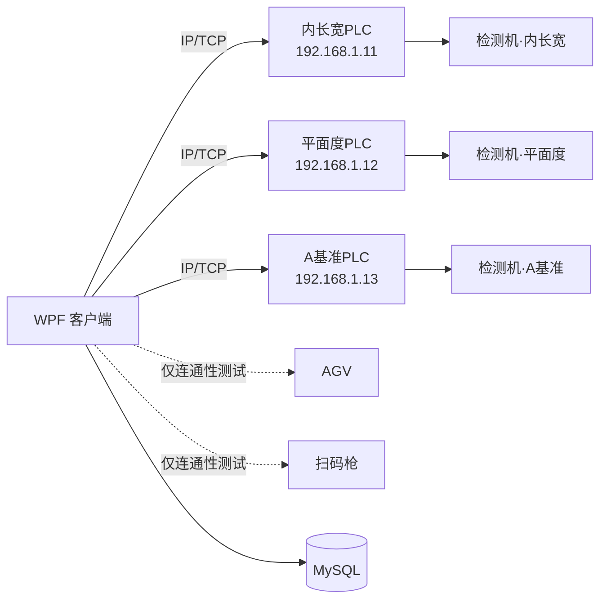
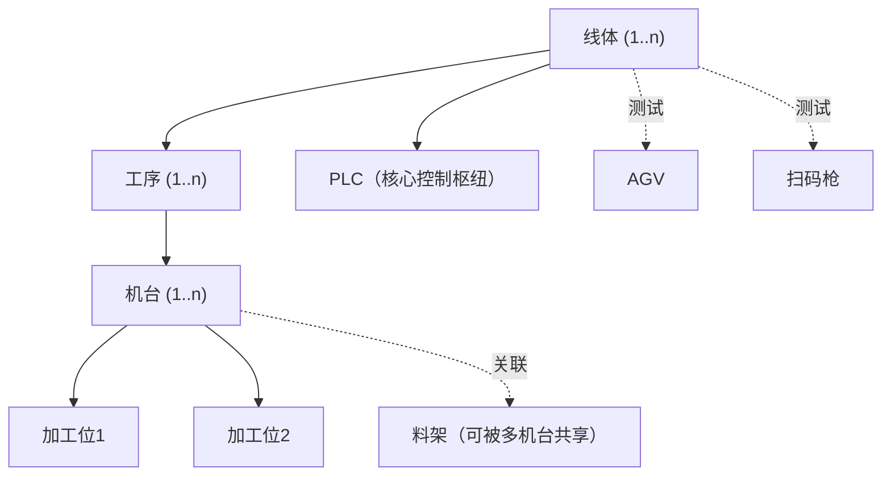
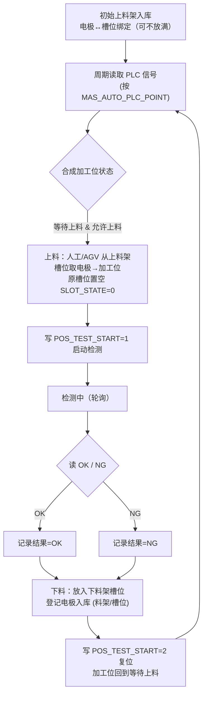

# CNC 自动化上下料客户端 — 开发文档

> 本文是**唯一的开发方案**，已合并早期的标准化参考方案与原始需求方案：对二者做缺漏审查、逻辑调整与补齐，按当前约束（WPF / .NET 8 / MySQL / 仅与 PLC 通信）重写。数据库设计见 `数据库文档.md` 与 `sql/cnc_schema.sql`，UI 规范见 `UI设计文档.md`，PLC 信号契约见 `测试机信号表.md`。本文与其他文档冲突处，**以本文为准**。

---

## 0. 关键修订（相对既有文档的调整）

落地前必须知道的四点变更，原因写在每条后面：

1. **数据库改为 MySQL**。既有文档用 Oracle 类型（`VARCHAR2`、`NUMBER(38,0)`、`sysdate`）。本文所有 DDL 已 MySQL 化，逻辑表名/字段名沿用原 schema 以便迁移对照。
2. **客户端仅与 PLC 通信，不直连机台**。既有文档存在"客户端直接 OPC/Modbus 读机台状态、FTP 直连机台取报告/传程式"的设计——这违反新约束。机台的所有状态、检测结果、上下料许可、启动控制，**全部经 PLC 信号**完成，信号定义见 `测试机信号表.md`。
3. **机台为双加工位、可并行**。每台机台固定 2 个独立加工位（信号表中的"工位1/工位2"），一位加工时另一位可并行上下料。调度与点位映射按"加工位"而非"机台"为最小单元。
4. **料架与电极追踪重构**。原模型无法表达"一架两用"与"槽位级电极定位"，本文将料架抽为独立主体 + 绑定关系 + 槽位表（见 §5）。

> **范围决定**：原方案的**报告文件采集、程式文件上传、加工数据写入**均为客户端直连机台的文件级操作，与"仅与 PLC 通信"互斥。这些功能**本期不做**（详见 §9），相关表结构保留但不实现。

---

## 1. 技术架构与运行环境

| 项 | 选型 |
| --- | --- |
| 应用类型 | WPF 桌面应用程序（单机/工位机部署） |
| 目标框架 | **.NET 8**（`net8.0-windows`，类库 `net8.0`；SDK 8.0.x） |
| UI 框架 | WPF（`UseWPF`），UI 模式 MVVM，`CommunityToolkit.Mvvm` 8.4.x |
| UI 控件库 | **WPF-UI 4.3.x**（FluentWindow 外壳 + NavigationView 导航 + 明暗主题）+ **HandyControl 3.5.x**（业务控件），职责切分见 §1.4 |
| 设计方向 | **现代工业系统 / HMI 仪表盘**（深色优先、可切浅色；非传统 ERP、非消费级 Fluent）。完整规范见 `UI设计文档.md`；**`prototype/index.html` 为 UI 唯一权威基准，后续各页开发一律以原型为准**（如 PLC 页 = PLC 列表 + 读/写/点位映射三 tab） |
| UI 结构 | `FluentWindow` 外壳 + `NavigationView` 分组导航 + 内容区页面切换；主题/令牌以自研 `ResourceDictionary` 覆盖两库默认配色；`Inter`(界面)/`JetBrains Mono`(数据) 字体嵌入打包。**按新设计重建**，旧自研 `Theme`/`ShellWindow` 待替换（见 §1.4） |
| 宿主 / DI | `Microsoft.Extensions.Hosting` Generic Host；各层用 `ServiceCollection` 扩展方法注册（`*ServiceCollectionExtensions`），配置走 `appsettings.json` |
| 数据库 | MySQL（8.x），ORM 用 EF Core + `Pomelo.EntityFrameworkCore.MySql` 8.0.x |
| 与 PLC 通信 | **协议可切换**：Modbus TCP（`NModbus` 3.x，默认）与欧姆龙 **FINS/UDP**（手写，端口 9600）；按信号表寄存器（D 区）+ IO 位读写，协议见 §3。每台 PLC 的协议存于 `PLC_READ_WAY` |
| 与机台 | **不直连**，一切经 PLC |
| AGV / 扫码枪 | 仅连通性测试，不纳入自动调度闭环（§7、§8） |

### 1.1 通信边界（强约束）

**每台机台对应一台独立 PLC，IP 各不相同**；客户端按机台分别与各自 PLC 建 IP/TCP 连接。



要点：
- **一机一 PLC**：三台机台检测项目不同（内长宽 / 平面度 / A基准），各自配一台 PLC、IP 不同。客户端同时维护多条 PLC 连接，互相独立。
- 客户端与机台之间**不存在任何直接连接**。"机台是否允许上料""检测 OK/NG""门开关/机台安全""启动测试"等全部是 PLC 信号。
- 数据模型：机台表 `PLC_ID` 绑定其专属 PLC（`MAS_AUTO_WORKLINE_PLC` 一行=一台 PLC、IP 唯一）；点位映射 `MAS_AUTO_PLC_POINT.PLC_ID` 指向同一台 PLC。

### 1.2 工程分层（已落地，6 个项目）

```
CncLoader.sln
├─ CncLoader.App           # WinExe 启动、Generic Host、DI 组装、appsettings.json
├─ CncLoader.UI            # Views + ViewModels + 主题资源 + Converters（视觉层按新设计基于 WPF-UI/HandyControl 重建）
├─ CncLoader.Core          # 领域：Abstractions/Signals/State/Polling/Plc（纯逻辑，无外部包）
├─ CncLoader.Communication # PLC 适配器(NModbus / 欧姆龙 FINS)、Polling 轮询、Simulation 模拟器(Modbus/FINS)、通信日志
├─ CncLoader.Data          # EF Core(Pomelo) 仓储 + Entities
└─ CncLoader.Common        # 配置/日志/Security(加解密)/Identity/Results 通用件
```

依赖方向：`App` 引用全部；`UI`/`Core`/`Communication`/`Data` 各自仅引用 `Core` + `Common`，业务层不依赖通信/数据实现细节。`Communication` 内置 `Simulation` 模拟器，无设备时也能联调 UI 与状态机。

设计要点：
- 通信统一走适配器接口（§3.3），业务层不拼协议字节。
- 所有写 PLC 的操作先落库（操作流水）再发起，便于追溯。
- 敏感信息（AGV/扫码枪/数据库口令）加密存储，不入日志、不入代码。

### 1.3 工程纪律（编码要求）

落地编码统一遵守，避免脚本式实现：

1. **状态值一律用枚举/字典**：机台状态、信号语义（`SIGNAL_KEY`）、ON/OFF 约定、料架角色等不允许散落魔法值。
2. **外部通信只在适配器层**：PLC、AGV、扫码枪的协议拼装、连接、心跳、超时、重试全部封装在 `CncLoader.Communication`，业务服务不直接发协议。
3. **先落库再执行外部调用**：所有写 PLC / 派工等会驱动现场动作的操作，先写操作流水再下发，并对重复下发做幂等保护。
4. **关键业务表保留审计字段**：创建人、创建时间、更新人、更新时间、状态（`STATE`），便于追溯与回溯。
5. **异常结构化**：错误码 + 错误描述 + 处理建议 + 是否可重试，对应 §8 的异常处理与告警。
6. **全链路留痕**：PLC 通信、料架/槽位变更、写操作、告警与人工干预均落库可追溯，这是与脚本式自动化的关键区别。

### 1.4 UI 控件库集成（WPF-UI + HandyControl，职责切分）

引入两套控件库，**严格切分职责、不让其主题互相覆盖**。NuGet 包加在 `CncLoader.UI`（经项目引用传递给 `App`）：`WPF-UI` 4.3.x、`HandyControl` 3.5.x。设计方向为**现代工业 / HMI**（详见 `UI设计文档.md`）。

**职责边界（谁负责什么）**

| 库 | 只用于 | 明确不用 |
| --- | --- | --- |
| WPF-UI | 窗口外壳/导航/主题：`FluentWindow` + `TitleBar`（关闭 Mica，用实色工业平面感）、`NavigationView` 分组导航、`ApplicationThemeManager` 明暗切换、`ui:Card`/`SymbolIcon` | — |
| HandyControl | 业务控件：`Growl`(报警/操作提示)、`Dialog`/`Drawer`、`Pagination`、`NumericUpDown`、增强 `DataGrid`/`ComboBox`/日期时间控件 | **不用**其窗口外壳与导航 |
| 自研令牌 `ResourceDictionary` | 颜色与排版的**唯一来源**（design source of truth），覆盖两库默认配色/圆角/字体，落到"现代工业"基调 | — |

**资源字典加载顺序（强约束，`App.xaml`）**：后加载者覆盖先加载者的隐式样式，故自研令牌必须**最后**加载：

```
1. WPF-UI       ControlsDictionary + ThemesDictionary
2. HandyControl SkinDefault + Theme
3. 自研          Tokens.xaml → Styles.xaml   ← 最后，覆盖两库配色/圆角/字体
```

要点：
- 两库都会**全局重定义原生控件隐式样式**；统一以 HandyControl 作业务控件基线，自研 `Styles` 对需覆盖的控件用 `x:Key` 显式覆盖，WPF-UI 仅作用于外壳/导航作用域，避免三套主题抢同一批控件。
- 两库主色一律用自研令牌覆盖，不直接暴露库的默认强调色；导航用 WPF-UI `NavigationView`（替代旧自绘侧栏）。

**落地进度**

已完成（深色现代工业改造，整解决方案编译 0 错误、启动运行验证通过）：
- ✅ `App.xaml` 合并 HandyControl `SkinDark` + `Theme` + 自研令牌（令牌最后覆盖）。
- ✅ `Tokens.xaml` 重写为深色现代工业（保留全部 brush 键以兼容既有绑定），`Styles.xaml`/`PageTemplates.xaml` 浅色硬编码改令牌。
- ✅ **PLC 管理页按原型重做**：PLC 列表 + `读操作/写操作/点位映射` 三 tab；点位映射并入 PLC 页（`PlcViewModel` 组合 `PointMapping`），导航栏移除独立"点位映射"项。PLC 列表占比自适应（行高 36、随数量增长）。
- ✅ **表格/下拉框全局统一**为 HandyControl 深色基线（`DataGridCompact`/`FormCombo`/`FormInput` 改 `BasedOn`，移除旧浅色表格样式）。
- ✅ 标题栏品牌名前加仪表图标；窗口设全局浅色前景，详情页顶部标题改白。
- ✅ 报警与关键操作走 HandyControl `Growl`，弹窗确认改 HandyControl `MessageBox`（PLC / 点位映射）。
- ✅ 字体移除 Saira，界面 Inter + 数据 JetBrains Mono。

> ⚠️ 待落地（下一阶段，需运行可视化迭代）：
> 1. `ShellWindow` 改为 WPF-UI `FluentWindow` + `NavigationView`（NavigationView 基于 Page 类型导航，需把 ViewModel-first 路由适配为 Page 服务）；标题栏承载线体名 / PLC 在线 / 告警 / 心跳 / 主题切换。WPF-UI `ControlsDictionary` 随此阶段按外壳作用域引入。
> 2. 切换 NavigationView 后**删除**过时自研件：旧自绘外壳、`Converters/StringToGeometryConverter.cs`、`ShellViewModel` 内嵌 `Icons` 几何。
> 3. 按新原型把监控看板等页重建为更丰富的现代工业布局（双加工位卡 + KPI + 告警流）。
> 4. 保留 `ViewModels/*`、`Converters/PlcConverters.cs`、`UiServiceCollectionExtensions`（重建时按 `NavigationView` 调整导航注册）。

---

## 2. 业务模型与动态可配置性

### 2.1 三层结构 + 加工位 + 料架



- **物理现状（示例，非硬编码）**：1 线体 → 1 检测工序 → 3 机台（内长宽 / 平面度 / A基准），每机台 2 加工位。
- **软件要求**：线体、工序、机台数量与关联关系**全部由用户在界面动态增删配置**，不绑定示例数量。加工位数量随机台型号可配（当前型号固定为 2）。

### 2.2 可配置性原则

1. 任何层级（线体/工序/机台/加工位/料架）都是数据库记录，新增即生效，不改代码。
2. 机台与"PLC 信号点位"通过映射表绑定（§3.2、§4.4），新增机台 = 新增机台记录 + 配置其点位映射，无需改协议代码。
3. 料架与机台是**多对多 + 角色**关系（上料/下料），支持一架两用（§5）。

---

## 3. 与 PLC 的通信与信号对接

这是客户端的**核心控制枢纽**。机台不可直连，所有交互在此发生。

### 3.1 信号契约来源

信号定义唯一来源是 `测试机信号表.md`。每台测试机含两组：

- **测试机输出**（客户端**读**）：门开关、机台安全、工位1/2 有料、工位1/2 允许上料、工位1/2 OK、工位1/2 NG。寄存器 D 区（如内长宽 `D1000`–`D1018`），约定 `1=ON`、`2=OFF`。
- **测试机输入**（客户端**写**，启动类）：工位1/2 测试启动。约定 `1=启动`、`2=关闭启动信号`。

地址样例（内长宽机）：

| 语义 | 方向 | 寄存器 | IO 位 | ON/启动 | OFF/关闭 |
| --- | --- | --- | --- | --- | --- |
| 工位1 允许上料 | 读 | D1006 | I0.3 | 1 | 2 |
| 工位1 OK | 读 | D1008 | I0.4 | 1 | 2 |
| 工位1 NG | 读 | D1010 | I0.5 | 1 | 2 |
| 工位1 测试启动 | 写 | D1100 | Q0.0 | 1 | 2 |

信号表中的寄存器地址与 ON/OFF 数值约定为**现场实际可用数据**，开发可直接据此读写。代码以寄存器（D 区）地址为读写主键，IO 位仅作界面展示。

### 3.2 信号 → 加工位 的绑定

为支持"动态增删机台"，不得把地址硬编码。引入**点位映射表** `MAS_AUTO_PLC_POINT`（DDL 见 §4.4），把"信号语义 + 机台 + 加工位"映射到具体寄存器：

- `PLC_ID`：该点位所属 PLC（即该机台专属 PLC）。同一机台所有点位的 `PLC_ID` 相同，等于机台表的 `PLC_ID`。
- `SIGNAL_KEY`：标准语义枚举（`DOOR` / `MACHINE_SAFE` / `POS_HAS_MAT` / `POS_ALLOW_LOAD` / `POS_OK` / `POS_NG` / `POS_TEST_START`）。
- `EQUIMENT_ID` + `POSITION_ID`：定位到具体机台的具体加工位（工位级语义带 `POSITION_ID`，机台级语义如门开关留空）。
- `REGISTER_ADDR` / `RW` / `ON_VALUE` / `OFF_VALUE` / `DATA_LEN`。

新增一台机台时：建 PLC 记录（IP）→ 建机台记录并填 `PLC_ID` → 建 2 个加工位 → 按信号表插入该机台 12 读 + 2 写共一组点位映射。零代码改动。

寄存器地址**以《测试机信号表》/库表数据为准**：各机台保持各自不同的 D 段（内长宽 `D1000–D1102` / 平面度 `D1200–D1302` / A基准 `D1400–D1502`），不做"各 PLC 从 D1000 重编址"的假设。`MAS_AUTO_PLC_POINT.REGISTER_ADDR` 即按此数据落库。IO 位地址因 PLC 独立、各机台自成体系、跨机台不连续，仅作展示。

### 3.3 PLC 适配器接口（多连接）

每台 PLC 一个独立连接实例，由 `PlcConnectionManager` 按 `PLC_ID` 管理多条连接，互不影响（一台断线只暂停该机台调度）。

```text
IPlcClient                                  // 单台 PLC 的连接
- Task ConnectAsync(endpoint)               // IP/TCP 建链
- Task<bool> IsConnected / Heartbeat()
- Task<int[]> ReadRegistersAsync(addr, len)
- Task WriteRegisterAsync(addr, value)
- event ConnectionStateChanged

PlcConnectionManager
- IPlcClient Get(plcId)                      // 按机台的 PLC_ID 取连接
- Task ConnectAllAsync() / DisconnectAllAsync()
- IReadOnlyDictionary<long,bool> ConnectionStates
```

要求：每条连接各自有状态、心跳、超时、重试、断线告警；读写全部记录设备通信流水（请求/响应/耗时/结果）。

信号表的 D 区寄存器 + ON/OFF 数值化约定对应基于寄存器的读写，地址与数值按信号表直接使用。适配器保持协议可替换，业务层不感知具体协议，当前实现两种：

- **Modbus TCP**（`NModbusPlcClient`，默认）：D 区 → 保持寄存器读写。
- **欧姆龙 FINS/UDP**（`OmronFinsPlcClient`，端口 9600）：D 区 → DM 区字读写（命令码 读 0x0101 / 写 0x0102）。节点寻址默认自动推导：目的节点=PLC IP 末段、源节点=本机 IP 末段、网络号/单元号=0（现场若节点号≠IP 末段需改为可配置）。FINS 走 UDP 无握手，故 `ConnectAsync` 会实际读一次 DM 探活，离线设备判为未连接，避免轮询被读超时拖垮。

### 3.4 机台状态判定（由信号合成）

客户端没有机台直读状态，需用 PLC 信号**合成**标准状态：

| 标准状态 | 判定条件（按加工位） |
| --- | --- |
| 等待上料 | `POS_ALLOW_LOAD=ON` 且 `POS_HAS_MAT=OFF` |
| 加工/检测中 | 已写 `POS_TEST_START` 且 `POS_HAS_MAT=ON`，未出 OK/NG |
| 完成-OK | `POS_OK=ON` |
| 完成-NG | `POS_NG=ON` |
| 不安全/报警 | `MACHINE_SAFE=OFF` 或 `DOOR=ON`（开门）|

两个加工位**独立判定、独立调度**，互不阻塞。

---

## 4. 数据模型（MySQL）

沿用原 schema 表名/字段名，类型 MySQL 化。映射约定：`VARCHAR2(n)`→`VARCHAR(n)`，`NUMBER(38,0)`→`BIGINT`，`CHAR(1)`→`CHAR(1)`，`DATE`→`DATETIME`，默认 `sysdate`→`CURRENT_TIMESTAMP`，主键 `ID1`→`BIGINT AUTO_INCREMENT`。

### 4.1 既有表（迁移保留）

下列表逻辑结构沿用原始 schema 定义（见 `数据库文档.md`、`sql/cnc_schema.sql`），仅类型 MySQL 化，**且按本文约束删除"直连机台"字段的实际用途**：

| 表 | 用途 | 本文调整 |
| --- | --- | --- |
| `MAS_AUTO_WORKLINECONFIGS` | 线体主表 | 保留 |
| `MAS_AUTO_WORKLINE_PLC` | PLC 配置 | **一机一 PLC**：一行=一台 PLC，`PLC_ID` 唯一、IP 各异；机台/点位据此关联 |
| `MAS_AUTO_WORKLINE_AGV` | 线体 AGV 配置 | 仅供测试页使用 |
| `MAS_AUTO_WORKLINE_CRAFTWORK` | 工序，按 `CRAFTWORK_NODE` 排序 | 保留 |
| `MAS_AUTO_WORKLINE_EQUIMENT` | 机台 | **新增 `PLC_ID`** 绑定专属 PLC；程式上传/直连字段保留但本期不实现（§9）|
| `MAS_AUTO_EQUIMENT_POSITION` | 加工位（每机台 2 行） | 保留，与点位映射 `POSITION_ID` 关联 |
| `MAS_AUTO_EQUIMENT_CONDITION` | 机台状态读取 | **改为 PLC 点位映射**承载（见 §4.4），原表可弃用或仅存状态字典 |
| `MAS_AUTO_EQUIMENT_MATERIEL_FRAME` | 料架 | **重构**为主表+绑定+槽位（§4.2/4.3）|
| `MAS_AUTO_EQUIMENT_REPORT` | 报告采集 | 保留结构，本期不实现（§9）|
| `MAS_AUTO_EQUIMENT_WORKDATA` | 加工数据写入 | 保留结构，本期不实现（§9）|

### 4.2 料架主表 + 绑定（新增，替代原单挂法）

支持"一架两用"：一个料架可同时绑定为 A 机的下料架、B 机的上料架。

```sql
CREATE TABLE MAS_AUTO_FRAME (
  ID1               BIGINT AUTO_INCREMENT PRIMARY KEY,
  FRAME_NAME        VARCHAR(50)  NOT NULL COMMENT '料架名称，如 3号料架',
  FRAME_CODE        VARCHAR(50)  NOT NULL COMMENT '料架机器码',
  FRAME_IDENTIFY_CODE VARCHAR(50) NOT NULL COMMENT '唯一识别码（AGV/扫码用）',
  LAYER_TOTAL       INT          NOT NULL DEFAULT 1 COMMENT '层数，如 2 层',
  SLOTS_PER_LAYER   INT          NOT NULL DEFAULT 0 COMMENT '每层槽位数，如 5',
  SLOT_TOTAL        INT          NOT NULL DEFAULT 0 COMMENT '槽位总数 = 层数×每层数',
  FRAME_SET_INFO    VARCHAR(50)  NULL COMMENT '位置坐标等',
  STATE             CHAR(1)      NOT NULL DEFAULT '0' COMMENT '0=启用,1=禁用',
  AUTHOR            VARCHAR(15)  NULL,
  UPDATETIME        DATETIME     NULL DEFAULT CURRENT_TIMESTAMP,
  UNIQUE KEY uk_frame_identify (FRAME_IDENTIFY_CODE)
) COMMENT='料架主表';

CREATE TABLE MAS_AUTO_FRAME_BIND (
  ID1          BIGINT AUTO_INCREMENT PRIMARY KEY,
  FRAME_ID     BIGINT NOT NULL COMMENT '关联 MAS_AUTO_FRAME.ID1',
  EQUIMENT_ID  BIGINT NOT NULL COMMENT '关联机台 ID',
  FRAME_ROLE   CHAR(1) NOT NULL COMMENT '0=该机台的上料架,1=下料架',
  STATE        CHAR(1) NOT NULL DEFAULT '0',
  AUTHOR       VARCHAR(15) NULL,
  UPDATETIME   DATETIME NULL DEFAULT CURRENT_TIMESTAMP,
  UNIQUE KEY uk_bind (FRAME_ID, EQUIMENT_ID, FRAME_ROLE),
  KEY idx_eq (EQUIMENT_ID)
) COMMENT='料架-机台绑定（一架可多绑，实现共享）';
```

一架两用示例：`(FRAME_ID=3, EQUIMENT_ID=A机, ROLE=1下料)` 与 `(FRAME_ID=3, EQUIMENT_ID=B机, ROLE=0上料)` 两行并存。

### 4.3 料架槽位表（新增，电极位置追踪，支持分层）

实现"电极A ↔ 中转架 ↔ 1层4位"的绑定与随时反查。槽位带**层 + 层内位**两级物理坐标（如上料架 2 层 × 5 位 = 10 槽）。

```sql
CREATE TABLE MAS_AUTO_FRAME_SLOT (
  ID1          BIGINT AUTO_INCREMENT PRIMARY KEY,
  FRAME_ID     BIGINT NOT NULL COMMENT '关联 MAS_AUTO_FRAME.ID1',
  SLOT_NO      INT    NOT NULL COMMENT '料架内全局槽号 1..N（稳定主显号）',
  LAYER_NO     INT    NOT NULL DEFAULT 1 COMMENT '层号，从1起',
  POS_IN_LAYER INT    NOT NULL DEFAULT 1 COMMENT '层内位号，从1起',
  SLOT_STATE   CHAR(1) NOT NULL DEFAULT '0' COMMENT '0=空,1=占用,2=锁定/不可用',
  ELECTRODE_ID VARCHAR(50) NULL COMMENT '电极ID，如 A；空表示无电极（初始可不放满）',
  BIND_TIME    DATETIME NULL COMMENT '电极存入时间',
  REMARK       VARCHAR(200) NULL,
  UPDATETIME   DATETIME NULL DEFAULT CURRENT_TIMESTAMP,
  UNIQUE KEY uk_frame_slot (FRAME_ID, SLOT_NO),
  UNIQUE KEY uk_frame_layer_pos (FRAME_ID, LAYER_NO, POS_IN_LAYER),
  KEY idx_electrode (ELECTRODE_ID)
) COMMENT='料架槽位与电极绑定';
```

槽位生命周期与查询：
- **预建槽位**：料架建档时按 `层数 × 每层数` 一次性预建全部槽位（`SLOT_STATE='0'` 空）。
- **初始入库可不放满**：首次把电极放上料架时，只占用实际放入的槽位（写 `ELECTRODE_ID`、`SLOT_STATE='1'`、`BIND_TIME`），其余保持空——空满由 `SLOT_STATE` 表达，不要求放满。
- **反查电极位置（含层）**：`SELECT FRAME_ID, SLOT_NO, LAYER_NO, POS_IN_LAYER FROM MAS_AUTO_FRAME_SLOT WHERE ELECTRODE_ID='A' AND SLOT_STATE='1';`
- **取出/移动**：清空原槽位置 `SLOT_STATE='0'`，或迁移到新槽位。
- 占用/空闲数量由 `SLOT_STATE` 计数得出，替代原 `FRAME_MEMORY_NUM` 的粗粒度计数。

### 4.4 PLC 点位映射表（新增，承载信号契约）

```sql
CREATE TABLE MAS_AUTO_PLC_POINT (
  ID1           BIGINT AUTO_INCREMENT PRIMARY KEY,
  PLC_ID        BIGINT NOT NULL COMMENT '该点位所属PLC（=机台的PLC_ID，外键 PLC.PLC_ID）',
  EQUIMENT_ID   BIGINT NOT NULL COMMENT '关联机台',
  POSITION_ID   BIGINT NULL COMMENT '加工位；机台级信号(门/安全)留空',
  SIGNAL_KEY    VARCHAR(30) NOT NULL COMMENT 'DOOR/MACHINE_SAFE/POS_HAS_MAT/POS_ALLOW_LOAD/POS_OK/POS_NG/POS_TEST_START',
  RW            CHAR(1) NOT NULL COMMENT '0=读,1=写',
  REGISTER_ADDR VARCHAR(20) NOT NULL COMMENT '寄存器地址，如 D1006（主键依据）',
  IO_ADDR       VARCHAR(20) NULL COMMENT 'IO位，如 I0.3，仅展示',
  ON_VALUE      INT NOT NULL DEFAULT 1 COMMENT 'ON/启动值',
  OFF_VALUE     INT NOT NULL DEFAULT 2 COMMENT 'OFF/关闭值',
  DATA_LEN      INT NOT NULL DEFAULT 1,
  REMARK        VARCHAR(200) NULL,
  STATE         CHAR(1) NOT NULL DEFAULT '0',
  UPDATETIME    DATETIME NULL DEFAULT CURRENT_TIMESTAMP,
  UNIQUE KEY uk_point (EQUIMENT_ID, POSITION_ID, SIGNAL_KEY),
  KEY idx_plc (PLC_ID)
) COMMENT='机台/加工位信号→PLC寄存器映射（信号表的可配置落地）';
```

### 4.5 运行时记录表

沿用原始 schema 的 `MAS_AUTO_AGV_TASK`、`MAS_AUTO_WORK_RECORD`（MySQL 化）。补充建议：`MAS_AUTO_DEVICE_LOG`（PLC/AGV/扫码枪通信流水）、`MAS_AUTO_ALARM_EVENT`（告警）。检测结果 OK/NG 写入 `MAS_AUTO_WORK_RECORD.WORK_RESULT`。

---

## 5. 功能模块详细设计

> 页面组织原则：**线体管理、工序管理、机台管理、PLC 管理各为独立页面**，从主导航分别进入。**不做树形结构、不合并到同一页面**。层级关联通过各页内的"所属上级"下拉选择来建立，而非靠树节点拖拽。

### 5.1 线体管理（独立页面）

- 列表 + 表单：线体的新增/编辑/删除/启用停用，字段见 `MAS_AUTO_WORKLINECONFIGS`。
- 列表为线体平铺列表（表格），非树。
- 删除/停用前校验该线体下是否存在运行中任务，有则拒绝。

### 5.2 工序管理（独立页面）

- 列表 + 表单：工序的增删改查，落 `MAS_AUTO_WORKLINE_CRAFTWORK`。
- 表单含"所属线体"下拉（选 `WORKLINE_ID`）、工序排序 `CRAFTWORK_NODE`、优先级等。
- 列表支持按线体筛选，平铺展示，非树。

### 5.3 机台管理（独立页面）

- 列表 + 表单：机台的增删改查，落 `MAS_AUTO_WORKLINE_EQUIMENT`。
- 表单含"所属工序"下拉（选 `CARFTWORK_ID`）与**"所属 PLC"下拉**（选 `PLC_ID`，每台机台绑定自己的 PLC）。
- 新增机台时自动建 2 个加工位；同页内提供加工位子列表与"关联料架"入口；点位映射在 PLC 管理页维护或本页跳转维护。
- 列表支持按线体/工序筛选，平铺展示，非树。
- 删除/停用前校验存在运行中任务则拒绝。

### 5.4 PLC 管理（核心控制枢纽，独立页面）

本机型有 **3 台独立 PLC**，页面按 PLC 组织：

1. **PLC 列表与连接管理**：列出全部 PLC（`MAS_AUTO_WORKLINE_PLC`，每台名称/IP/端口/连接状态灯/心跳），逐台或一键建链/断开。一台断线只影响其对应机台。
   - **新增 PLC**：弹模态对话框，PLC_ID 由系统建议 `max(PLC_ID)+1`，用户可改但需唯一（重复拒绝）；名称/IP/端口必填，协议可选 ModbusTCP（默认，端口 502）/ FINS（端口 9600，选中时自动联动端口）。
   - **编辑 PLC**：PLC_ID 只读（业务键，被机台/点位外键引用，避免外键断裂），仅可改名称/IP/端口/协议；若该 PLC 在线，保存后自动断开连接，提示用户重新连接。
   - **删除 PLC**：删除前先做引用校验——被 `MAS_AUTO_WORKLINE_EQUIMENT.PLC_ID` 或 `MAS_AUTO_PLC_POINT.PLC_ID` 引用时禁止删除并提示具体引用数；0 引用则二次确认后**软删**（`STATE='1'`），列表不再显示，DB 行保留可恢复。
2. **读操作界面**：先选 PLC（或选机台自动定位其 PLC）→ 选加工位/信号语义（或直接填寄存器地址 + 长度）→ 读取 → 显示原始值与按 ON/OFF 翻译后的语义值。支持单次读与周期轮询。
3. **写操作界面**：选 PLC/机台 → 选"测试启动"等可写信号 → 选写入值（启动=1/关闭=2）→ 下发 → 回读校验。**写操作二次确认 + 落操作流水**（影响现场设备）。
4. **点位映射维护**：可视化维护 `MAS_AUTO_PLC_POINT`（含 `PLC_ID`），从信号表批量导入某机台一组点位到其 PLC。

> 写 PLC 会驱动真实机台动作，UI 必须有明确确认与权限控制，且记录操作人。

### 5.5 AGV 管理（仅测试界面，独立页面）

- 只做**连通性测试**：填 AGV 通信地址 → 发测试请求（HTTP/Socket，按 `AGV_CORRESPOND_WAY`）→ 显示连通/超时/返回报文。
- 不纳入自动调度闭环，不下发真实搬运任务（当前阶段）。配置存 `MAS_AUTO_WORKLINE_AGV`，口令加密。

### 5.6 扫码枪管理（仅测试界面，独立页面）

- 只做**连通性测试**：客户端开放 TCP 端口等待扫码枪连接（被动接收），或主动连，显示连接状态与最近一次扫码内容。
- 不参与来料校验闭环（当前阶段）。

### 5.7 料架管理（独立页面）

两块能力：

**(a) 料架配置（含一架两用）**
- 维护料架主表（名称/编码/识别码/槽位总数）。
- 通过绑定表把一个料架挂到多台机台并指定角色：可同时是上一台机台的**下料架**与下一台机台的**上料架**。界面以"料架 → 绑定的机台与角色"列表呈现，明确展示共享关系。

**(b) 电极位置追踪（分层）**
- 料架建档：填层数与每层数（如 2 层 × 5），系统按 `层×位` 预建全部空槽。
- 槽位视图：按**层**分行的网格展示（每层一排），每格显示"层-位"与电极ID、空/占用状态。
- **初始上料架入库**：新电极首次放上料架时按槽位批量绑定电极ID；**允许只放一部分、不放满**，未放的槽位保持空。支持扫码枪逐个录入电极ID或手动录入。
- 存入/取出/移动：写或清空 `MAS_AUTO_FRAME_SLOT` 的 `ELECTRODE_ID`/`SLOT_STATE`/`BIND_TIME`。
- **电极反查**：输入电极ID，立即返回"所在料架 + 层 + 层内位 + 全局槽号"。这是本模块的核心交付。

---

## 6. 核心流程：检测上下料（双加工位并行）

前置：**初始上料架入库**——上线前把电极放入上料架，按槽位绑定电极ID（可不放满），见 §5.7(b)。此后才进入下面的循环。



并发设计：
- 每个**加工位**独立状态轮询与推进，机台两位互不阻塞（一位检测中、另一位可上下料）。
- 料架槽位更新加锁，防止两位/两机台对同一槽位并发误占。
- 写 PLC 前先落操作流水，保证可追溯与幂等。

---

## 7. 状态机（加工位级）

| 状态 | 进入条件 | 触发动作 | 下一状态 |
| --- | --- | --- | --- |
| WAIT_LOAD 等待上料 | 允许上料=ON 且 有料=OFF | 上料 | LOADED |
| LOADED 已上料 | 有料=ON | 写测试启动 | PROCESSING |
| PROCESSING 检测中 | 启动已写 | 轮询 OK/NG | DONE_OK / DONE_NG |
| DONE_OK / DONE_NG | OK 或 NG=ON | 下料 + 记录 | UNLOADED |
| UNLOADED 已下料 | 有料=OFF | 复位启动信号 | WAIT_LOAD |
| ALARM 报警 | 机台安全=OFF / 开门 / 通信断 | 告警，暂停该位调度 | WAIT_LOAD（恢复后）|

---

## 8. 异常处理与告警

| 异常 | 检测 | 处理 |
| --- | --- | --- |
| 某台 PLC 断线 | 该 PLC 心跳/读写失败 | **只暂停其对应机台**的调度，不影响其他机台；自动重连（≤3 次），失败告警 |
| 读取超时 | 超时计数 | 重试 + 超时策略，连续失败告警 |
| 机台安全=OFF/开门 | 信号判定 | 暂停该机台调度，告警等待人工 |
| 加工位状态长时间不变 | 状态滞留计时 | 告警，暂停该加工位 |
| 检测出 NG | 信号判定 | 按 NG 流程下料并记录，不阻塞另一加工位 |
| 料架槽位冲突/满 | 槽位状态 | 暂停下料，告警提示清/补料 |
| AGV/扫码枪测试失败 | 连接超时 | 仅测试页提示，不影响主流程 |

---

## 9. 本期不做的模块（需与机台通信）

以下三项原方案均需客户端**直连机台**完成，与"仅与 PLC 通信"约束互斥，**本期不实现**：

| 模块 | 原实现方式 | 状态 |
| --- | --- | --- |
| 报告文件采集（FTP/SMB 取机台报告） | 直连机台 | 不做 |
| 程式文件上传（FTP/SMB 传机台） | 直连机台 | 不做 |
| 加工数据写入（直读机台数据） | 直连机台 | 不做 |

对应表（`MAS_AUTO_EQUIMENT_REPORT`、`MAS_AUTO_EQUIMENT_WORKDATA`、机台表的程式上传字段）**保留结构但不实现**，避免后续返工时改表。检测结果以 PLC 的 OK/NG 信号为准，写入 `MAS_AUTO_WORK_RECORD`。

---

## 10. 开发计划

| 阶段 | 内容 | 周期 |
| --- | --- | --- |
| 一 框架 | WPF/MVVM 骨架、MySQL 建表、DI、PLC 适配器接口 | 2 周 |
| 二 配置 | 线体/工序/机台/加工位/料架管理界面 + 点位映射维护 | 2 周 |
| 三 PLC 核心 | PLC 连接、读/写界面、信号语义合成、状态机 | 2 周 |
| 四 上下料 | 双加工位并行检测流程、电极槽位追踪、加工记录 | 2 周 |
| 五 外设测试 | AGV / 扫码枪连通性测试页 | 0.5 周 |
| 六 联调验收 | 现场 PLC 联调、异常场景、地址表复核 | 1.5 周 |

## 11. 验收要点

- 线体/工序/机台/料架可自由增删并正确关联入库。
- 新增机台仅靠配置点位映射即可纳入轮询与调度，无需改代码。
- PLC 读写界面能按信号表正确读出语义、写入启动并回读校验。
- 一个料架可同时作为相邻两机台的上/下料架并正确展示共享关系。
- 任意电极ID 可即时反查所在料架与槽位编号。
- AGV / 扫码枪测试页能反馈连通性。
- 全程 PLC 通信、料架变更、写操作均有流水可追溯。
