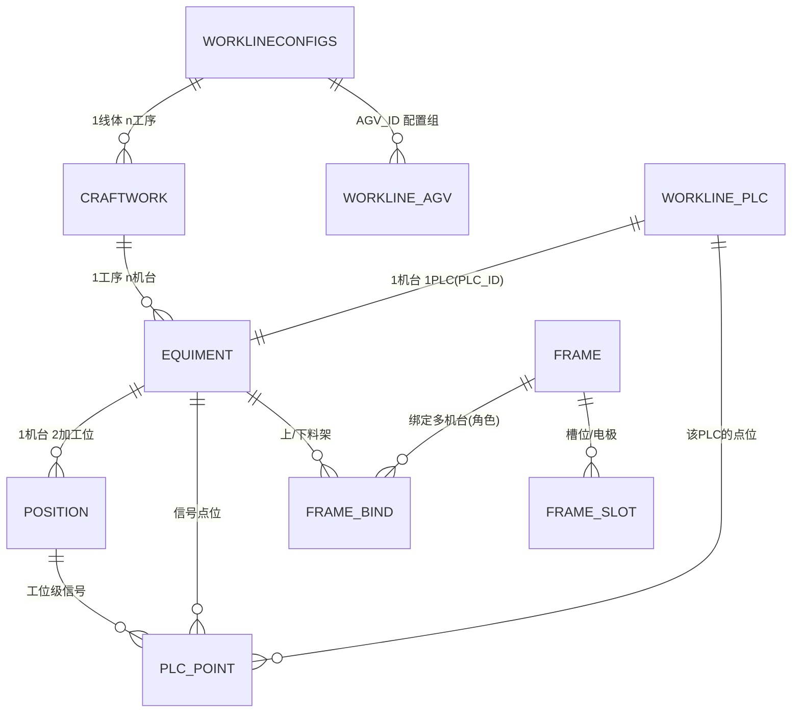

# 数据库文档

> 依据 `客户端开发文档.md` 与 `测试机信号表.md` 生成。完整可执行脚本（建表 + 初始化）见 `sql/cnc_schema.sql`，本文为结构说明与关键约定。

## 1. 通用约定

| 项 | 约定 |
| --- | --- |
| DBMS | MySQL 8.x |
| 库名 | `cnc_auto` |
| 引擎 / 字符集 | `InnoDB` / `utf8mb4` |
| 主键 | `ID1 BIGINT AUTO_INCREMENT` |
| 状态位 | `STATE CHAR(1)`，`0=启用 1=禁用` |
| 时间戳 | `UPDATETIME DATETIME DEFAULT CURRENT_TIMESTAMP ON UPDATE CURRENT_TIMESTAMP` |
| 命名 | 表/字段沿用既有 Oracle schema 名称以便迁移对照（含历史拼写 `CARFTWORK_ID`、`EQUIMENT_`） |

类型映射（Oracle → MySQL）：`VARCHAR2(n)`→`VARCHAR(n)`，`NUMBER(38,0)`→`BIGINT`，端口类→`INT`，`CHAR(1)`→`CHAR(1)`，`DATE`→`DATETIME`，`sysdate`→`CURRENT_TIMESTAMP`。口令字段统一加宽到 `VARCHAR(100)` 以容纳密文。

## 2. 相对原 schema 的结构变化

| 变化 | 说明 |
| --- | --- |
| 新增 `MAS_AUTO_PLC_POINT` | 把《测试机信号表》落为可配置点位映射，机台/加工位信号 → 寄存器地址 |
| 料架拆三张表 | `MAS_AUTO_FRAME`（主）+ `MAS_AUTO_FRAME_BIND`（机台绑定，支持一架两用）+ `MAS_AUTO_FRAME_SLOT`（槽位/电极追踪），取代原 `MAS_AUTO_EQUIMENT_MATERIEL_FRAME` 单挂法 |
| `POSITION.EQUIMENT_ID` 规范为 `BIGINT` | 直接外键关联机台 `ID1`，原为 `VARCHAR2` 间接关联 |
| `MAS_AUTO_EQUIMENT_CONDITION` 改为状态字典 | 机台实时状态改由 `MAS_AUTO_PLC_POINT` 信号合成；本表精简为"标准状态码→名称/判定说明"字典，去掉原直连机台的 IP/端口/协议字段 |
| **一机一 PLC** | `MAS_AUTO_WORKLINE_PLC` 一行=一台逻辑 PLC（`PLC_ID` 唯一）；机台表 `PLC_ID` 绑定专属逻辑 PLC。现场多机共物理 PLC 时，多行可填相同 IP/端口 |
| 机台表 legacy 字段 | `UPMATERIEL_ID/DOWNMATERIEL_ID/STATE_ID/WORK_SET_ID` 保留但标记 legacy，被新表取代 |
| 报告/数据写入表 | `MAS_AUTO_EQUIMENT_REPORT`、`MAS_AUTO_EQUIMENT_WORKDATA` 保留结构，**本期不实现**（需直连机台） |
| 新增运行表 | `MAS_AUTO_DEVICE_LOG`（通信流水）、`MAS_AUTO_ALARM_EVENT`（告警） |
| **【第四阶段】RCS 对接扩展** | `MAS_AUTO_AGV_TASK` 扩展 RCS 任务全生命周期列（`RCS_TASK_ID/RCS_KIND/RCS_STATUS/TASK_STATE/PRIORITY/DISPATCH_TIME/REDO_COUNT/CANCEL_MANUAL_FLAG/POSITION_ID/ELECTRODE_ID/TXN_ID/REQ_PARAM`）；新增 `MAS_AUTO_LOCATION_MAP`（逻辑位置↔RCS点位编码，station/cell 双层）、`MAS_AUTO_RCS_MSG_LOG`（双向报文流水）；`MAS_AUTO_FRAME_SLOT` 加 `BIND_SOURCE/LAST_VERIFY_TIME`；`FRAME_BIND.FRAME_ROLE` 语义扩展 0/1/2/3=上料/下料/中转/NG。迁移脚本 `sql/migration_phase4_rcs.sql`（幂等） |

## 3. 表清单

| # | 表名 | 中文 | 类别 |
| --- | --- | --- | --- |
| 1 | MAS_AUTO_WORKLINECONFIGS | 线体主表 | 配置 |
| 2 | MAS_AUTO_WORKLINE_PLC | PLC配置（一机一PLC；共物理机时IP可相同） | 配置（核心通信） |
| 3 | MAS_AUTO_WORKLINE_AGV | 线体AGV/RCS连接配置 | 配置（RCS 正式） |
| 4 | MAS_AUTO_WORKLINE_CRAFTWORK | 工序表 | 配置 |
| 5 | MAS_AUTO_WORKLINE_EQUIMENT | 机台表 | 配置 |
| 6 | MAS_AUTO_EQUIMENT_POSITION | 加工位表 | 配置 |
| 7 | MAS_AUTO_EQUIMENT_CONDITION | 机台标准状态字典 | 字典 |
| 8 | MAS_AUTO_PLC_POINT | PLC点位映射表 | 信号 |
| 9 | MAS_AUTO_FRAME | 料架主表 | 料架 |
| 10 | MAS_AUTO_FRAME_BIND | 料架-机台绑定 | 料架 |
| 11 | MAS_AUTO_FRAME_SLOT | 料架槽位/电极 | 料架 |
| 12 | MAS_AUTO_WORK_RECORD | 加工/检测记录 | 运行 |
| 13 | MAS_AUTO_AGV_TASK | AGV/RCS任务记录（第四阶段扩展） | 运行 |
| 14 | MAS_AUTO_DEVICE_LOG | 设备通信流水 | 运行 |
| 15 | MAS_AUTO_ALARM_EVENT | 告警事件（含 RCS_WARN） | 运行 |
| 16 | MAS_AUTO_LOCATION_MAP | 逻辑位置↔RCS点位编码映射 | 运行（RCS） |
| 17 | MAS_AUTO_RCS_MSG_LOG | RCS双向报文流水 | 运行（RCS） |
| 18 | MAS_AUTO_EQUIMENT_REPORT | 报告采集配置 | 保留不实现 |
| 19 | MAS_AUTO_EQUIMENT_WORKDATA | 加工数据写入配置 | 保留不实现 |

## 4. ER 关系



要点：
- `FRAME_BIND` 是料架与机台的**多对多 + 角色**关系，一行 `(料架,机台,角色)`。一架两用 = 同一 `FRAME_ID` 出现在两行不同角色/机台中。【第四阶段】`FRAME_ROLE` 取值扩展：`0=上料LOAD 1=下料UNLOAD 2=中转TRANSIT 3=NG架NG_FRAME`（字段仍为 `CHAR(1)`，兼容原 0/1 种子）。
- `PLC_POINT` 唯一键 `(EQUIMENT_ID, POSITION_ID, SIGNAL_KEY)`；机台级信号（门/安全）`POSITION_ID` 为空。

## 5. 关键字段语义

**MAS_AUTO_PLC_POINT.SIGNAL_KEY** 枚举：

| KEY | 含义 | 方向 |
| --- | --- | --- |
| DOOR | 门开关 | 读（机台级） |
| MACHINE_SAFE | 机台安全 | 读（机台级） |
| POS_HAS_MAT | 工位有料 | 读 |
| POS_ALLOW_LOAD | 工位允许上料 | 读 |
| POS_OK | 工位检测OK | 读 |
| POS_NG | 工位检测NG | 读 |
| POS_TEST_START | 工位测试启动 | 写 |

读约定 `ON_VALUE=1 / OFF_VALUE=2`，写约定 `启动=1 / 关闭=2`（同信号表）。

**MAS_AUTO_FRAME_SLOT（分层 + 电极绑定）**：槽位带两级物理坐标 `LAYER_NO`（层）+ `POS_IN_LAYER`（层内位），另有料架内全局槽号 `SLOT_NO`；唯一键同时约束 `(FRAME_ID,SLOT_NO)` 与 `(FRAME_ID,LAYER_NO,POS_IN_LAYER)`。`ELECTRODE_ID`+这些坐标构成"电极A在中转架1层4位"的绑定，`SLOT_STATE` 标空/占用。`idx_slot_electrode` 支持按电极ID快速反查。
- **槽位预建 + 初始可不放满**：建档时按 `料架.LAYER_TOTAL × SLOTS_PER_LAYER` 预建全部空槽；初始入库只把实际放入的槽位置占用，其余保持空（`SLOT_STATE='0'`、`ELECTRODE_ID` 为 NULL）。

**MAS_AUTO_EQUIMENT_CONDITION（状态字典）**：仅存标准状态码与含义，状态机与界面统一从此取值；机台实时状态仍由 `PLC_POINT` 信号合成，本表不参与通信。内置 8 种状态：`OFFLINE / WAIT_LOAD / LOADED / PROCESSING / DONE_OK / DONE_NG / UNLOADED / ALARM`。

## 5b. 第四阶段 RCS 对接相关表（迁移脚本 `sql/migration_phase4_rcs.sql`，幂等）

**MAS_AUTO_AGV_TASK（扩展为 RCS 任务记录）**：承载一条 RCS 任务的完整生命周期。
- `RCS_TASK_ID`：全局唯一 taskId，格式 `{线体}-{类型}-{yyyyMMddHHmmss}-{4位序列}`，**先落库后发送**保证幂等；redo 复用同一 taskId。
- `RCS_KIND`：接口种类 `transit`(搬运) / `grab`(抓取) / `identify`(识别盘点) / `pallet_return`(空托盘回收) / `change_frame`(换架)。
- `TASK_STATE`：本系统态 `CREATED → DISPATCHED → EXECUTING → COMPLETED / FAILED / CANCELED`；`RCS_STATUS` 存 RCS 原始 11 态（映射见开发文档 §4.5）。
- `PRIORITY` 1-10 大者优先（换架/回收 ≥ 紧急下料 > 常规上料，RCS 单任务串行）；`REDO_COUNT` 记 redo 次数；`CANCEL_MANUAL_FLAG` 取消后人工处理确认（未确认前锁点位禁止重派）；`TXN_ID` 关联换架"先拉后送"任务对；`REQ_PARAM` 存下发参数快照。

**MAS_AUTO_LOCATION_MAP（逻辑位置↔RCS点位编码）**：把机台/加工位/料架/命名区域映射到 RCS 点位编码。`RCS_TYPE ∈ {shelf,cell,station}`——**抓取任务用 station 级**（如 101 上料架 / 201 下料架），**搬运任务用 cell 级仓位编码**（如 601203=601 架 2 层 3 位）。缓存区/备料区/托盘回收区等命名点用 `LOC_TYPE='AREA'` + `LOC_NAME`。

**MAS_AUTO_RCS_MSG_LOG（双向报文流水）**：`DIRECTION` OUT=出站请求 / IN=入站回调；记 `INTERFACE_NAME`、`URL`、`TASK_ID`、请求/应答报文原文、耗时、结果，供联调追溯与幂等去重。

**MAS_AUTO_WORKLINE_AGV（RCS 连接配置，迁移 `sql/migrate_workline_agv_rcs.sql`）**：正式存 RCS 出站与回调。新增列 `RCS_BASE_URL` / `RCS_CLIENT_CODE` / `RCS_CALLBACK_HOST` / `RCS_CALLBACK_PORT` / `RCS_TIMEOUT_MS` / `RCS_MAX_RETRIES` / `RCS_POLL_INTERVAL_MS`。旧 `AGV_COMPUTER_*` 保留兼容；口令列本系统不读写加密。页面「连接&下发」可编辑保存；出站字段热更新，回调 Host/Port 变更需重启。

**MAS_AUTO_FRAME_SLOT 扩展**：`BIND_SOURCE`（`MANUAL/SCAN_GUN/RCS_QR` 电极码绑定来源）、`LAST_VERIFY_TIME`（最近 identifyQR 盘点校正时间，电极反查结果附带数据新鲜度）。

## 6. 初始化数据（示例场景）

`sql/cnc_schema.sql` 末尾内置示例：**1 线体 → 3 道工序 → 3 机台（内长宽/平面度/A基准）**；**3 台逻辑 PLC**（一机一 `PLC_ID`），种子默认 FINS `192.168.250.1:9600`（三行 IP 相同，表示共物理 PLC；演示 `UseSimulator=true` 时仍各起本机模拟端口）。点位按《测试机信号表》分属各逻辑 PLC。

直接执行：

```bash
mysql -u<user> -p < docs/sql/cnc_schema.sql
```

脚本可重复执行（开头按依赖逆序 `DROP` 后重建）。

## 7. 常用查询

```sql
-- 反查电极当前位置
SELECT f.FRAME_NAME, s.SLOT_NO
FROM MAS_AUTO_FRAME_SLOT s JOIN MAS_AUTO_FRAME f ON f.ID1 = s.FRAME_ID
WHERE s.ELECTRODE_ID = 'A' AND s.SLOT_STATE = '1';

-- 某加工位的全部点位（含机台级信号）
SELECT SIGNAL_KEY, RW, REGISTER_ADDR, ON_VALUE, OFF_VALUE
FROM MAS_AUTO_PLC_POINT
WHERE EQUIMENT_ID = 1 AND (POSITION_ID = 1 OR POSITION_ID IS NULL);

-- 某料架被哪些机台以何角色共享
SELECT EQUIMENT_ID, FRAME_ROLE FROM MAS_AUTO_FRAME_BIND WHERE FRAME_ID = 2;
```
