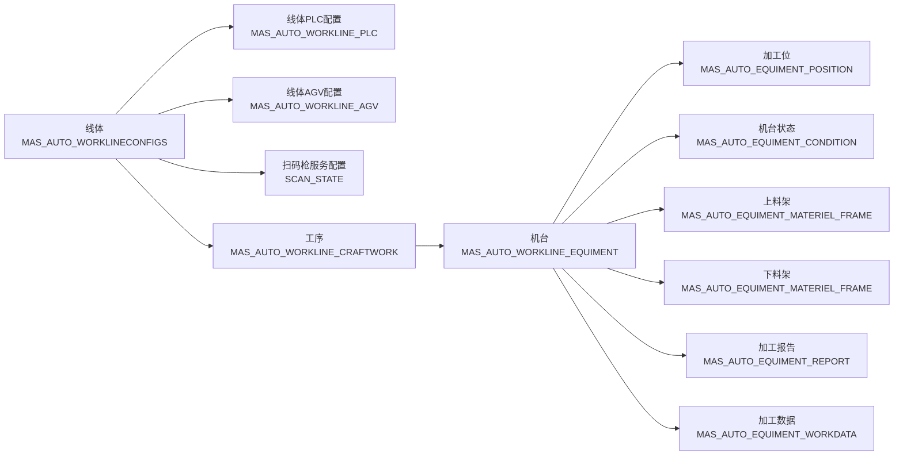
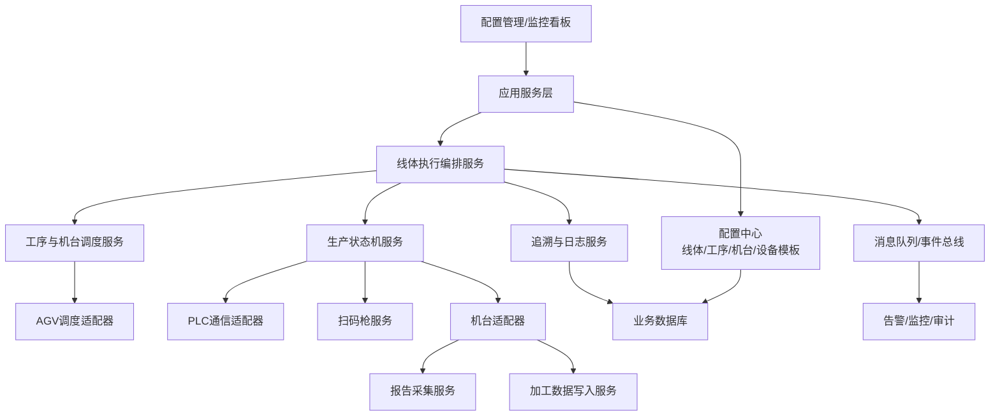
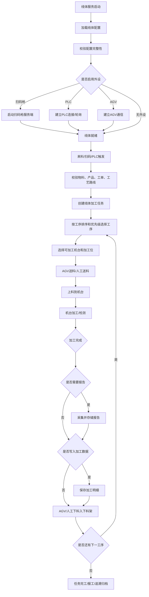

# 自动化标准化软件开发方案

> ⚠️ **修订说明（2026-06-26）**：本文为早期标准化参考，与当前开发约束存在冲突，**开发以 `客户端开发文档.md` 为准**。需注意三处差异：
> 1. **数据库**：本文按 Oracle 描述（`MAS_AUTO_*` 表、字典/版本表），现选型为 **MySQL**。
> 2. **通信对象**：本文含"客户端经适配器直连机台读状态、采集报告、写数据"的设计；现约束为**客户端仅经 IP/TCP 与 PLC 通信，不直连机台**，机台状态/结果全部走 PLC 信号（见 `测试机信号表.md`）。
> 3. **形态**：本文偏服务端编排/消息队列；现形态为 **WPF / .NET 10 单机客户端**。
>
> 本文的"线体→工序→机台→加工位/料架"建模思想、状态机与异常处理思路仍有参考价值，但具体表/协议/部署以新文档为准。

## 1. 方案定位

本方案用于建设一套以“线体”为主业务对象的自动化主控软件。系统通过配置线体、工序、机台、加工位、料架、PLC、AGV、扫码枪、报告和加工数据规则，实现不同自动化线的标准化接入、调度、加工、物流、报工和追溯。

核心原则：

1. 线体是主线，是自动化投放、调度和状态归集的主体。
2. 工序是线体内部的加工步骤，按排序和优先级组织执行。
3. 机台是工序的执行资源，带有加工能力、加工位、状态读取、上下料、报告和数据写入配置。
4. PLC、AGV、扫码枪是线体级基础能力，由线体按需启用。
5. 所有自动化差异优先通过配置表达，代码侧通过适配器、模板和状态机实现复用。

## 2. 总体业务模型



推荐业务边界：

| 领域 | 职责 |
| --- | --- |
| 线体配置域 | 维护线体基础信息、是否启用扫码枪/PLC/AGV、产品物料规则 |
| 工序配置域 | 维护工序顺序、优先级、加工/品质属性、是否自动发送、是否参与报工 |
| 机台配置域 | 维护机台类型、加工类型、程序上传、状态读取、加工位和上下料规则 |
| 物流调度域 | 根据工序、机台、料架、AGV能力生成送料/取料任务 |
| 设备通信域 | 封装PLC、AGV、扫码枪、机台状态读取、报告读取、数据写入 |
| 生产执行域 | 生成加工任务、推进状态机、记录加工过程和异常 |
| 追溯报表域 | 保存扫码、投料、上下料、加工、报告、报工、异常、人工干预记录 |

## 3. 企业级系统架构



建议采用分层架构：

1. 表现层：配置页面、线体看板、异常处理台、日志追溯页面。
2. 应用层：线体启动、任务创建、工序调度、机台分配、AGV派工、报工。
3. 领域层：线体、工序、机台、加工位、料架、物料、任务、状态机。
4. 基础设施层：Oracle数据库、PLC协议、AGV接口、扫码枪Socket、文件/FTP/SFTP/共享目录、日志、消息队列。

## 4. 运行主流程



## 5. 数据配置优化方案

### 5.1 现有表定位

| 表 | 定位 | 建议 |
| --- | --- | --- |
| MAS_AUTO_WORKLINECONFIGS | 线体主表 | 保留为线体聚合根，新增启用状态、版本、运行模式字段 |
| MAS_AUTO_WORKLINE_PLC | 线体PLC配置 | 支持一线多PLC，建议PLC_ID改为线体关联组ID或新增WORKLINE_ID |
| MAS_AUTO_WORKLINE_AGV | 线体AGV配置 | 支持一线多AGV或多AGV区域，建议新增WORKLINE_ID |
| MAS_AUTO_WORKLINE_CRAFTWORK | 工序配置 | CRAFTWORK_NODE作为顺序，CRAFTWORK_PRIOR作为调度权重 |
| MAS_AUTO_WORKLINE_EQUIMENT | 工序机台配置 | 建议统一拼写视图EQUIPMENT，表名可兼容历史 |
| MAS_AUTO_EQUIMENT_POSITION | 加工位 | 建议EQUIMENT_ID改为NUMBER并关联机台ID或加工位组ID |
| MAS_AUTO_EQUIMENT_CONDITION | 机台状态 | 建议状态值标准字典化 |
| MAS_AUTO_EQUIMENT_MATERIEL_FRAME | 上下料架 | 建议区分FRAME_TYPE：1上料、2下料、3缓存、4不良品 |
| MAS_AUTO_EQUIMENT_REPORT | 报告采集 | 当前存在REPORT_UPLOAD_TYPE重复字段，建议拆分上传协议和文件类型 |
| MAS_AUTO_EQUIMENT_WORKDATA | 加工数据写入 | JSON模板建议版本化，并保存解析后的字段映射 |

### 5.2 推荐新增标准表

| 表名 | 作用 |
| --- | --- |
| MAS_AUTO_CONFIG_VERSION | 配置版本表，支持发布、回滚、灰度 |
| MAS_AUTO_DICT | 字典表，统一状态、协议、加工类型、报告类型、异常类型 |
| MAS_AUTO_DEVICE_ENDPOINT | 通信端点表，统一IP、端口、协议、账号、密钥引用 |
| MAS_AUTO_PROTOCOL_TEMPLATE | 协议模板表，维护AGV JSON、PLC点位、报告命名、数据写入模板 |
| MAS_AUTO_LINE_TASK | 线体任务主表，记录一次来料到完工的全链路任务 |
| MAS_AUTO_CRAFT_TASK | 工序任务表，记录每道工序执行状态 |
| MAS_AUTO_EQUIPMENT_TASK | 机台任务表，记录机台加工、上下料、程序、报告、数据 |
| MAS_AUTO_MATERIAL_TRACE | 物料追溯表，记录扫码、工单、物料、工序、位置、状态 |
| MAS_AUTO_AGV_TASK | AGV任务表，记录呼叫、接单、运输、完成、失败 |
| MAS_AUTO_DEVICE_LOG | 设备通信日志，记录请求、响应、耗时、结果 |
| MAS_AUTO_ALARM_EVENT | 告警事件表，记录异常、等级、处理人、恢复方式 |
| MAS_AUTO_MANUAL_INTERVENTION | 人工干预表，记录跳过、重试、强制完成、补录 |

### 5.3 配置发布规则

1. 草稿配置允许编辑，已发布配置只读。
2. 线体启动必须绑定一个已发布配置版本。
3. 配置发布前执行完整性校验：
   - 线体编码唯一。
   - 已启用扫码枪时端口必须配置。
   - 已启用PLC时至少存在一个有效PLC读取或写入配置。
   - 已启用AGV时必须配置通信方式和任务模板。
   - 每条线体至少有一个有效工序。
   - 每个工序至少有一个有效机台。
   - 每台启用机台必须配置状态读取规则。
   - 需要报告时必须配置报告采集路径、命名模板和文件类型。
   - 需要加工数据写入时必须配置写入方式、连接和字段模板。
4. 配置发布后生成配置快照，运行任务引用快照，避免运行中配置变更导致追溯不一致。

## 6. 核心调度策略

工序选择优先级：

1. CRAFTWORK_NODE小的工序优先，保证工艺顺序。
2. 同一顺序内按CRAFTWORK_PRIOR高低排序。
3. 若配置了标准加工时长，优先调度加工时长较长的瓶颈工序，保障AGV和机台供料连续性。
4. 若存在品质工序，品质工序必须在其前置加工工序完成后触发。

机台选择优先级：

1. 机台状态为可上料、空闲、在线。
2. 加工位POSITION_WORK_STATE为可加工。
3. 机台支持当前物料、产品、工艺代码和加工类型。
4. 上料架有料，下料架有可用容量。
5. 机台当前排队任务最少。
6. 同等条件下使用负载均衡策略，避免长期集中使用单台设备。

AGV派工原则：

1. AGV只接收已经完成物料校验、机台校验、料架校验的任务。
2. 每次派工生成唯一AGV_TASK_ID，所有重试保持业务幂等。
3. AGV响应超时、拒单、路径不可达时，任务进入等待或人工处理状态。
4. AGV任务完成后必须由PLC、扫码、料架状态或人工确认形成闭环。

## 7. 标准状态机

### 7.1 线体任务状态

| 状态 | 含义 |
| --- | --- |
| CREATED | 已创建 |
| MATERIAL_CHECKING | 物料校验中 |
| WAITING_DISPATCH | 等待调度 |
| RUNNING | 加工中 |
| WAITING_AGV | 等待AGV |
| WAITING_EQUIPMENT | 等待机台 |
| REPORT_COLLECTING | 报告采集中 |
| DATA_WRITING | 数据写入中 |
| COMPLETED | 已完成 |
| FAILED | 失败 |
| PAUSED | 暂停 |
| MANUAL_HANDLING | 人工处理中 |
| CANCELLED | 已取消 |

### 7.2 机台状态映射

机台读取到的原始状态不应直接驱动业务，应先映射为标准状态：

| 标准状态 | 来源示例 |
| --- | --- |
| OFFLINE | 网络断开、心跳失败 |
| IDLE | 空闲、可上料 |
| WAIT_LOAD | 等待上料 |
| LOADING | 上料中 |
| PROCESSING | 加工中 |
| WAIT_UNLOAD | 等待下料 |
| UNLOADING | 下料中 |
| FINISHED | 加工完成 |
| ALARM | 报警 |
| MAINTENANCE | 维护 |
| DISABLED | 禁用 |

## 8. 设备通信标准

统一抽象接口：

```text
IScanService
- Start(lineConfig)
- OnScan(code, timestamp)

IPlcAdapter
- Connect(endpoint)
- Read(point, length)
- Write(point, value)
- Heartbeat()

IAgvAdapter
- CreateTask(template, payload)
- QueryTask(taskId)
- CancelTask(taskId)

IEquipmentAdapter
- QueryState(equipment)
- UploadProgram(equipment, program)
- StartWork(task)
- QueryReport(task)
- QueryWorkData(task)
```

通信要求：

1. 所有外设通信必须有连接状态、心跳、超时、重试和熔断。
2. 所有请求和响应必须记录到设备通信日志。
3. AGV JSON、PLC点位、报告命名、数据写入模型必须支持模板化。
4. 用户名、密码、密钥不能明文散落在业务表，建议保存密钥引用或加密字段。
5. 关键写操作必须具备幂等号，例如LINE_TASK_ID、CRAFT_TASK_ID、AGV_TASK_ID。

## 9. 异常处理和恢复

| 异常 | 处理策略 |
| --- | --- |
| 扫码失败 | 允许重新扫码；超过次数进入人工确认 |
| 物料不匹配 | 阻断投料，记录异常，禁止生成加工任务 |
| PLC断线 | 暂停相关线体调度，重连成功后恢复 |
| PLC读取异常 | 使用重试和超时策略，连续失败触发告警 |
| AGV无响应 | 取消或重派AGV任务，保留原任务记录 |
| 机台离线 | 禁用该机台调度，不影响同工序其他机台 |
| 加工位不可用 | 跳过该加工位，重新选择其他可用位 |
| 下料架满 | 暂停下料任务，通知AGV或人工清理 |
| 报告未生成 | 按配置等待，超时后进入报告异常队列 |
| 加工数据写入失败 | 支持补写队列，禁止直接丢弃加工数据 |
| 人工强制完成 | 必须记录原因、操作人、时间和影响范围 |

## 10. 追溯与审计

每个物料应形成完整追溯链：

```text
扫码 -> 物料校验 -> 线体任务 -> 工序任务 -> 机台任务 -> 上料架 -> 加工位
-> 加工开始 -> 加工完成 -> 报告 -> 加工数据 -> 下料架 -> 下一工序/完工
```

必须记录：

1. 物料编码、产品、工单、工艺代码。
2. 线体、工序、机台、加工位、料架。
3. PLC/AGV/扫码枪/机台通信记录。
4. 程序上传记录。
5. 报告文件路径、报告类型、报告采集结果。
6. 加工数据原始值和解析值。
7. 异常、重试、人工干预。
8. 配置版本快照。

## 11. 开发实施标准

模块建议：

| 模块 | 内容 |
| --- | --- |
| auto-config | 线体、工序、机台、协议、模板配置 |
| auto-runtime | 任务状态机、调度、执行编排 |
| auto-device | PLC、AGV、扫码枪、机台适配器 |
| auto-logistics | AGV任务、料架、上下料、缓存位 |
| auto-trace | 追溯、报告、加工数据、审计 |
| auto-monitor | 心跳、告警、看板、运行日志 |
| auto-admin | 配置发布、版本回滚、权限管理 |

编码要求：

1. 所有状态值使用字典或枚举，不允许散落魔法值。
2. 所有外部通信放入适配器层，不允许业务服务直接拼协议。
3. 所有JSON模板必须先校验再发布。
4. 所有调度动作必须先落库再执行外部调用。
5. 所有外部回调必须做幂等校验。
6. 所有关键业务表保留创建人、创建时间、更新人、更新时间、状态、版本。
7. 所有异常必须有错误码、错误描述、处理建议、是否可重试。

## 12. 测试验收标准

| 类型 | 验收内容 |
| --- | --- |
| 配置测试 | 线体、工序、机台、PLC、AGV、报告、加工数据配置校验 |
| 单元测试 | 调度策略、状态机、模板解析、状态映射 |
| 集成测试 | 扫码枪、PLC、AGV、机台状态、报告路径、数据写入 |
| 异常测试 | 断线、超时、重复回调、扫码错误、机台报警、下料架满 |
| 性能测试 | 多线体、多机台、多AGV并发任务处理 |
| 追溯测试 | 任意物料可反查完整加工链路 |
| 回归测试 | 配置版本切换和回滚不影响历史任务 |

## 13. 分阶段落地计划

第一阶段：配置标准化

1. 整理现有表关系，补齐WORKLINE_ID、配置版本、字典、模板。
2. 建立线体、工序、机台、加工位、料架、PLC、AGV的配置页面。
3. 实现配置发布校验和配置快照。

第二阶段：运行主流程

1. 实现扫码、来料校验、任务创建。
2. 实现工序排序、机台选择、加工位判断。
3. 实现AGV送料、上料、加工完成、下料闭环。

第三阶段：设备适配

1. 完成PLC读取/写入适配器。
2. 完成AGV JSON模板适配器。
3. 完成机台状态读取、程序上传、报告采集、加工数据写入。

第四阶段：企业级能力

1. 补齐状态机、告警、补偿、人工干预。
2. 建设线体看板、机台看板、AGV任务看板。
3. 建设物料追溯、加工报告、异常审计。

第五阶段：现场验证

1. 选择一条典型线体进行试点。
2. 按单工序多机台、多工序多机台、带AGV、带PLC、带报告五类场景验证。
3. 固化模板后推广到其他线体。

## 14. 关键优化结论

1. 不建议只把PLC_ID、AGV_ID当作是否配置的标记，应拆成“是否启用”和“配置关联ID/组ID”，否则一线多PLC、一线多AGV会混乱。
2. 线体运行必须引用配置版本快照，避免配置变更影响正在加工的任务。
3. 机台原始状态必须映射为标准状态，再进入调度和状态机。
4. AGV、PLC、扫码枪、机台报告、加工数据写入都应通过适配器实现，避免每条线单独开发。
5. 任务、设备通信、异常、人工干预必须全链路留痕，这是企业级自动化软件区别于脚本式自动化的关键。
6. 所有自动化线最终应归纳为同一套模型：线体 -> 工序 -> 机台 -> 加工位/料架/报告/数据，差异通过配置、模板和适配器扩展。
